# AWS
On va créer un bucket, 2 répertoires et un user qui aura les droits dessus
* Le premier répertoire ``data`` contiendra les données d'entrainements
* Le second `artifacts` recevra les artifacts des entrainements de nos différents modèles

## Créer un bucket sur AWS S3

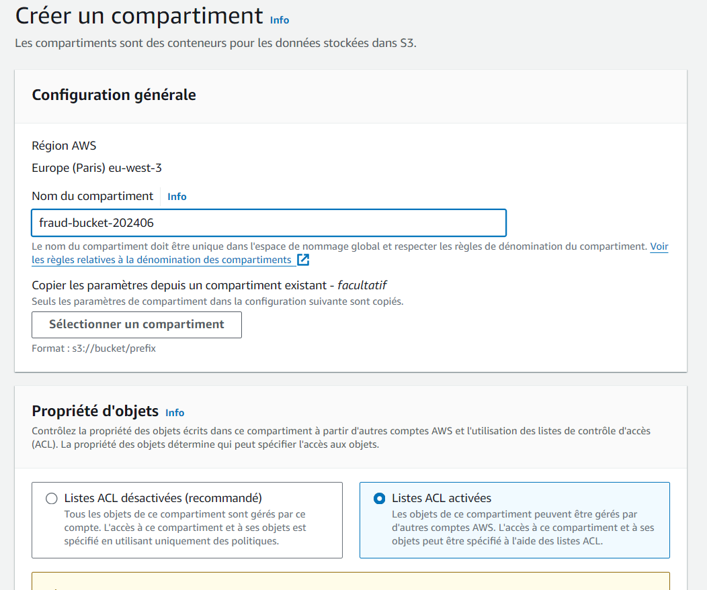

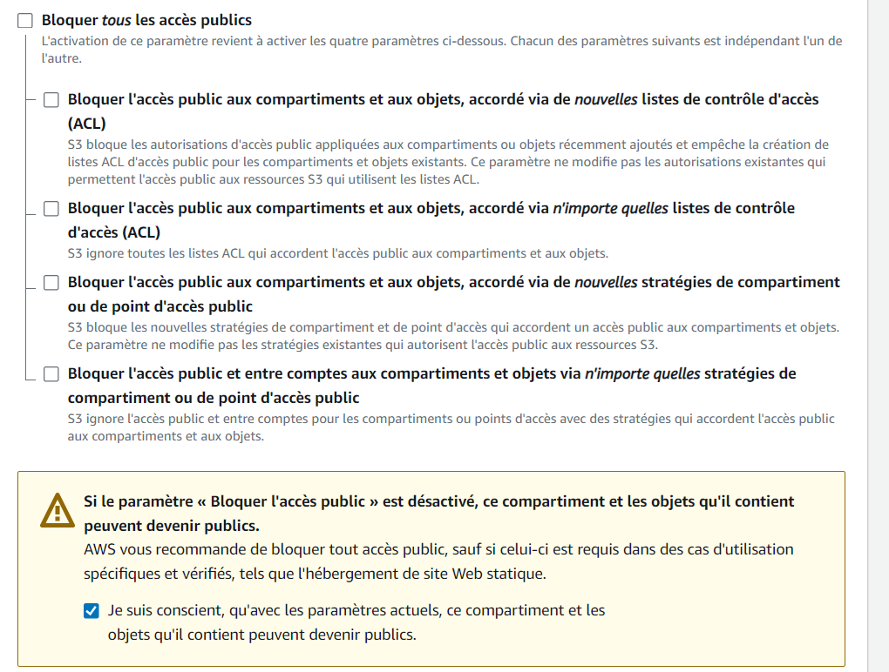

## Créer 2 répertoires dans le bucket

* Dans ``data`` on pourra aller lire les données pour entrainer le modèle
* Dans ``artifacts`` on ira y stocker, lors des entrainements, les artifacts (images, paramètres...)

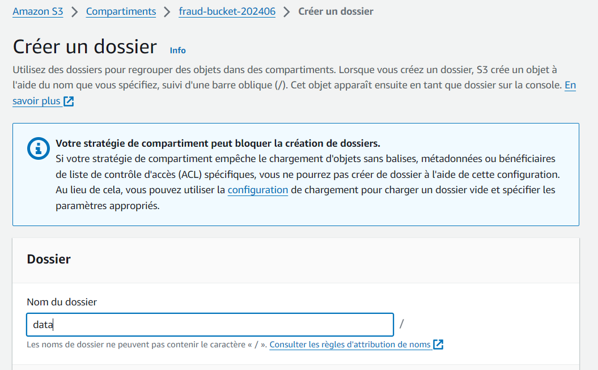

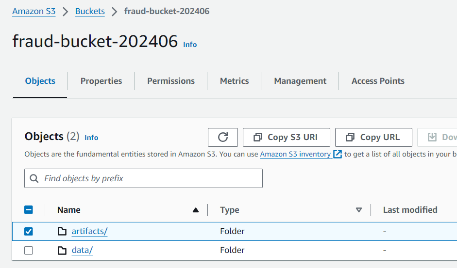

* Copier et mettre de côté les 2 URI

## Créer un user sur AWS IAM avec des droits S3 full access

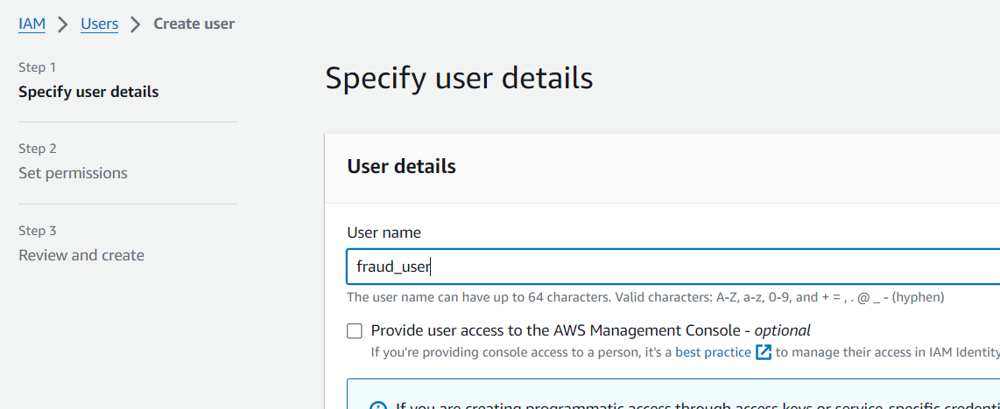

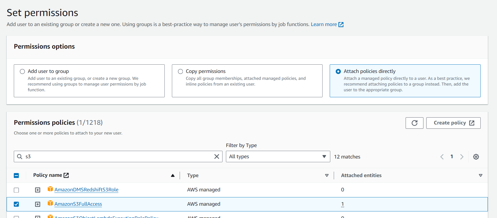

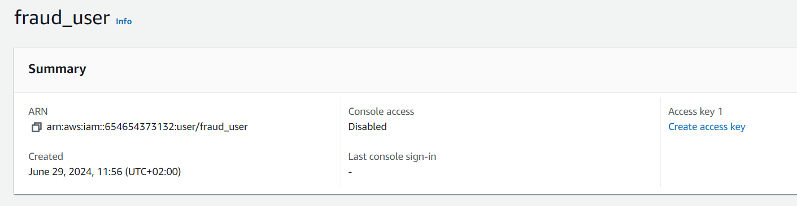

* Copier et mettre de côté l'identifiant et la clé d'accès

# Fichier Dockerfile

Le lire le contenu du fichier ``Dockefile`` qui est à côté de ce ``readme.md``

# Déployer un mlflow tracking server sur Heroku

On va faire tourner sur Heroku, un serveur mlflow tracking. 
* Ce dernier utilisera une base PostgreSQL (aussi sur Heroku) pour stocker les paramètres et les tags de chaque entrainement
* Si besoin, il ira rechercher les artifacts des entrainements sur le répertoire AWS S3 que l'on vient de créer

Pour déployer le serveur mlflow tracking :
* S'assurer que Docker tourne
* Ouvrir un terminal
    * heroku login
    * heroku create fraud-202406   
    * heroku container:login 
    * heroku container:push web -a fraud-202406 
    * heroku container:release web -a fraud-202406 

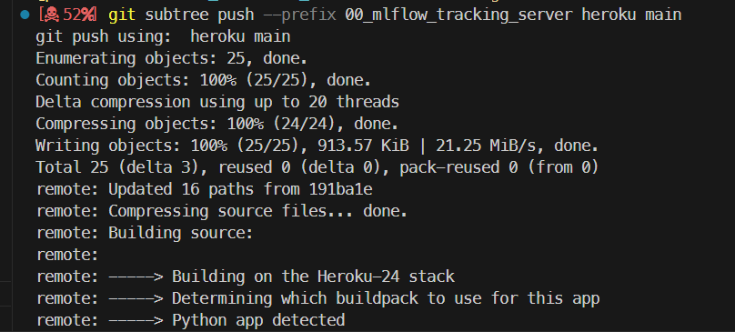

# La base SQL pour le serveur mlflow tracking

Sur la page Web de l'app fraud-202406 (sur Heroku)

* Cliquer sur Ressources
* Ajouter add on
* Chercher postgres Heroku
* Accepter d'être facturé
* Attendre...

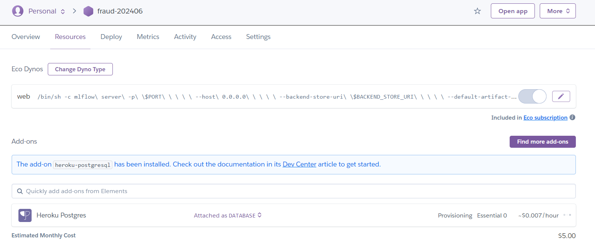

* Cliquer sur Heroku Postgres
* Dans la page qui s'ouvre...
* Cliquer sur Settings

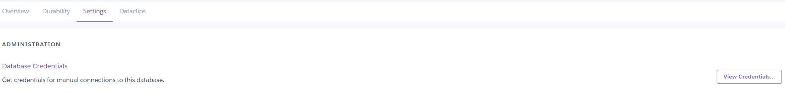

* View credential
* Copier le lien URI
* Ajouter "ql" à "postgres://…"
* Le mettre de côté

Revenir à la section ``settings`` de l'app fraud-202406

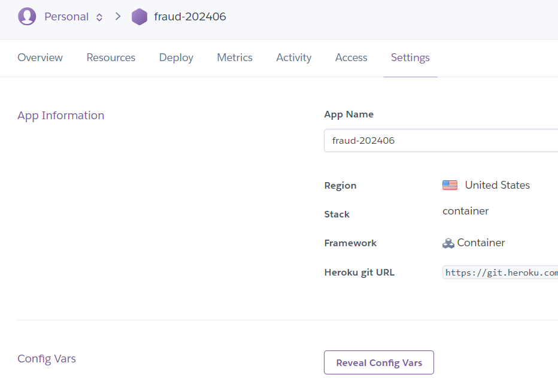

* Cliquer sur ``Reveal Config Vars`` et saisir les différentes clés qu'on a mis de côté

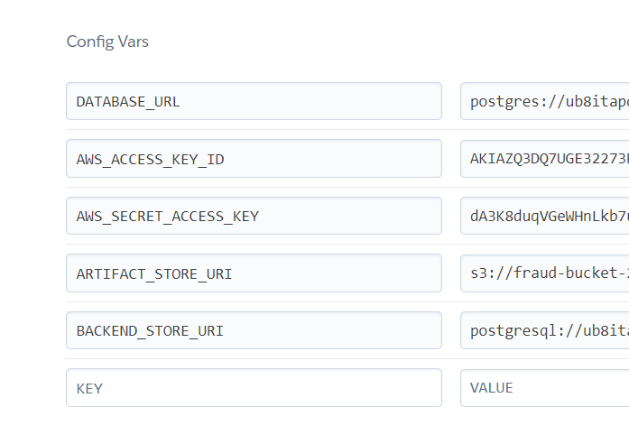

Revenir à la page de l'app fraud-202406

* Lancer l'app
* Y a rien mais au moins ça affiche

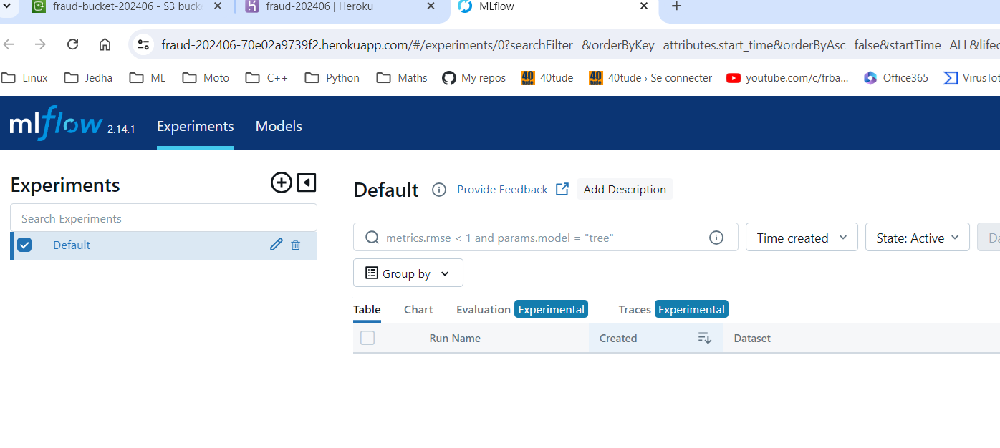

# Testing

Allez dans le répertoire `\02_train_code\01_sklearn\01_minimal` pour y lire le fichier ``readme.md``.
