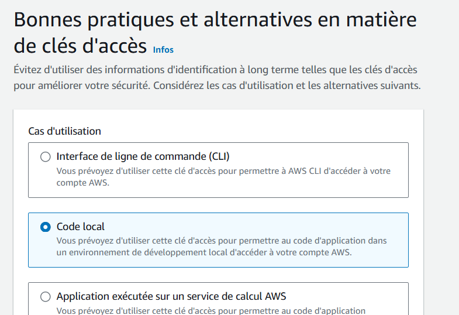
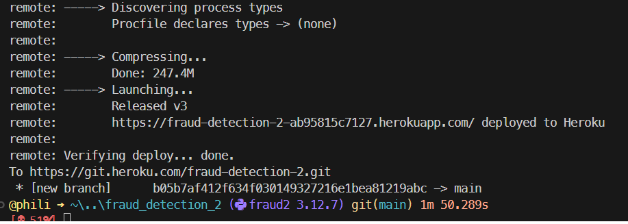
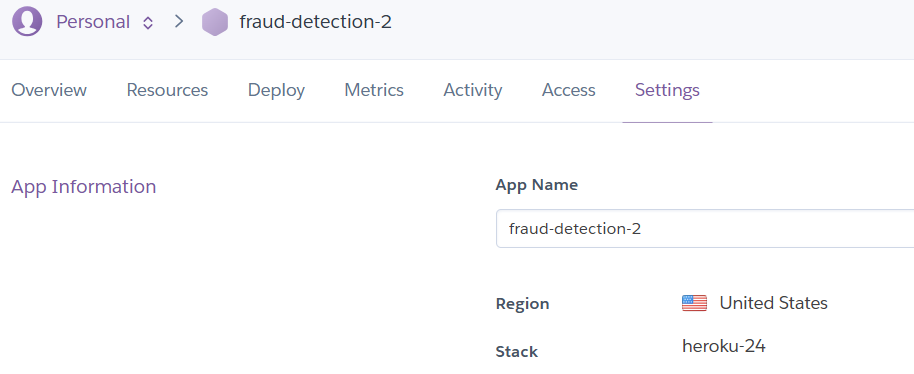
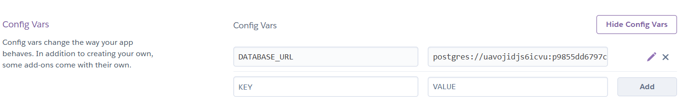
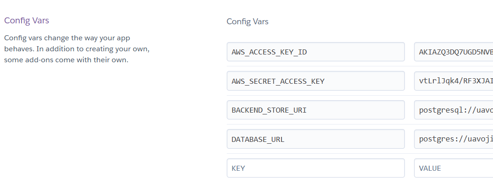
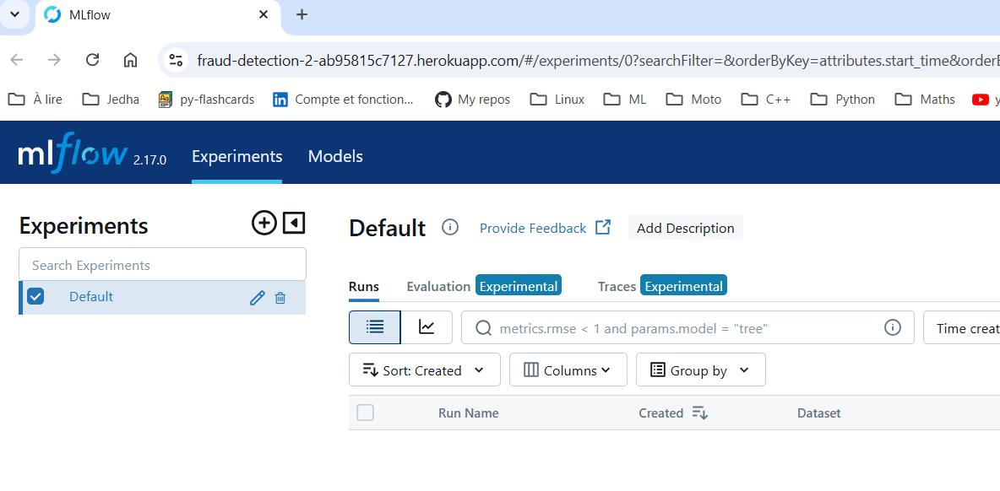
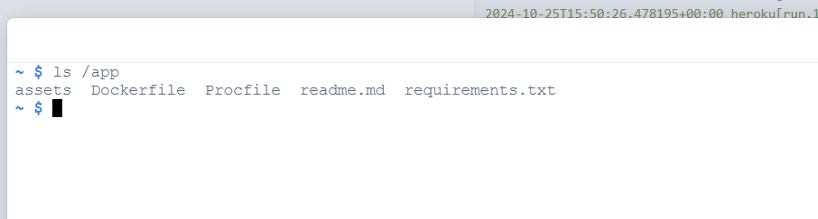
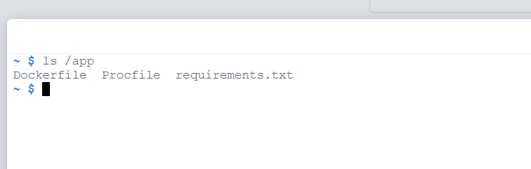

<!-- ###################################################################### -->
<!-- ###################################################################### -->
# Introduction
* The aim of the game here is to deploy an MLflow Tracking Server on Heroku
* This server will track the different versions of our models
* Some data (train data and the artifacts) will be hosted on an AWS S3 disk
* Other data (metrics of the models) will be stored in a PostgreSQL database, also hosted on Heroku


<!-- ###################################################################### -->
<!-- ###################################################################### -->
# AWS

We will create 1 bucket, 2 directories, and 1 user who will have permissions on them.
* The first directory `data` will contain the training data.
* The second directory `artifacts` will receive the artifacts from the training of our various models.

## Create a Bucket on AWS S3

* Even if some of screen captures refer to the previous `fraud_detection` project
* Or if some of the screen captures are in french
* You should get the main idea

<p align="center">

<p>

<p align="center">

<p>

## Create 2 Directories in the Bucket

* In `data`, we will read the data to train the model.
* In `artifacts`, we will store the artifacts (images, parameters, etc.) during training.

<p align="center">

<p>

<p align="center">

<p>

* Copy and save the 2 URIs.

## Create a User on AWS IAM with S3 Full Access Rights

<p align="center">

<p>

<p align="center">

<p>

<p align="center">

<p>

<p align="center">

<p>

* Copy and save the access key ID and secret key in `./secrets.ps1` at the top of the project directory.
* So far `./secrets.ps1` should looks like : 

```
# fraud-detection-2-user full access S3
$env:AWS_REGION             = "eu-west-3"
$env:AWS_ACCESS_KEY_ID      = "AKI..."
$env:AWS_SECRET_ACCESS_KEY  = "vtL..."

```

<!-- ###################################################################### -->
<!-- ###################################################################### -->
# Heroku

<!-- ###################################################################### -->
## Deploy the MLflow Tracking Server on Heroku with Git

The MLflow Tracking Server on Heroku will :
* fetch the training data or artifacts from the AWS S3 directory we just created.
* use a PostgreSQL database (also on Heroku) to store the parameters and tags of each training session.

Take the time to read the content of the `Dockerfile` located next to this `README.md`. You should now understand why there are instructions like `RUN ./aws/install` and why ``boto3`` is in the ``requirement.txt``. Indeed they help to plug the MLflow Tracking Server to the bucket on AWS. The connection between the MLflow Tracking Server and PostgreSQL is a matter of configuration (see the next section below)

To deploy the MLflow tracking server:
* Open a terminal
    * Make sure you are at the root of the `fraud-detection-2` project directory

    ```
    heroku login
    heroku create fraud-detection-2
    ```
    * Read the content of the terminal and note that these 2 urls have been created 
        * https://fraud-detection-2-ab95815c7127.herokuapp.com/ 
        * https://git.heroku.com/fraud-detection-2.git
    
    * Push the changes of the project ``fraud_detection_2`` to GitHub
        * This is NOT mandatory but it doesn't hurt

    * Now with the 2 lines below we :
        1. we add Heroku as a remote  
        1. we push the sub-directory `./00_mlflow_tracking_server` to Heroku 

    ```
    git remote add heroku https://git.heroku.com/fraud-detection-2.git
    git subtree push --prefix 00_mlflow_tracking_server heroku main
    ```

* See below what you can expect at the start of the `git subtree push`

<p align="center">

<p>

* And at the end 
<p align="center">

<p>


<!-- ###################################################################### -->
## Connect a SQL Database for the MLflow Tracking Server

On the web page of the app `fraud-detection-2` (on Heroku):

* Click on Resources
* Add an add-on
* Search for Heroku Postgres
* Agree to being charged
* Wait...

<p align="center">

<p>

* Click on Heroku Postgres
* Click on Settings in the next page

<p align="center">

<p>

* View credentials.
* Copy the URI link.
* Add "ql" to "postgres://…"
* Save it into the ``./secrets.ps1``

```
# fraud-detection-2-user full access S3
$env:AWS_REGION             = "eu-west-3"
$env:AWS_ACCESS_KEY_ID      = "AKI..."
$env:AWS_SECRET_ACCESS_KEY  = "vtL..."
# SQL on Heroku
$env:BACKEND_STORE_URI      = "postgresql://uav..."

```


Return to the `settings` section of the app `fraud-detection-2`.

<p align="center">

<p>

* Click on `Reveal Config Vars` 

<p align="center">

<p>

* You could click ``Add`` and enter the various keys you saved in ``./secrets.ps1`` 
* Instead, go to the terminal and use the following commands

```
heroku config:set AWS_ACCESS_KEY_ID=AKI...
heroku config:set AWS_SECRET_ACCESS_KEY=vtL...
heroku config:set BACKEND_STORE_URI=postgresql://uav...
heroku config:set ARTIFACT_ROOT=s3://fraud-detection-2-bucket/artifacts/
```
* The last line is not a secret. It is the path to the `artifacts` directory on the S3 disk.
* Go back to `fraud-detection-2` web page on Heroku. You should see something similar to :

<p align="center">

<p>


<!-- ###################################################################### -->
<!-- ###################################################################### -->
# Testing

* So far so good. However, at this stage Heroku still does'nt know how to launch the app (the MLflow Tracking server)
* Below we :
    1. Create a Procfile which tells Heroku how to launch the Server
    1. Update the content on Heroku
    1. Launch the MLflow Tracking Server 


## Create a Procfile
* In the ``00_mlflow_tracking_server`` directory create a file named `Procfile`
* Add the line below and save the file

```
web: mlflow server --host 0.0.0.0 --port $PORT --backend-store-uri $BACKEND_STORE_URI --default-artifact-root $ARTIFACT_ROOT
```
## Commit on GitHub and Heroku
* Push on GitHub graphically (again it doe'snt hurt)
* In VSCode, in a terminal 
    1. make sure you are at the root of the `fraud-detection-2` project
    1. Push the subtree on Heroku with

```
git subtree push --prefix 00_mlflow_tracking_server heroku main

```
## Launch MLflow Tracking Server
Return to the page of the app `fraud-detection-2`.

* Launch the app.
* There’s nothing there yet, but at least it displays.

<p align="center">

<p>


* While the server is running, one can 
1. visit the ``fraud-detection-2`` page
1. click on the `More` button (top right)
1. Select `Run console`
1. Type ``bash``
1. Wait...
1. Type `ls /app` and check that only the ``./00_mlflow_tracking_server`` has been deployed to Heroku
    * We could go one step further since it make no sense to transfer :
        * ``README.md`` and the ``./00_mlflow_tracking_server/assets`` directory (it contains png file for the README)

<p align="center">

<p>

In order to **NOT** send ``README.md`` and ``./00_mlflow_tracking_server/assets`` to Heroku
1. Create a ``.slugignore`` file in the ``./00_mlflow_tracking_server`` directory
1. Add these lines

```
README.md
readme.md
assets/
```

3. Once this is done and if you **REALLY** want to push on Heroku without pushing first on GitHub you could try the lines below 
    * Again I highly recommend to push on GitHub first and then on Heroku  

```
git add 00_mlflow_tracking_server/
git commit -m "my message"
git subtree push --prefix 00_mlflow_tracking_server heroku main

```

<p align="center">

<p>

This shows that using `.slugignore` can help to reduce the file on Heroku to the strict minimum.

## What could be next ?
* Replace the web server coming with MLflow Tracking Server?
* A lite web server based on Flask

### Use gunicorn as a web server
* Already done within another project ([py-flashcards](https://github.com/40tude/py-flashcards))
* Unlike Nginx (see below), Gunicorn doesn't require any additional configuration to redirect HTTP requests to MLflow. It handles this directly.
* Add it to `requirements.txt` 
* New Procfile

```
web: gunicorn -w 3 -b 0.0.0.0:$PORT "mlflow.server:app"

```

* ``--backend-store-uri $BACKEND_STORE_URI`` and `` --default-artifact-root $ARTIFACT_ROOT`` are no longer needed
* Might be a good idea (later)

<!-- 
Vérifier/Essayer  un truc du style
Nb_Workers = (2 x CPU) + 1
gunicorn -w 4 --timeout 120 -b 0.0.0.0:$PORT "mlflow.server:app"
web: gunicorn --workers=3 'mlflow.server:create_app()' 
-->


### Use Nginx as a web server 
* Harder
* Need to add Nginx in `requirements.txt` 
* Need a new Procfile
```
web: nginx -c /app/web_app/nginx.conf && mlflow server --host 127.0.0.1 --port 5000 --backend-store-uri $BACKEND_STORE_URI --default-artifact-root $ARTIFACT_ROOT

```
* Not sure it's worth it

## What's next ?
* Go to the directory `\02_train_code\01_sklearn\01_minimal` to read the `README.md` file.