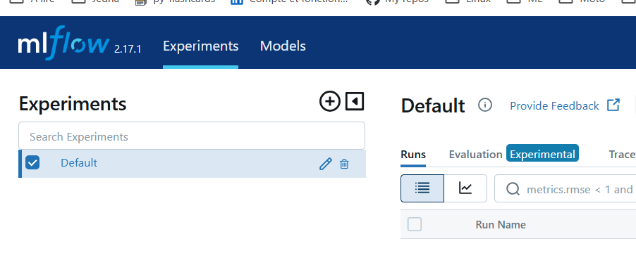
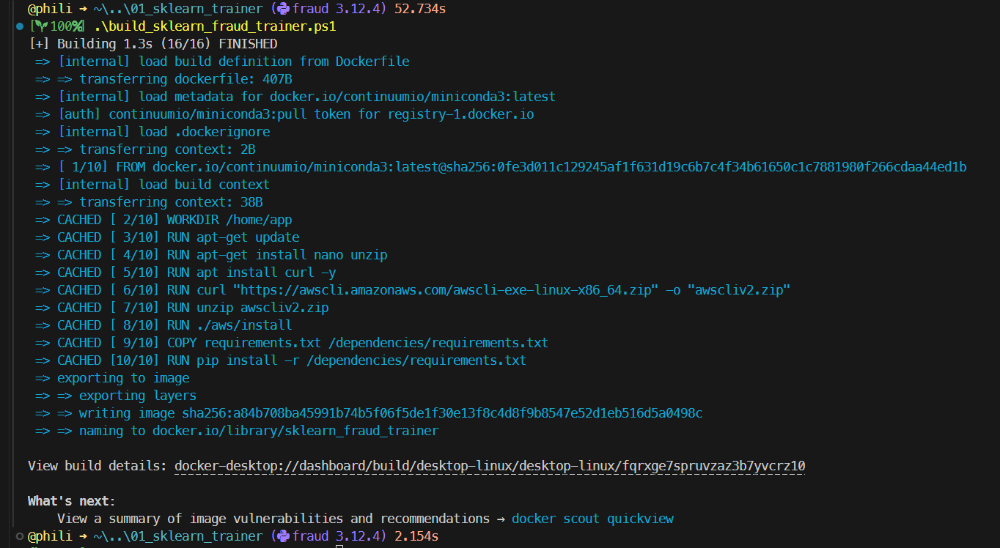
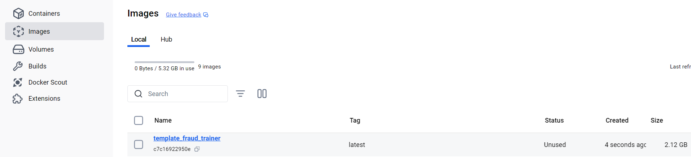
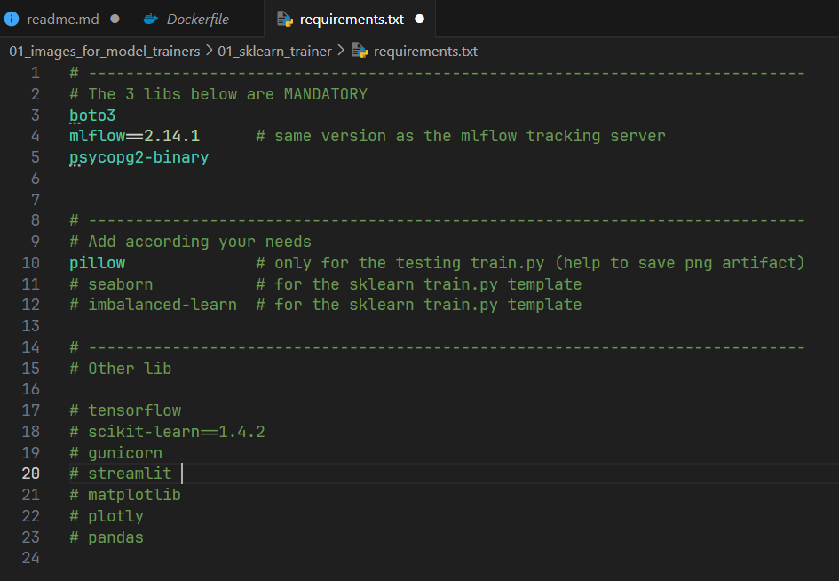
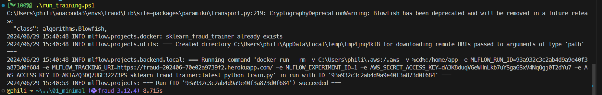
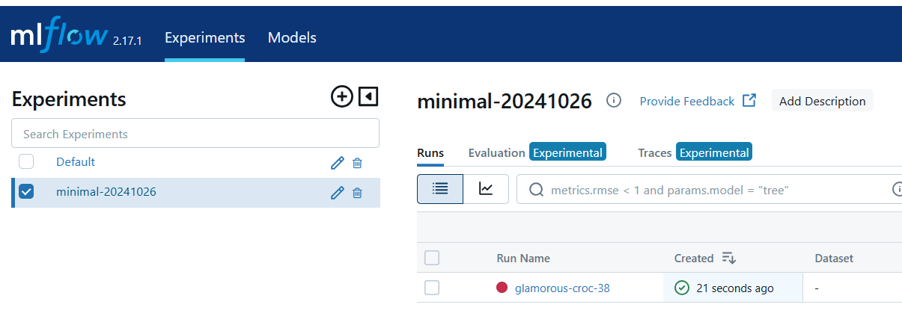
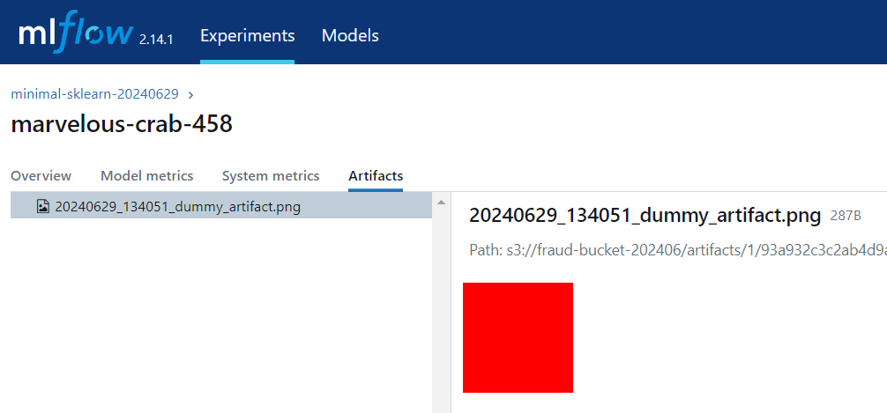
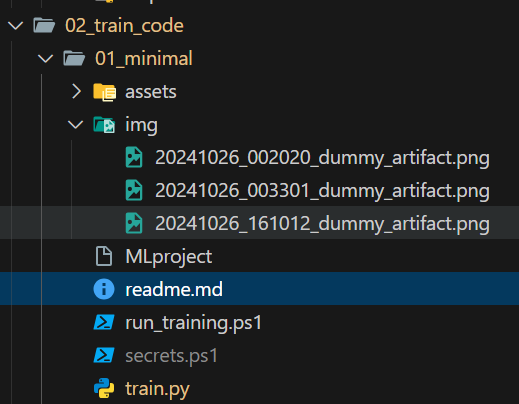

<!-- ###################################################################### -->
<!-- ###################################################################### -->
# Installation Testing for MLflow Tracking Server and SQL Database

* The goal is to test the MLflow Tracking Server, the SQL database and the artifact storage.
* Each model training will run in a Docker image.
* A training script is a Python file (`train.py` for example).
* **IMPORTANT :** Depending on the libraries on which the training Python script is based (sklearn, tensorflow, numpy...). You need to make sure that these libraries are available in the Docker image in which the training Python script is running.

In the following steps, we will:
1. Build a minimal Docker image. This image will offer a context in which a minimal training Python script can be executed.
2. Write a minimal training Python script (around 20 lines) and run it within the Docker image.
3. The Docker image and the training Python script run locally. However, results are sent to the MLflow Tracking Server and artifacts are stored in the ``./artifacts`` directory on the AWS S3 bucket (check now the very end of this document)


<!-- ###################################################################### -->
## Building a Minimal Docker Image

* Make sure Docker is up and running 
* Do you remember which version of MLflow is running on Heroku ?
    * If not, restart the MLflow Tracking Server on Heroku and look in the upper left corner (2.17.1 below)

<p align="center">

<p>

* Keep this number in mind and reach the  ``01_images_for_model_trainers\01_minimal_trainer`` directory
* Open `requirements.txt` and make sure the version of MLflow matches the number you still have in mind (do you?). 

Find below the first lines of the `requirements.txt` file :  

```
# -----------------------------------------------------------------------------
# The 3 libs below are MANDATORY
boto3               # for AWS
mlflow==2.17.1      # same version as the mlflow tracking server
psycopg2-binary     # connection to PostgreSQL

```

* Save the `requirements.txt` file if you made any change
* Now, run ``.\build_fraud_trainer.ps1``

<p align="center">

<p>

At the end, in Docker you can see the `template_fraud_trainer` image in the Docker Desktop (or invoke ``docker image ls`` in a terminal)

<p align="center">

<p>


### About ExecutionPolicy

* Trust in me, just in me... ``PowerShell`` is your friend 
* So to run a `.ps1` script, the necessary permissions must be granted. 
* If needed, as an ``Administrator``, use the command below or a similar one.

```
Set-ExecutionPolicy -ExecutionPolicy RemoteSigned -Scope LocalMachine
```

We now have a minimal image (without even Pandas nor sklearn) in which a minimal training Python script can run.


### About requirements.txt

The most interesting part of the previous recipe is found in the ``01_images_for_model_trainers\01_minimal_trainer\requirements.txt`` file:
* It contains only the 3 mandatory libraries.
* In addition, it list ``pillow`` because this lib is used by the minimal training Python script when it saves a ``.png`` image as an artifact.

<p align="center">

<p>

If later, a training Python script requires other libraries (sklearn...), simply add them to the ``requirements.txt`` file.
* If you modify the ``requirements.txt`` file then you **must** rebuild the Docker image using the script `build_fraud_trainer.ps1`.
* If you want to give the Docker image a new name, modify it in ``build_fraud_trainer.ps1``.
    * For example, if instead of `template_fraud_trainer` you prefer `minimal_trainer` modify the code as shown below (and don't forget the `.` at the end of the line)

```
docker build -t minimal_trainer .
```


<!-- ###################################################################### -->
## Running a Minimal Training Python Script

* We use MLflow Projects and one MLproject file
* In order to execute the minimal training Python script we will invoke `run_training.ps1` whose code is shown below.

```
. "./secrets.ps1"
mlflow run --experiment-name $env:MLFLOW_EXPERIMENT_NAME .
```

* For the moment, forget about the ``secrets.ps1`` on the first line
* Since on the second line ``mlfow`` is called, we must install it locally in the current conda virtual environment
* Open a terminal, then execute the following commands :

```
conda install mlflow=2.17 -y   # same version as on the server. It comes with request 2.32
conda install requests=2.31    # In oct 2024 there is still a problem with request 2.32. This is why 2.31 must be installed 
```

* Then execute the minimal training Python script in the Docker image

```
./run_training.ps1
```

<p align="center">

<p>

* The "training" is recorded on the MLflow Tracking Server hosted on Heroku.
    * See: https://fraud-detection-2-ab95815c7127.herokuapp.com/
    * In the top left corner of the web page, a `minimal-20241026` experiment has been created. 
        * The name comes from the `$env:MLFLOW_EXPERIMENT_NAME` variable which is defined in `02_train_code\01_minimal\secrets.ps1`
        * The training is named `glamorous-croc-38`. This name has been generated by the MLflow Tracking Server
        * If minimal training Python script (`train.py`) is run multiple time today, then the results of the new instances will be stored under `minimal-20241026`

<p align="center">

<p>

### About 02_train_code\01_minimal\secrets.ps1

* This ``02_train_code\01_minimal\secrets.ps1`` should not be confused with the `./secrets.ps1` previously used when we deployed the MLflow Tracking Server.
* They serve 2 differents purpose
    1. The first one (`./secrets.ps1`) helps to build and deploy the MLflow Tracking Server on Heroku
    1. The second one (`02_train_code\01_minimal\secrets.ps1`) helps to run training Python scripts. It needs a different set of experiment dependant information or confidential information : 
        * The name of the experiment   
        * The URL of the the MLflow Tracking Server 
        * The ID and KEY to connect to the S3 disk to store the artifacts (they are confidential, cannot be pushed on GitHub)

Here is the content of ``02_train_code\01_minimal\secrets.ps1`` :

```
$currentDate = Get-Date -Format "yyyyMMdd"
$env:MLFLOW_EXPERIMENT_NAME = "minimal-$currentDate"

$env:MLFLOW_TRACKING_URI    = "https://fraud-detection-2-ab95815c7127.herokuapp.com/"
$env:AWS_ACCESS_KEY_ID      = "AKI..."
$env:AWS_SECRET_ACCESS_KEY  = "vtL..."

```

* The training Python script doesn'nt really care about the PostgreSQL database. 
    * Indeed once it sends the metrics to the MLflow Tracking Server, the later will get in touch with the database and store the metrics.
    * This explain why this version of ``02_train_code\01_minimal\secrets.ps1`` has no information about PostgreSQL while `./secrets.ps1` had a line specific to PostgreSQL (refer to the line `$env:BACKEND_STORE_URI      = "postgresql://uav...`)
* This ``02_train_code\01_minimal\secrets.ps1`` is in the directory of the experiment because it is experiment specific. Indeed, it contains the name of the experiment. 
    * If one copy/paste/rename the ``01_minimal`` directory and build a more new training Python script he should change the name of the experiment in the local copy of `secrets.ps1`


### What has been tracked so far on the server ?

* The author of the training run is tagged as `Philippe`.
* At the very bottom, we also see the test parameter ``Dummy_Param`` with a value of ``42``.

<p align="center">

<p>

* Finally, the saved artifact is also available.

<p align="center">

<p>

* Again, the minimal training Python script is 21 lines long (see below)
* We can see how the parameters, the tag and the artifacts are saved
* A local ``./img`` directory is created. It demonstrates how a copy of the artifacts (.png files) saved the MLflow Tracking Server can be saved locally

<p align="center">

<p>

Above, the content of the ``./img`` directory after 3 runs of `train.py`

Below the code of the minimal training Python script 

```python
import mlflow
import random
import datetime
from PIL import Image
from pathlib import Path

class ModelTrainer:
    def __init__(self) -> None:
        mlflow.log_param("Dummy_Param", 42)
        mlflow.set_tag("Author", "Philippe")

        image = Image.new("RGB", (100, 100), color=random.choice(["blue", "red", "blue", "orange", "green"]))
        timestamp = datetime.datetime.now().strftime("%Y%m%d_%H%M%S")
        title = f"./img/{timestamp}_dummy_artifact.png"
        image.save(title)
        mlflow.log_artifact(title)
        return

if __name__ == "__main__":
    Path("./img").mkdir(parents=True, exist_ok=True)
    trainer = ModelTrainer()
```


<!-- ###################################################################### -->
## My recommendations

1. Keep in mind that one Docker image can be used by many training Python scripts
1. Each training Python script needs a Docker image (see the line `image: blablabla` in the `MLproject` file)
1. At the end you should have more directories with training Python scripts than directories with Docker images 

### Docker images management
* Copy/paste/rename the ``01_images_for_model_trainers\01_minimal_trainer\`` directory 
* Create your own custom images from there
    * Comment ``pillow`` from ``requirements.txt`` and add the ML/DL libraries your training Python script requires 
    * Give a name to the image (edit ``build_fraud_trainer.ps1``)
* Run `./build_fraud_trainer.ps1` to build the image

### Training Python Scripts management
* Do **NOT** copy/paste/rename the ``02_train_code\01_minimal`` directory
    * Wait until you know more about the `02_train_code\02_sklearn\01_template` directory
* If your training Python scripts use a specific ML/DL library then 
    1. Create a specific Docker image 
        * See above
    1. Copy/paste/rename the `02_train_code\02_sklearn\01_template` directory 
        * Modify MLproject (at least, name the Docker image to be used)
        * Write your Python code
        * Run ``./run_training.ps1`` to execute the code locally in the Docker image


<!-- ###################################################################### -->
## What's next ?
Go to the `..\02_train_code\02_sklearn\01_template` directory and read the `readme.md`.
