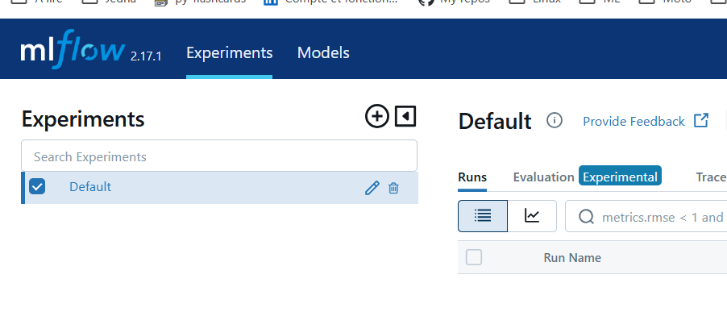
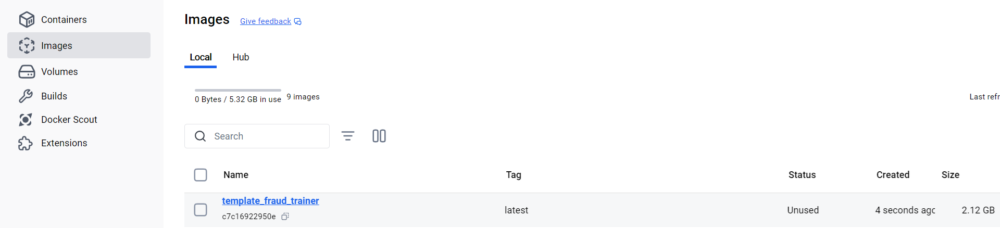

<!-- ###################################################################### -->
<!-- ###################################################################### -->
# Installation Testing for MLflow Tracking Server and SQL Database

* The goal is to test the MLflow tracking server, the SQL database, the data source, and artifact storage.
* Each model training will run in a Docker image.
* A training script is simply a Python file (`train.py`).
* Depending on the libraries used by the training Python code (sklearn, tensorflow, numpy...), you must ensure that these are available in the Docker image where the Python code will execute.

In the following steps, we will:
1. Build a minimal Docker image. This image will offer a context in which the training script can run.
2. Run a minimal training script within it.


<!-- ###################################################################### -->
## Building a Minimal Docker Image for a Minimal Model

* Make sure Docker is up and running 
* Do you remember which version of MLflow you are running on Heroku ?
    * If needed restart the server on Heroku and look in the upper left corner

<p align="center">

<p>

* Keep this number in mind and reach the  ``01_images_for_model_trainers\01_sklearn_trainer`` directory
* Open `requirements.txt` and make sure the version of MLflow matches the number you still have in mind (do you?). Find below the first lines of `requirements.txt`.  

```
# -----------------------------------------------------------------------------
# The 3 libs below are MANDATORY
boto3               # for AWS
mlflow==2.17.1      # same version as the mlflow tracking server
psycopg2-binary     # connection to PostgreSQL

```

* Save the file if you made any change
* Now, run ``.\build_sklearn_fraud_trainer.ps1``

<p align="center">

<p>

At the end, in Docker you can see the `template_fraud_trainer` image

<p align="center">

<p>


### About ExecutionPolicy

* Trust me, PowerShell is your friend 
* So to run a `.ps1` script, the necessary permissions must be granted. If needed, as an ``Administrator``, use the command below or a similar one.

```
Set-ExecutionPolicy -ExecutionPolicy RemoteSigned -Scope LocalMachine
```

We now have a minimal image (without even Pandas or sklearn) in which a minimal training script can run.

### About requirements.txt
The most interesting of the previous recipe is found in the ``requirements.txt`` file:
* It contains only the 3 mandatory libraries.
* Along with ``pillow``, which is used only in the minimal training script to save a ``.png`` image as an artifact.

<p align="center">

<p>

If later, the training Python code requires other libraries (sklearn...), add them in the ``requirements.txt`` file.
* If you modify the ``requirements.txt`` file then you must rebuild the Docker image using the script `build_sklearn_fraud_trainer.ps1`.
* If you want to give the image a different name, modify it in ``build_sklearn_fraud_trainer.ps1``.

```
docker build -t my_image_name .
```
#### My recommendation
* Copy/paste/rename the ``01_images_for_model_trainers\01_sklearn_trainer\`` directory 
* Create your own images from there


<!-- ###################################################################### -->
## Running a Minimal Training Script

* We use MLflow Projects and one MLproject file
* In order to execute the Python minimal training script we will execute `run_training.ps1`
* Find below the content of the PowerShell script

```
. "./secrets.ps1"
mlflow run --experiment-name $env:MLFLOW_EXPERIMENT_NAME .
```
* For the moment forget about the ``secrets.ps1``
* Since on the second line ``mlfow`` is invoqued, we must instal it
    * Open a terminal in `02_train_code\01_sklearn\01_minimal`

```
conda install mlflow=2.17 -y   # same version as on the server. It comes with request 2.32
conda install requests=2.31    # In oct 2024 there is still a problem with request 2.32 and 2.31 must be installed 
```

* The execute
```
./run_training.ps1
```

<p align="center">

<p>

* The "training" is recorded on the MLflow Tracking Server hosted on Heroku.
    * See: https://fraud-detection-2-ab95815c7127.herokuapp.com/
    * At the top left of the web page, you can see that it is in the `minimal-20241026` category referes to `$env:MLFLOW_EXPERIMENT_NAME` which is defined in `02_train_code\01_sklearn\01_minimal\secrets.ps1`

<p align="center">

<p>

### About 02_train_code\01_sklearn\01_minimal\secrets.ps1
* It should not be confused with the `secrets.ps1` previously used when we deployed the MLflow Tracking Server.
* The training script need : 
    * A name for the experiment  
    * To know the URL of the the MLflow Tracking Server 
    * To get ID and KEY to connect to the S3 disk and store the artifacts

Here is its content :

```
$currentDate = Get-Date -Format "yyyyMMdd"
$env:MLFLOW_EXPERIMENT_NAME = "minimal-$currentDate"

$env:MLFLOW_TRACKING_URI    = "https://fraud-detection-2-ab95815c7127.herokuapp.com/"
$env:AWS_ACCESS_KEY_ID      = "AKI..."
$env:AWS_SECRET_ACCESS_KEY  = "vtL..."

```

* For exemple the training script doesn'nt really care about the PostgreSQL database. Indeed once it sends the metrics to the MLflow Tracking Server, the later will get in touch with the database and store the metrics.
* This is why we need another ``secrets.ps1``
* I decided to store it in the directory of the experiment because it contains the name of the experiment. 
* If tomorow I copy/paste/rename the ``01_minimal`` directory and build a more sophisticated training script I should change the name in `secrets.ps1`


### What has been tracked so far on the server ?

* The author of the training run is tagged as `Philippe`.
* At the very bottom, we also see the test parameter ``Dummy_Param`` with a value of ``42``.

<p align="center">

<p>

* Finally, the saved artifact is also available.

<p align="center">

<p>

* The minimal training code is 20 lines long (see below)
* It is here to check the process and the setup.

```python

import os
import mlflow
import datetime
from PIL import Image

class ModelTrainer:
    def __init__(self):
        mlflow.log_param("Dummy_Param", 42)
        mlflow.set_tag("Author", "Philippe")

        image = Image.new("RGB", (100, 100), color="red")
        timestamp = datetime.datetime.now().strftime("%Y%m%d_%H%M%S")
        title = f"./img/{timestamp}_dummy_artifact.png"
        image.save(title)
        mlflow.log_artifact(title)

if __name__ == "__main__":
    os.makedirs("./img", exist_ok=True)
    trainer = ModelTrainer()

```


<!-- ###################################################################### -->
## What's next ?
Go to the `..\02_train_code\01_sklearn\02_template` directory and read the `readme.md`.


<!-- # Testing de l'installation de mlflow serveur et de la base SQL

* On veut tester le serveur mlflow tracking, la base SQL, la source de données, le stockage des artifacts
* Chaque entrainement de modèle va tourner dans une image docker
* Un code d'entrainement c'est donc un code Python (`train.py`)
* Selon que le code Python d'entrainement utilise telle ou telle bibliothèque (sklearn, tensorflow, numpy...) il faut s'assurer que cette dernière est disponible dans l'image Docker dans laquelle le code Python va s'exécuter.


Dans ce qui suit, on va donc faire 2 choses : 
1. Construire une image Docker minimale 
1. Dans laquelle on va faire tourner un code d'entrainement minimal

## Construire une image docker minimale pour modèle minimal

* Dans le répertoire ``01_images_for_model_trainers\01_sklearn_trainer``
* Executer ``.\build_sklearn_fraud_trainer.ps1``

<p align="center">

<p>

### C'est peut être un détail pour vous...

Pour pouvoir lancer un script `.ps1` il faut que les autorisations soient accordées. Si besoin, en tant qu'Administrateur utilisez la commande ci-dessous ou l'une de ces petites soeurs. 

```
Set-ExecutionPolicy -ExecutionPolicy RemoteSigned -Scope LocalMachine
```

On a maintenant une image minimale (il n'y a même pas Pandas ni sklearn de disponible) dans laquelle on peut faire tourner un code de training minimal.


La partie la plus interressante se trouve dans le fichier ``requirements.txt`` :
* Ici il n'y a que les 3 bibliothèques obligatoires
* Ainsi que ``pillow`` qu'on utilise pour sauver une image ``.png`` comme un artifact

<p align="center">

<p>

Si plus tard le code Python de training nécessite d'autres bibliothèques c'est ici qu'il faudra les ajouter
* Dans ce cas, il faudra reconstruire l'image Docker en utilisant `build_sklearn_fraud_trainer.ps1`
* Si vous souhaitez donner un nom différent à l'image il faudra aller le modifier dans le fichier ``01_images_for_model_trainers\01_sklearn_trainer\build_sklearn_fraud_trainer.ps1``
* Il ne faut pas hésiter à dupliquer le répertoire ``01_images_for_model_trainers\01_sklearn_trainer\`` pour construire vos propres images.


## Faire tourner un code de training minimal

* Ouvrir un terminal
* conda create --name fraud
* conda activate fraud
* À ce jour (juin 2024) il y a des soucis avec requests 2.32
    * conda install requests=2.31
    * conda install mlflow=2.12
* Depuis le répertoire du projet `97_fraud_detection`
    * code .

* Dans le sous-répertoire 02_train_code\01_sklearn\01_minimal
* Executer `./run_training.ps1`

<p align="center">

<p>


* Le "training" est alors enregistré sur le serveur mlflow-tracking qui est sur Heroku
    * Voir : https://fraud-202406-70e02a9739f2.herokuapp.com/
    * En haut à gauche de la page web, on voit qu'il est dans la catégorie `minimal-sklearn-20240629` (voir le contenu de `02_train_code\01_sklearn\01_minimal\secrets.ps1`)

<p align="center">

<p>

* L'auteur du training est un tag qui vaut `Philippe`
* Tout en bas on retrouve aussi le paramètre du test ``Dummy_Param`` qui vaut ``42``

<p align="center">

<p>

* On retrouve enfin l'artifact qui a été sauvé 

<p align="center">

<p>

* Le code de minimal d'entrainement fait 20 lignes
* C'est juste un moyen de vérifier le setup

```python

import os
import mlflow
import datetime

from PIL import Image

class ModelTrainer:
    def __init__(self):
        mlflow.log_param("Dummy_Param", 42)
        mlflow.set_tag("Author", "Philippe")

        image = Image.new("RGB", (100, 100), color="red")
        timestamp = datetime.datetime.now().strftime("%Y%m%d_%H%M%S")
        title = f"./img/{timestamp}_dummy_artifact.png"
        image.save(title)
        mlflow.log_artifact(title)

if __name__ == "__main__":
    os.makedirs("./img", exist_ok=True)
    trainer = ModelTrainer()

```


## Faire tourner un code de training qui utilise sklearn

Allez dans le répertoire `..\02_train_code\01_sklearn\02_template` et lisez le `readme.md`.

 -->
