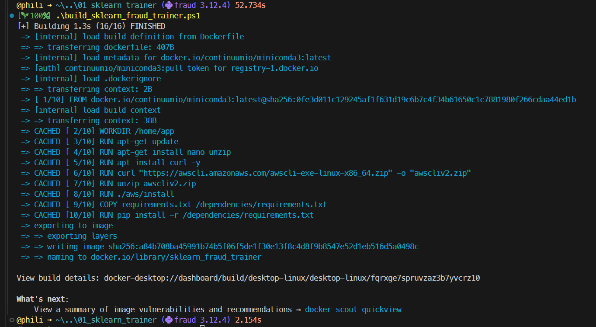
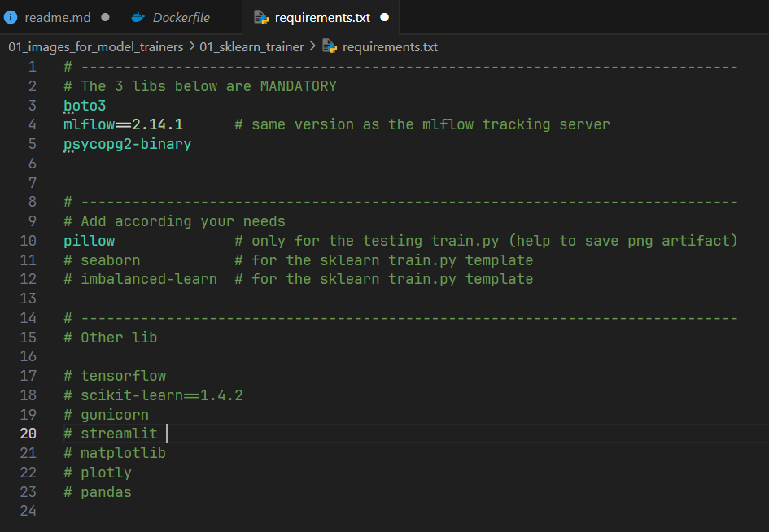
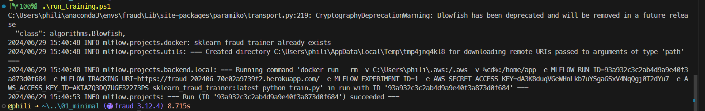
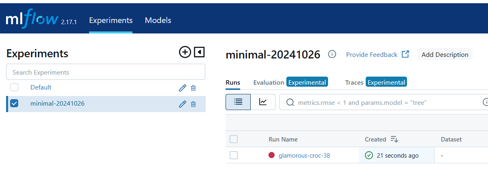
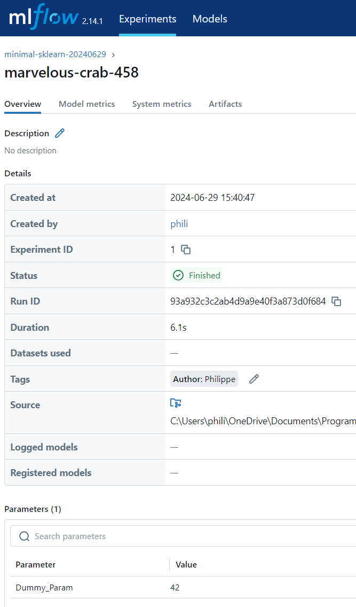
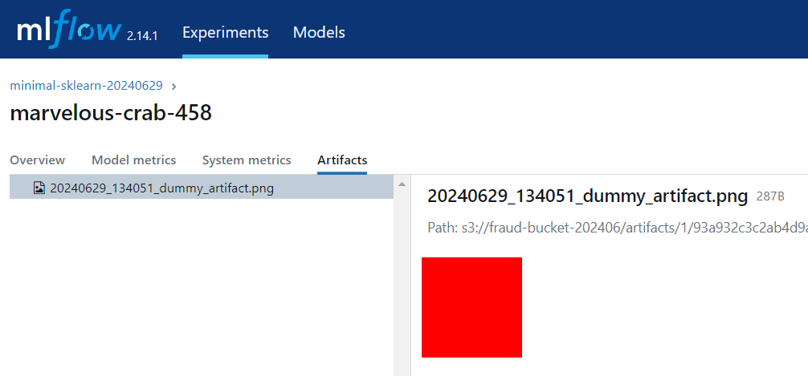

# Testing de l'installation de mlflow serveur et de la base SQL

* On veut tester le serveur mlflow tracking, la base SQL, la source de données, le stockage des artifacts
* Chaque entrainement de modèle va tourner dans une image docker
* Un code d'entrainement c'est donc un code Python (`train.py`)
* Selon que le code Python d'entrainement utilise telle ou telle bibliothèque (sklearn, tensorflow, numpy...) il faut s'assurer que cette dernière est disponible dans l'image Docker dans laquelle le code Python va s'exécuter.


Dans ce qui suit, on va donc faire 2 choses : 
1. Construire une image Docker minimale 
1. Dans laquelle on va faire tourner un code d'entrainement minimal

## Construire une image docker minimale pour modèle minimal

* Dans le répertoire ``01_images_for_model_trainers\01_sklearn_trainer``
* Executer ``.\build_sklearn_fraud_trainer.ps1``

<p align="center">

<p>

### C'est peut être un détail pour vous...

Pour pouvoir lancer un script `.ps1` il faut que les autorisations soient accordées. Si besoin, en tant qu'Administrateur utilisez la commande ci-dessous ou l'une de ces petites soeurs. 

```
Set-ExecutionPolicy -ExecutionPolicy RemoteSigned -Scope LocalMachine
```

On a maintenant une image minimale (il n'y a même pas Pandas ni sklearn de disponible) dans laquelle on peut faire tourner un code de training minimal.


La partie la plus interressante se trouve dans le fichier ``requirements.txt`` :
* Ici il n'y a que les 3 bibliothèques obligatoires
* Ainsi que ``pillow`` qu'on utilise pour sauver une image ``.png`` comme un artifact

<p align="center">

<p>

Si plus tard le code Python de training nécessite d'autres bibliothèques c'est ici qu'il faudra les ajouter
* Dans ce cas, il faudra reconstruire l'image Docker en utilisant `build_sklearn_fraud_trainer.ps1`
* Si vous souhaitez donner un nom différent à l'image il faudra aller le modifier dans le fichier ``01_images_for_model_trainers\01_sklearn_trainer\build_sklearn_fraud_trainer.ps1``
* Il ne faut pas hésiter à dupliquer le répertoire ``01_images_for_model_trainers\01_sklearn_trainer\`` pour construire vos propres images.


## Faire tourner un code de training minimal

* Ouvrir un terminal
* conda create --name fraud
* conda activate fraud
* À ce jour (juin 2024) il y a des soucis avec requests 2.32
    * conda install requests=2.31
    * conda install mlflow=2.12
* Depuis le répertoire du projet `97_fraud_detection`
    * code .

* Dans le sous-répertoire 02_train_code\01_sklearn\01_minimal
* Executer `./run_training.ps1`

<p align="center">

<p>


* Le "training" est alors enregistré sur le serveur mlflow-tracking qui est sur Heroku
    * Voir : https://fraud-202406-70e02a9739f2.herokuapp.com/
    * En haut à gauche de la page web, on voit qu'il est dans la catégorie `minimal-sklearn-20240629` (voir le contenu de `02_train_code\01_sklearn\01_minimal\secrets.ps1`)

<p align="center">

<p>

* L'auteur du training est un tag qui vaut `Philippe`
* Tout en bas on retrouve aussi le paramètre du test ``Dummy_Param`` qui vaut ``42``

<p align="center">

<p>

* On retrouve enfin l'artifact qui a été sauvé 

<p align="center">

<p>

* Le code de minimal d'entrainement fait 20 lignes
* C'est juste un moyen de vérifier le setup

```python

import os
import mlflow
import datetime

from PIL import Image

class ModelTrainer:
    def __init__(self):
        mlflow.log_param("Dummy_Param", 42)
        mlflow.set_tag("Author", "Philippe")

        image = Image.new("RGB", (100, 100), color="red")
        timestamp = datetime.datetime.now().strftime("%Y%m%d_%H%M%S")
        title = f"./img/{timestamp}_dummy_artifact.png"
        image.save(title)
        mlflow.log_artifact(title)

if __name__ == "__main__":
    os.makedirs("./img", exist_ok=True)
    trainer = ModelTrainer()

```


## Faire tourner un code de training qui utilise sklearn

Allez dans le répertoire `..\02_train_code\01_sklearn\02_template` et lisez le `readme.md`.


