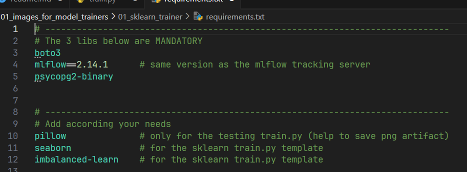
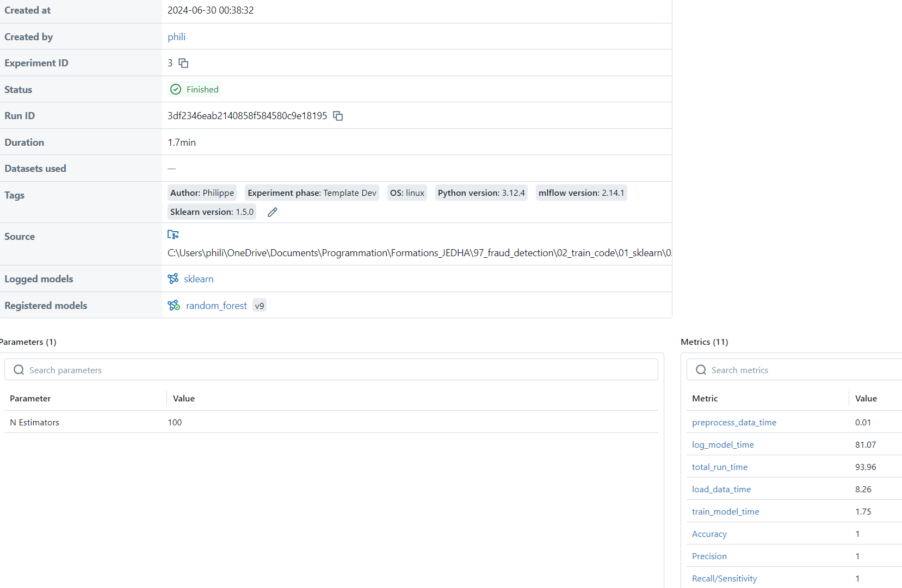
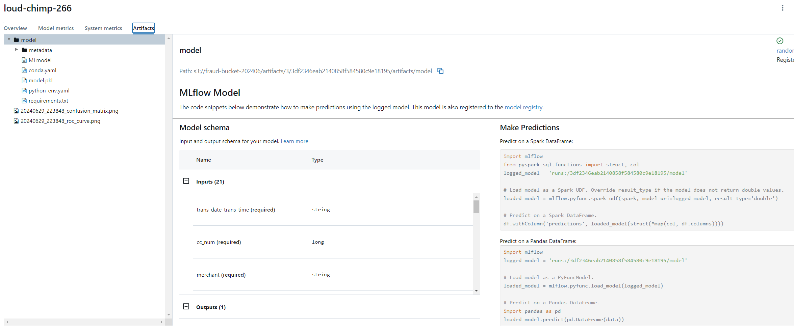
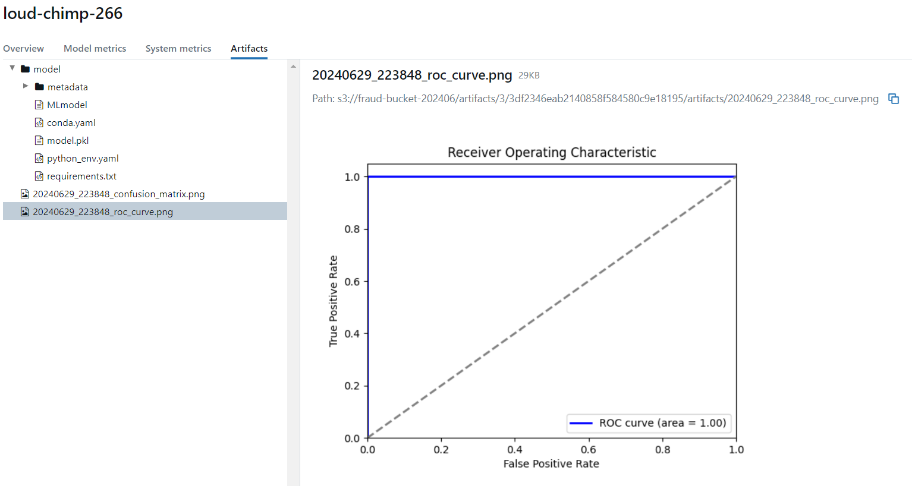
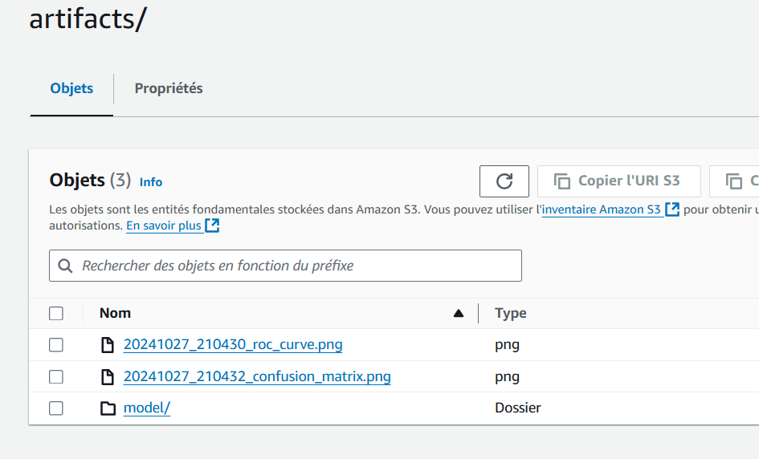
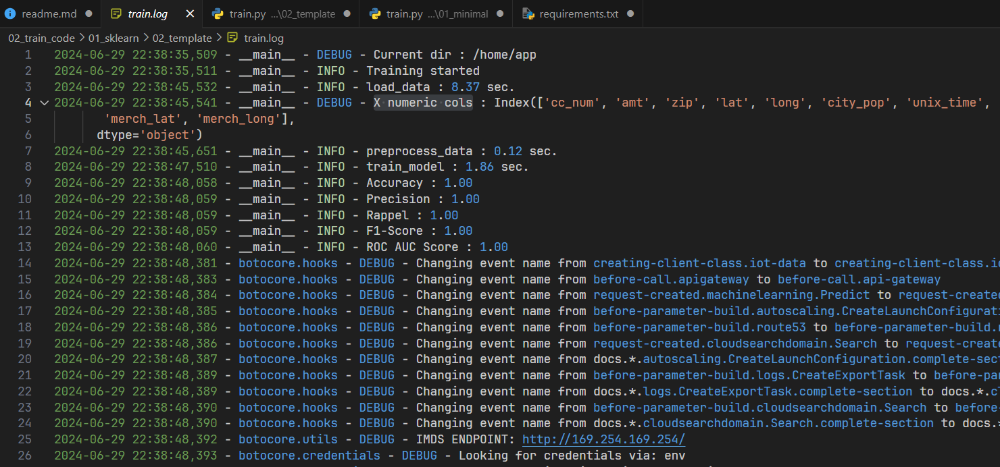

<!-- ###################################################################### -->
<!-- ###################################################################### -->
# Creating and Running a Training Script with Sklearn

This guide covers setting up a training environment using Sklearn, though similar steps would apply if using TensorFlow. Generally, you will need to:

1. Build a Docker image containing Sklearn and any additional libraries required to run the training code, `train.py`
2. Develop the training code, `train.py`


<!-- ###################################################################### -->
<!-- ###################################################################### -->
# 1. Build a Docker image
* Copy `01_images_for_model_trainers/01_minimal_trainer`.
* Paste and rename it to `01_images_for_model_trainers/02_sklearn_trainer`
* Edit the PowerShell script ``build_fraud_trainer.ps1`` and change the name of the Docker image to be created
    * Don't forget the `.` at the end of the line
    * Find below an example

```
docker build -t sklearn_fraud_trainer .
```
* Modify the `requirements.txt` file as specified below.


<p align="center">

<p>

In fact the template code use 
* seaborn which includes most of the other required lib
* SMOTE and other imblearn features which are part of imbalanced-learn

Run the `build_fraud_trainer.ps1` to create a Docker image named `sklearn_fraud_trainer`

```
.\build_fraud_trainer.ps1
docker image ls sk*     # sklearn_fraud_trainer should be listed 
```


<!-- ###################################################################### -->
<!-- ###################################################################### -->
# 2. Develop the training code


<!-- ###################################################################### -->
## 1. Duplicate the template directory

1. Duplicate the `02_train_code/01_sklearn/02_template` directory.
1. Open a terminal in the new directory 
1. Run the command 
```
./create_fresh_project.ps1
```
The `create_fresh_project.ps1` utility script, clean the directory if necessary :
   1. Delete the `./assets` directory.
   1. Delete the `./img` directory.
   1. Delete this `readme.md` file.
   1. Delete the `train.log` file.

Once `create_fresh_project.ps1` has been used it can be deleted.


<!-- ###################################################################### -->
## 2. Edit/Create the ``secrets.ps1`` file

* See below
    * `$env:AWS_ACCESS_KEY_ID` and `AWS_SECRET_ACCESS_KEY` : These values are those already used in previous versions of ``secrets.ps1``
* Make sure to update ``MLFLOW_EXPERIMENT_NAME``
* Save the file in the project directory and name it `secrets.ps1`

```
$currentDate = Get-Date -Format "yyyyMMdd"
$env:MLFLOW_EXPERIMENT_NAME = "sklearn-$currentDate"

$env:MLFLOW_TRACKING_URI    = "https://fraud-detection-2-ab95815c7127.herokuapp.com/"
$env:AWS_ACCESS_KEY_ID      = "AKI..."
$env:AWS_SECRET_ACCESS_KEY  = "vtL..."

```


<!-- ###################################################################### -->
### 3. Edit the `MLproject` file
* **IMPORTANT :** Specifies the image in which `train.py` should run,
* If needed, you pass `parameters` to the training code `train.py`. See the end of the MLproject file which is currently commented. `train.py` will need to import `argparse`

Here is the MLproject we will use :

```
name: fraud_detection 

docker_env:
  image: sklearn_fraud_trainer
  volumes: ["%cd%:/home/app"]
  environment: [ 
      "MLFLOW_TRACKING_URI", 
      "AWS_ACCESS_KEY_ID",
      "AWS_SECRET_ACCESS_KEY",
    ]
    
entry_points:
  main:
    command: "python train.py" 
```

<!-- ###################################################################### -->
## 4. Run the template training code

Open a terminal

```
.\run_training.ps1
```
* Expect to wait a minute or so.
* There is nothing magic. The code get the train data from a JEDHA's bucket with public access. We will put data on the project's bucket later.
* After the training, the MLflow tracking server can display the parameters, tags, and results (metrics)

<p align="center">

<p>

The training artifacts are also available:

<p align="center">

<p>

The model had been saved as well as confusion matrix and ROC curve (.png files). Check below :

<p align="center">

<p>

Here is what is avaible in the ``./artifacts`` directory on the project's bucket. 
<p align="center">

<p>

If needed, the local directory includes a ``train.log`` file, and the `./img` folder contains copies of the `.png` images saved as artifacts :

<p align="center">

<p>

At this point you have a solid base to develop your own ``train.py`` with your own model etc.


<!-- ###################################################################### -->
## 5. Own the source code of ``train.py``

#### Quick recap of what the baseline code do
* For the demonstration, the model is based on SMOTE and RandomForest.
* The code fetches data from an S3 disk 
* To speedup operations, the code trains the model only on 5_000 samples **NOT** the whole dataset
* It stores parameters and results on the MLflow tracking server,
* It saves the model and training artifacts on S3:
    * Including all model parameters,
    * Saves a confusion matrix and ROC AUC curve as `.png` images,
    * Creates local copies of images in a subdirectory `./img`,
        * Each image is timestamped.
* The code also sets up a logging mechanism.
* Length of every calls are benchmarked and logged 
* Optionally, you can pass parameters to ``train.py`` (the code is in place but commented)
* The code is:
    * Object-oriented,
    * About 250 lines long,


### High level point of view

Here's how the code looks when you avoid getting bogged down in details.

```python
class ModelTrainer:
    def load_data(self) :
        ...
        return data

    def preprocess_data(self, df) :
        ...
        return X_train, X_test, y_train, y_test

    def train_model(self, X_train, y_train):
        ...
        return model_pipeline

    def evaluate_model(self,model_pipeline, X_train, X_test, y_train, y_test):
        ...
        return

    def log_tags_and_parameters(self):
        ...
        return

    def log_model(self, model_pipeline, X_train, y_train):
        ...
        return

    def run(self):
        with mlflow.start_run():
            self.log_tags_and_parameters()
            df = self.load_data()
            X_train, X_test, y_train, y_test = self.preprocess_data(df)
            model_pipeline = self.train_model(X_train, y_train)
            self.evaluate_model(model_pipeline, X_train, X_test, y_train, y_test)
            self.log_model(model_pipeline, X_train, y_train)

if __name__ == "__main__":
    trainer = ModelTrainer()
    trainer.run()

```
In plain English this means :
* The code start by creating an object of type ModelTrainer
* It then call the ``.run()`` method of the object
* The ``.run()`` method is the place where most of the job is done. It calls the other method
    * ``.load_data()``
    * ``.preprocess_data()``
    * ``.train_model()`` 
    * ``.evaluate_model()`` 
    * ``.log_model()``


### Modify `train.py`

The methods of the class are based on the same pattern :

```python
# -----------------------------------------------------------------------------
    def new_method(self, param1, param2) :
        start_time = time.time()

        # Do what needs to be done here

        mlflow.log_metric("new_method_time", round(time.time() - start_time, 2))
        logger.info(f"new_method : {round(time.time() - start_time, 2)} sec.")
        return return_value
```
* The code of interrest (the comment in the code above) is surrounded with lines which measures execution time. 
* Execution time is then logged in the log file and as a training metric on the MLflow tracking server.

Having all this in mind one of the method you might be tempted to modify is `train_model()`. The code looks like this :

```python
def train_model(self, X_train: pd.DataFrame, y_train: pd.Series) -> ImbPipeline:
    start_time = time.time()

    model_pipeline: ImbPipeline = ImbPipeline(
        steps=[
            ("scaler", StandardScaler()),
            ("smote", SMOTE(random_state=42)),
            (
                "classifier",
                RandomForestClassifier(n_estimators=k_N_Estimators, random_state=42, class_weight="balanced"),
            ),
        ]
    )

    model_pipeline.fit(X_train[self.numeric_columns], y_train)

    mlflow.log_metric("train_model_time", round(time.time() - start_time, 2))
    logger.info(f"train_model : {round(time.time() - start_time, 2)} sec.")
    return model_pipeline
```
To highlight what's importnat it can be view as :

```python
def train_model(self, X_train: pd.DataFrame, y_train: pd.Series) -> ImbPipeline:
    #...
    model_pipeline: ImbPipeline = ImbPipeline(
        steps=[
            ("scaler", StandardScaler()),
            ("smote", SMOTE(random_state=42)),
            (
                "classifier",
                RandomForestClassifier(...),
            ),
        ]
    )
    model_pipeline.fit(X_train[self.numeric_columns], y_train)
    # ...
    return model_pipeline
```

* The core of the method is a pipeline of type ImbPipeline 
* The pipelin includes the processing and the model
* It is then followed by a `.fit()` call
* The method return the fitted model_pipeline 


### My recommendation
* Even if the code of ``train.py`` is executed in a Docker image, it might smart to install in the local Python virtual environment the libraries required by mypy in order to check the datatypes effectively
* For example in order to support the type `ImbPipeline` I had to install ``imbalanced-learn``

```bash
conda install imbalanced-learn
```


<!-- ###################################################################### -->
<!-- ###################################################################### -->
# What's next ?
* Go to the directory `03_producer` and read the [README.md](../../../03_producer/README.md) file. 
    * The previous link to the next README.md to read may not work on GitHub but it works like a charm locally in VSCode or a Web browser.


<!-- 
Next steps:
* If your model uses parameter values (`n_estimators`, `C`, `gamma`, etc.), you can:
    1. Declare these as constants at the top of the source code, like `k_N_Estimators = 100`,
    2. Log these parameters in the `log_tags_and_parameters()` method. See this example: `mlflow.log_param("N Estimators", k_N_Estimators)`.
* If your training requires additional tags, follow the same approach:
    1. Define the constant at the start of the source code,
    2. Save the tag in the `log_tags_and_parameters()` method,
    3. For example, update `k_Author` with your own name.
-->
