# Introduction

In the [fraud_detection_2 project](https://github.com/40tude/fraud_detection_2), the ``Consume Data`` block, the yellow rectangle, is positioned between the "real-time" data producer and MLflow.

<p align="center">

<p>


Ce document aborde trois sujets :
1. Design : Architecture et fonctionnement du bloc ``Consume Data``
1. Design : Le format des documents échangés aux différentes interfaces de l'application `fraud_detection_2`  
1. Technique : Mise en oeuvre d'un Topic Kafka dans `fraud_detection_2`


# 1. Architecture et fonctionnement du bloc ``Consume Data``

Le bloc `Consume Data` du schéma précédent va s'organiser autour de deux topics et on va jouer sur la capacité de ces derniers à stocker de la données (backlog) pour rendre le système résilient. 

<p align="center">
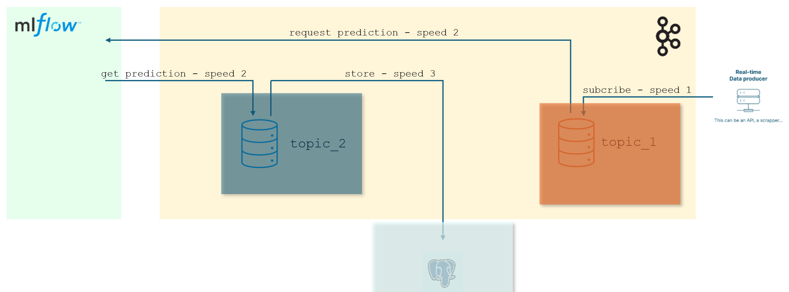
<p>

1. À droite, on déverse à la vitesse ``speed_1`` dans ``topic_1`` les transactions simulées issues du ``Real-time Data producer``. 
    * Si jamais la connexion avec le ``Real-time Data producer`` et que le système ne reçoit plus de nouvelle transaction cela ne doit pas être une raison pour arrêter l'ensemble de l'application. 
    * Ce dernier est résilient, il continue de fonctionner. Tant qu'il y a des données dans `topic_1`, il continue à le vider à la vitesse ``speed_2`` et à demander des prédictions au modèle (MLflow). 
    * Ainsi, si une transaction frauduleuse se trouve dans ``topic_1``, elle est détectée "au plus vite" et une alarme est déclenchée. 
    * Encore une fois, ce n'est pas parce qu'on a perdu la connexion avec le ``Real-time Data producer`` que tout s'arrête. Le système fait "au mieux". 
    * Ce point est **très important** : Quoiqu'il arrive, l'application doit tout faire pour consommer les transactions reçues afin de pouvoir faire des prédictions et sonner l'alarme le cas échéant.

1. Quand les transactions ont été lues à la vitesse ``speed_2`` dans ``topic_1`` puis envoyées au modèle, les prédictions sont déversées dans ``topic_2`` à la vitesse ``speed_2``. Enfin, ``topic_2`` est vidé à la vitesse ``speed_3`` pour alimenter la base de données. 
    * Là aussi, cette désynchronisation permet d'avoir un système plus résilient. Même si on perd la connexion avec la base, tout le reste (récupération des transactions, demandes de prédictions, remplissage de `topic_2`, émission d'alarmes) continue de tourner "au mieux" (certains pourraient parler de mode dégradé). 

## Note
Ci-dessus on indique que le modèle recoit des demandes et emet des prédictions à la vitesse ``speed_2``. C'est pour simplifier les explications et faire ressortir que la vitesse de prédiction est différente de la vitesse d'acquisition des transactions et de la vitesse de stockage dans la base de données. 

En toute rigueur, rien n'empêche que la vitesse des demandes de prédictions soit différente de la vitesse de stockage dans la base.
* Cela pourrait être le cas si le modèle étant distribué, certaines instances sont plus lentes que d'autres. Momentanément, les vitesses de récupération des prédictions seraient différentes de la vitesse de stockage dans la base de données.
* Un autre cas pourrait apparaître si au lieu de lire dans `topic_1` un enregistrement à la fois, le consommateur qui alimente le modèle (MLflow) lit plusieurs enregistrements à la fois. On peut imaginer plusieurs scénarios : 
    * Le consommateur demande à lire dans `topic_1` la moitié des enregistrements disponibles
    * Le consommateur demande à lire un 4 enregistrements à la fois car il "sait" que les predictions vont se faire sur 4 modèles qui tournent sur des process en parallèle 
    * etc.


Une raison supplémentaire, peut être un peu plus plus subtile, incite à mettre en oeuvre 2 topics dans le bloc `Consume Data`. Elle concerne la résilience du système vis à vis du format des documents échangés.


# 2. Format des documents échangés aux différentes interfaces de l'application `fraud_detection_2`

Si on prend du recul par rapport au schéma de fonctionnenent ci-dessous on observe que le système manipule trois types de documents susceptibles d'évoluer dans le temps. 

Il est donc important d'anticiper ce qui va arriver afin de rendre le module `Consume Data` résilient

<p align="center">

<p>

 Les trois types document sont :
 1. Les transactions bancaires reçues du bloc ``Real-time Data producer``
 1. Les informations fournies au modèle pour qu'il réalise ses prédictions
 1. Les informations stockées dans le base de données

 ## Exemples
 
* À droite, rien n'assure que le format des transactions bancaires reste stable dans le temps. Pas sûr non plus que le format d'aujourd'hui corresponde exactement au format attendu par le modèle pour faire des prédictions. Une transaction pourrait, par exemple, comporter plus de features que nécessaire. On a 2 alors options :
    1. On stocke telles quelles les transactions dans ``topic_1`` mais on les filtre avant de les envoyer au modèle.
    1. On filtre à l'entrée et on stocke dans ``topic_1`` des transcations au format attendu par le modèle.
* Il est important de noter qu'avec une architecture à deux topics, ce qui se passe autour de ``topic_1`` reste transparent pour le reste du bloc `Consume Data`. Si il faut reprendre le code en charge des écritures/lectures dans `topic_1` on ne touche pas au code en charge des écritures/lectures dans `topic_2`
* Il en va de même si les utilisteurs de la bases de données demandent à ce que des features supplémentaires soient enregistrées (version du modèle qui a fait les prédictions, heure de la prédiction...). Là aussi, si il faut reprendre le code en charge des écritures/lectures dans `topic_2` cela n'a pas d'impact sur le code en charge des écritures/lectures dans `topic_1`


## ``topic_1`` : Format des transcations temps-réel et du jeu d'entrainement 

Dans le fichier `data\fraud_test.csv` qu'on utilise pour entrainer le modèle, les observations ont le format ci-dessous : 
* Il y a 23 colonnes
* La première n'a pas de titre (`empty` ci-dessous) c'est juste un indice

| empty | trans_date_trans_time  | cc_num          | merchant             | category       | amt  | first | last    | gender | street            | city     | state | zip   | lat     | long     | city_pop | job                  | dob         | trans_num                          | unix_time   | merch_lat | merch_long  | is_fraud |
|------|-------------------------|-----------------|----------------------|----------------|------|-------|---------|--------|-------------------|----------|-------|-------|---------|----------|----------|----------------------|-------------|-------------------------------------|-------------|-----------|-------------|----------|
| 0    | 2020-06-21 12:14:25    | 2291163933867244| fraud_Kirlin and Sons | personal_care | 2.86 | Jeff  | Elliott | M      | 351 Darlene Green | Columbia | SC    | 29209 | 33.9659 | -80.9355 | 333497   | Mechanical engineer  | 1968-03-19  | 2da90c7d74bd46a0caf3777415b3ebd3   | 1371816865  | 33.986391 | -81.200714  | 0        |

Un test rapide (voir `99_tooling\02_API_test\quick_test.ipynb`) montre que les transactions bancaires simulées reçues du bloc ``Real-time Data producer`` ont le format suivant :

```python
# Sous forme de dictionnaire
{"columns":["cc_num","merchant","category","amt","first","last","gender","street","city","state","zip","lat","long","city_pop","job","dob","trans_num","merch_lat","merch_long","is_fraud","current_time"],"index":[301199],"data":[[4497913965512794052,"fraud_Berge, Kautzer and Harris","personal_care",60.16,"Scott","Edwards","M","838 Amy Street Suite 107","Pembroke","NC",28372,34.6902,-79.1834,14783,"Hospital doctor","1955-11-07","3cb54a489fb351f73a7db98f6c7bb1ad",34.38451,-78.621062,0,1730134684025]]}
```
Sous forme de tableau on observe que :
* Il y a 21 colonnes. Il manque : 
    * l'indice
    * la feature `trans_date_trans_time` (on peut la reconstruire sans doute avec la feature `current_time`)
* Certains noms sont différents (`unix_time` vs `current_time` par exemple)
* L'ordre des features n'est pas le même que celui du jeu d'entrainement
 

| cc_num           | merchant                    | category       | amt   | first | last    | gender | street                   | city     | state | zip   | lat     | long     | city_pop | job             | dob        | trans_num                         | merch_lat | merch_long | is_fraud | current_time  |
|------------------|-----------------------------|----------------|-------|-------|---------|--------|--------------------------|----------|-------|-------|---------|----------|----------|-----------------|------------|-----------------------------------|-----------|------------|----------|---------------|
| 4497913965512794052 | fraud_Berge, Kautzer and Harris | personal_care | 60.16 | Scott | Edwards | M      | 838 Amy Street Suite 107 | Pembroke | NC    | 28372 | 34.6902 | -79.1834 | 14783    | Hospital doctor | 1955-11-07 | 3cb54a489fb351f73a7db98f6c7bb1ad | 34.38451  | -78.621062 | 0        | 1730134684025 |


### Décision concernant ``topic_1``
* Avant de sauvegarder les transactions issues du bloc ``Real-time Data producer`` dans ``topic_1`` nous allons les transformer pour qu'elles correspondent à celles du jeu d'entrainement 


## ``topic_2`` : Format des prédictions et des enregistrements dans la base de données 

Revenons à l'architecture globale de l'application 

<p align="center">

<p>

* À gauche, dans le bloc ``Build algorithm`` on voit que le modèle est entrainé avec un jeu de données d'entrainement (feuille ``.csv``)
* Sous le bloc ``Build algorithm`` il y a un jeu complémentaire de données. Ce jeu est un jeu de données qui ont été validé. Typiquement ce sont des transactions issues de la base de données qui ont fait l'objet de vérification. Dit autrement, dans la base de données, il y a une feature supplémentaire (`fraud_confirmed`) dans laquelle il peut y avoir : 
    1. Rien : la transaction n'a pas fait l'objet de vérification et donc, on ne sait pas
    1. `1` : la transaction a fait l'objet d'une vérification et un enquêteur confirme qu'il s'agit d'une fraude
    1. `0` : la transaction a fait l'objet d'une vérification et un enquêteur confirme qu'il ne s'agit pas d'une fraude  
* On sait déjà que les transactions classées comme frauduleuses auront fait l'objet d'une vérification. Autant en profiter pour réutiliser cette information et permettre au modèle de s'entrainer sur plus de données que celles du jeu d'entrainement initial.
* De plus, l'idée est que sous réserve que l'on investisse dans la vérification de certaines transactions "non frauduleuses", on enrichisse le jeu de données d'entrainement avec des données récentes.

### Décision concernant ``topic_2``
* On sauvegarde dans ``topic_2`` des enregistrements qui ont le même format que ceux de ``topic_1``
* La feature `is_fraud` contient la prédiction du modèle 
* On sauvegarde dans la base de données des enregistrements qui ont le même format que ceux de ``topic_2`` **plus** une feature `fraud_confirmed` qui est vide par défaut
* Quand une alarme pour fraude est déclenchée une investigation est initiée. Quand cette dernière est terminée, dans la base de données, le champs `fraud_confirmed` de la transaction est mis à jour (il contient alors `1` ou ``0``) 
* Si une transcation prédite comme non frauduleuse fait l'objet d'une vérification. À la fin de l'enquête, dans la base de données, le champs `fraud_confirmed` de la transaction est mis à jour (il contient alors `1` ou ``0``)
* Quotidiennenemt 
    1. On extrait de la base de données toutes les transactions dont la feature `fraud_confirmed` n'est pas vide
    1. On supprime la feature ``is_fraud`` (qui contient la prédiction qui avait été faite par le modèle) 
    1. On renomme la feature `fraud_confirmed` en ``is_fraud``
    1. On sauvegarde les observations sur le bucket S3 dans un fichier ``validated.csv``
    1. Lors du prochain entrainement on ajoute au jeu de données d'entrainement le contenu du fichier ``validated.csv``


# 3. Mise en oeuvre d'un topic Kafka

On s'interresse au topic dans lequel un producteur va déposer des transactions bancaires simulées qu'il a récupéré auprès du "Real-time Data producer"

<p align="center">
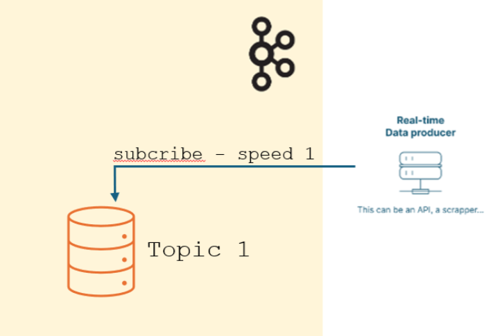
<p>

## Créer un topic

* Se connecter sur le site [Confluent](https://confluent.cloud/home) 
* Ajouter un Cluster

<p align="center">
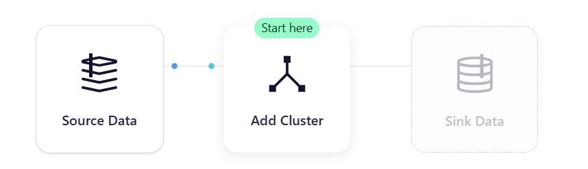
<p>

* Choisir une prestation Basic

<p align="center">
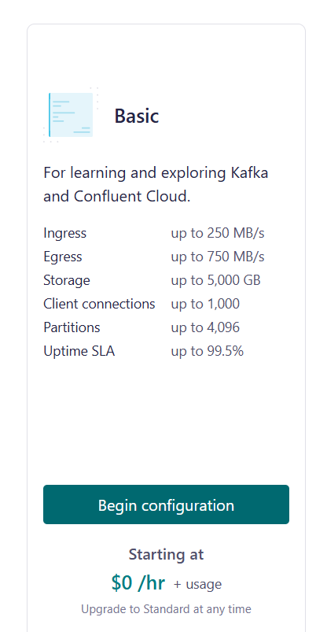
<p>

* Ensuite, comme ``fraud_detection_2`` utilise déjà un bucket S3 sur AWS, je choisi AWS de nouveau. 
* **ATTENTION :** il est important de choisir une région à laquelle nous avons le droit d'accèder. 
    * Par exemple le bucket que l'on utilise pour stocker les artefacts du MLflow Tracking Server est dans la région ``eu-west-3``. 
    * Je prends donc soin de choisir cette région.

<p align="center">
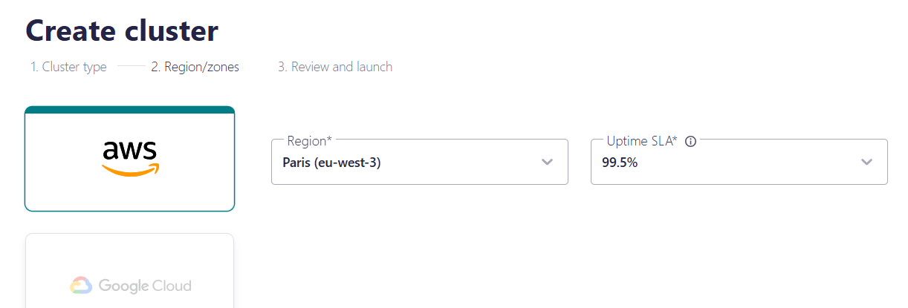
<p>


<p align="center">
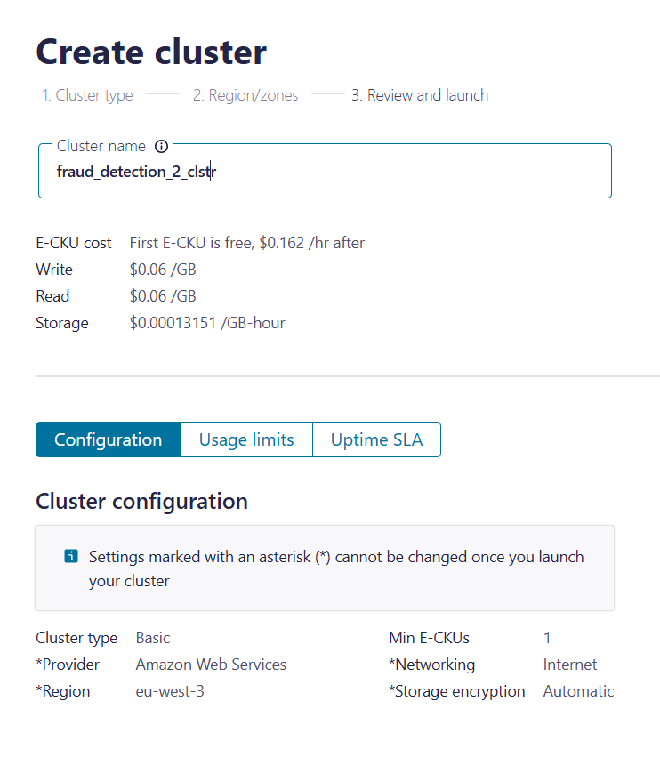
<p>

* Quand le cluster est créé, il faut générer les clés pour utiliser l'API.
* Si vous êtes perdu dans l'interface de la page Web, cliquez sur "Home" puis sur "Cluster"

<p align="center">
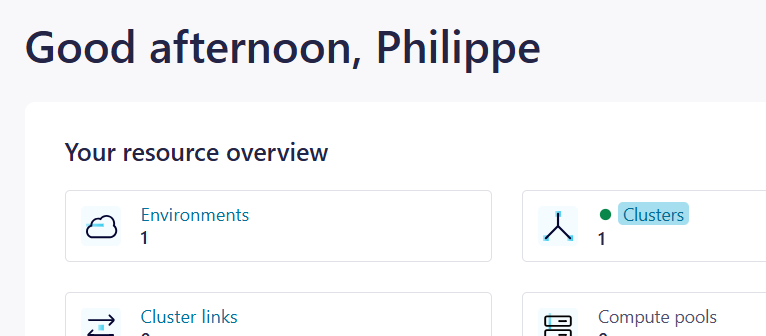
<p>

* Choisissez `fraud_detection_2_clstr` dans la liste des clusters

<p align="center">
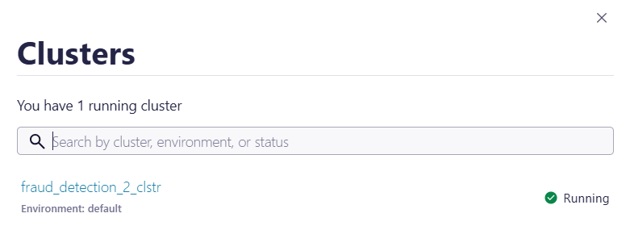
<p>

* Enfin il faut cliquer sur API (colonne à gauche)
<p align="center">
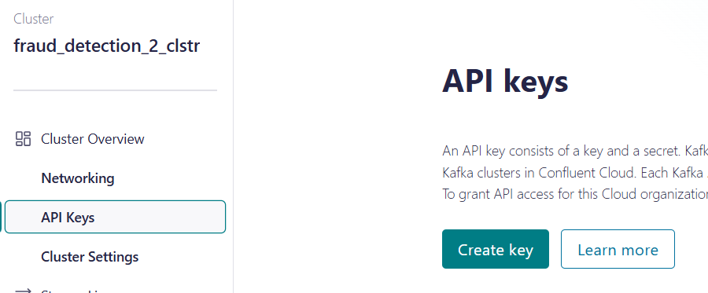
<p>

<p align="center">
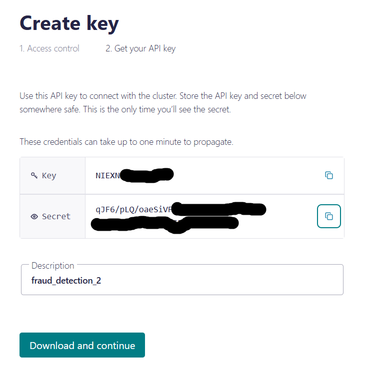
<p>


* Mettre la ``Key`` et le ``Secret`` de côté dans un fichier ``secrets.ps1``
* Le fichier ``secrets.ps1`` est à créer dans le répertoire du module, à côté de ce fichier ``README.md``. 
* Comme le fichier ``.gitignore`` empêche les fichiers ``secrets.ps1`` de se retrouver sur GitHub,  on est tranquille.
* Voilà ce à quoi doit ressembler le fichier ``secrets.ps1``

```powershell
$env:SASL_USERNAME = "6KQ..."
$env:SASL_PASSWORD = "zBV..."

```

* Cliquez sur le bouton "Download and continue" 
* Le fichier du type `api-key-6KQxxxxx.txt` peut être supprimé une fois téléchargé.


## Créer un producteur

* C'est un code Python qui récupère des transactions bancaires simulées auprès du "Real-time Data producer" et les dépose dans ``topic_1`` 
* Il produit des données dans la mesure où il les dépose dans le topic
* Ce code doit possèder les crédentials qui vont lui permettre d'accèder à ``topic_1``

<p align="center">

<p>


* Revenir sur la page de `fraud_detection_2_clstr` puis cliquez sur "Set up client"

<p align="center">

<p>

* Choisissez un langage
* Si un formulaire demande le nom du topic, sasissez `topic_1`

<p align="center">

<p>


<p align="center">
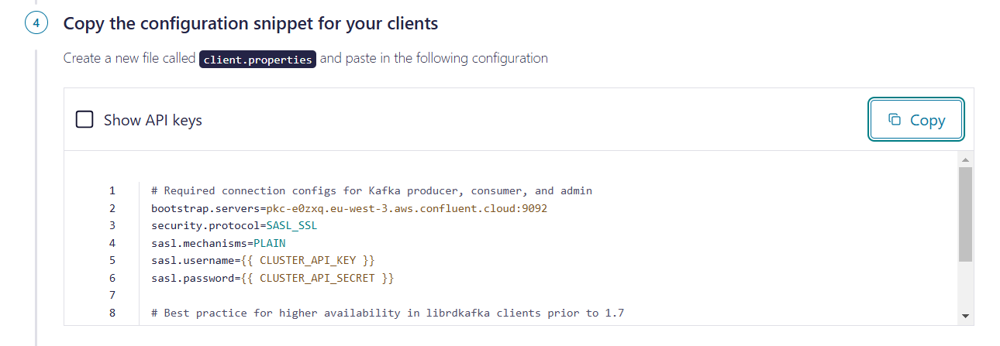
<p>


* Sur la page web on nous propose de sauvegarder un fichier `clients.properties` qui contient la ``Key`` et le ``Secret`` en clair (ou qu'il faudra saisir plus tard en clair dans le fichier `clients.properties` en question)
* **IMPORTANT** : Une fois que le fichier `clients.properties` est sauvegardé dans le répertoire du projet, éditez-le et supprimez les 2 lignes ci-dessous :

```
sasl.username=6KQ...
sasl.password=zBV...
```

* En effet, `$env:SASL_USERNAME` et `$env:SASL_PASSWORD` ont déjà été sauvegardées dans un fichier `secrets.ps1`


## Tester le producteur 

* Pour tester le producteur il faut :
    1. Ouvrir un terminal dans le réperoire
    1. Lancer l'image Docker en mode interactif via le script `run_confluent_image.ps1`

```powershell
./run_confluent_image.ps1
```


<p align="center">
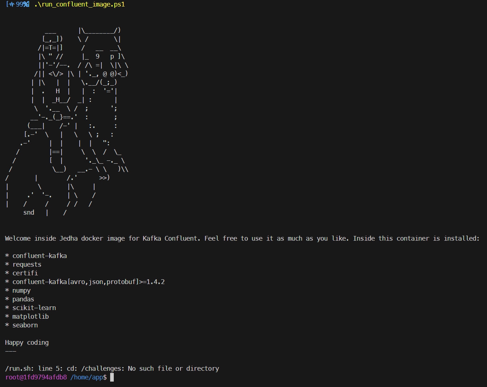
<p>

* Quand le prompt Linux est à l'écran, on lance le code du producteur proprement dit

```bash
python test_producer02.py 
```

<p align="center">
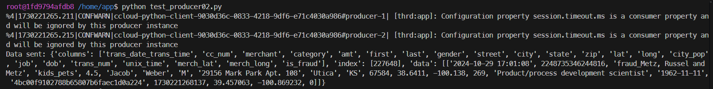
<p>

* Compte tenu de la vitesse du ``Real-time Data producer``, le code  affiche des transactions toutes les 15 secondes.
* Pour arrêter le code, appuyez sur ``CTRL+C`` dans la console Linux. 
* Pour revenir sous PowerShell, tapez `exit` au prompt Linux.


## It's a kind of magic...
Le but du jeu ici est d'expliquer comment se déroule le démarrage du producteur et comment la ``Key`` et le ``Secret`` de l'API Confluent passent de PowerShell à Linux.

### Le script `run_confluent_image.ps1`

```powershell
. "./secrets.ps1"
docker run -it -v "$(pwd):/home/app" -e SASL_USERNAME="$env:SASL_USERNAME" -e SASL_PASSWORD="$env:SASL_PASSWORD" jedha/confluent-image bash

```

* Le script commence par s'assurer que le script `secrets.ps1` est bien exécuté
* Côté Windows, c'est l'exécution du script `secrets.ps1` qui définit les 2 variables d'environnements `$env:SASL_USERNAME` et `$env:SASL_PASSWORD`
* Une fois ces deux variables en place, le script ``run_confluent_image.ps1`` les transmet à l'image Docker (via la ligne de commande)
* Une fois lancée, cette dernière peut accèder à un volume qui pointe sur le répertoire courant et elle reste en mode interactif avec un prompt de type ``bash``


### La fonction `read_ccloud_config()` du fichier `ccloud_lib`. 

Dans le cadre du projet `fraud_detection_2` cette dernière a été modifiée afin de :
1. Lire le fichier ``client.properties`` 
1. Récupérer le contenu des variables d'environnement ``SASL_USERNAME`` et `SASL_PASSWORD`

```python
def read_ccloud_config(config_file: str) -> dict:
    """Read Confluent Cloud configuration for librdkafka clients"""

    conf = {}
    with open(config_file) as fh:
        for line in fh:
            line = line.strip()
            if len(line) != 0 and line[0] != "#":
                parameter, value = line.strip().split("=", 1)
                conf[parameter] = value.strip()

    sasl_username = os.getenv("SASL_USERNAME")
    sasl_password = os.getenv("SASL_PASSWORD")

    # Check if environment var are defined
    if not sasl_username or not sasl_password:
        raise EnvironmentError(
            "The SASL_USERNAME or SASL_PASSWORD environment variables are not defined."
        )

    # Get credentials from environment variables
    conf["sasl.username"] = sasl_username
    conf["sasl.password"] = sasl_password

    # conf['ssl.ca.location'] = certifi.where()

    return conf
```

### Le code du producteur ``test_producerXY.py`` 

Bien voir la définition des "constantes" ci-dessous au tout début du code.   

```python
k_Topic = "topic_1"
k_Client_Prop = "client.properties"
k_RT_Data_Producer = "https://real-time-payments-api.herokuapp.com/current-transactions"
```