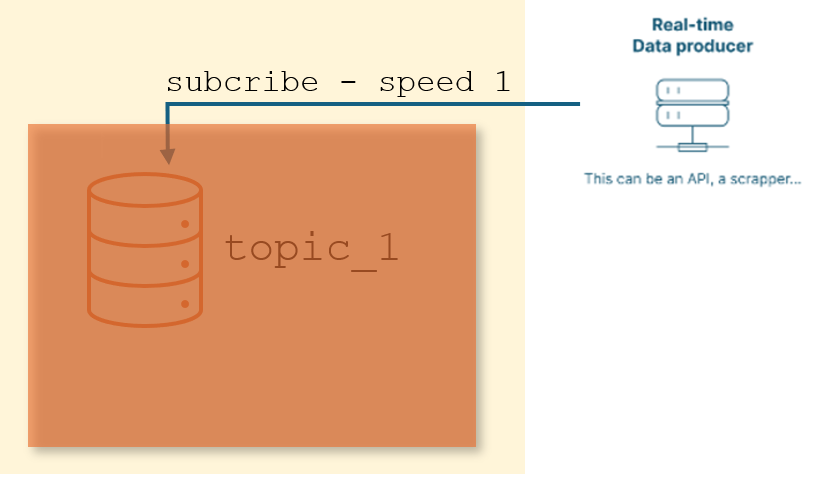
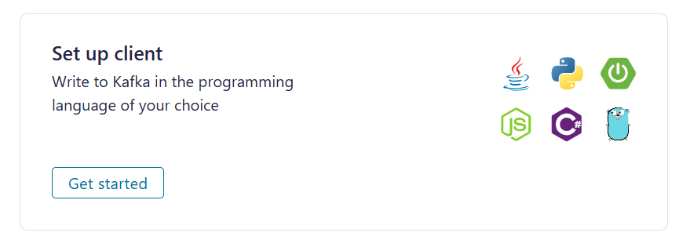
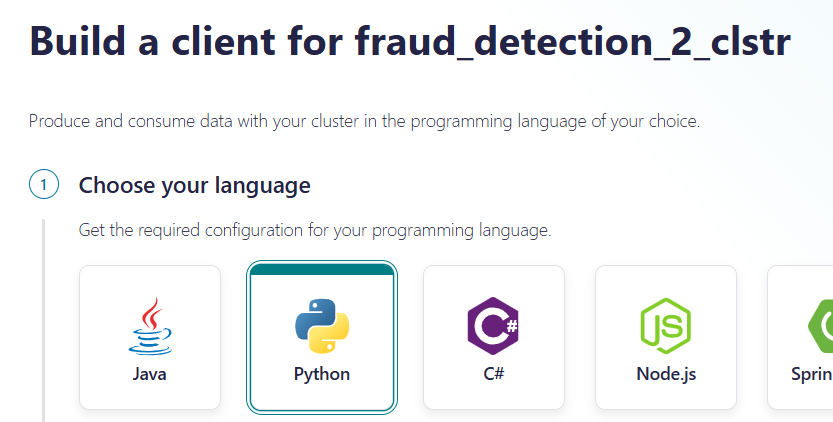

# Introduction

In the [fraud_detection_2 project](https://github.com/40tude/fraud_detection_2), this block, the yellow rectangle, is positioned between the "real-time" data producer and MLflow.

<p align="center">

<p>


Ce document aborde trois sujets :
1. Design : Architecture et fonctionnement du block ``Consume Data``
1. Design : Le format des documents échangés aux interfaces de l'application `fraud_detection_2`  
1. Technique : Mise en oeuvre d'un Topic Kafka dans `fraud_detection_2`


---
# Architecture et fonctionnement du block ``Consume Data``

<!-- 1. Pour le reste, à ce jour (05/07/24), il n'est pas interdit d'être malin et de faire des demandes de prédictions par batch. Typiquement, lors de la première prédiction faut rapatrier le modèle sélectionné (lent) puis faire des prédictions (rapide). Ensuite quand il faut faire de nouvelles prédiction, sous réserve que le modèle à utiliser reste le même, il suffit de faire faire des prédictions (il n'y a plus de modèle à rapatrier, c'est donc très rapide) -->

<!-- Il faut aussi anticiper l'arrivée de Kafka et de ses "topics".  -->

Le bloc `Consume Data` du schéma précédent va s'organiser autour 2 topics et on va jouer sur la capacité de ces derniers à stocker de la données (backlog) pour rendre le système résilient. 

<p align="center">

<p>

1. À droite, on déverse à la vitesse ``speed_1`` dans ``topic_1`` les transactions simulées issues du ``Real-time Data producer``. 
    * Si jamais on perd la connexion avec ce dernier et que le système ne reçoit plus de nouvelle transaction à vérifier cela ne doit pas être une raison pour arrêter le système. 
    * Ce dernier est résilient. Il continue à tourner, il continue à vider ``topic_1`` à la vitesse ``speed_2`` et à demander des prédictions au modèle (MLflow). 
    * Ainsi, si une transaction frauduleuse se trouve dans ``topic_1``, elle est détectée "au plus vite" et une alarme est déclenchée. 
    * Encore une fois, ce n'est pas parce qu'on a perdu la connexion avec le ``Real-time Data producer`` que tout s'arrête. Le système fait "au mieux". 
    * Ce point est **très important** : Quoiqu'il arrive, l'application doit tout faire pour consommer les transactions reçues afin de pouvoir faire des prédictions et sonner l'alarme le cas échéant.

1. Quand les transactions ont été lues à la vitesse ``speed_2`` dans ``topic_1`` puis envoyées au modèle, les prédictions sont déversées dans ``topic_2`` à la vitesse ``speed_2``. Enfin, ``topic_2`` est vidé à la vitesse ``speed_3`` pour alimenter la base de données. 
    * Là aussi, cette désynchronisation permet d'avoir un système plus résilient. Même si on perd la connexion avec la base, tout le reste (récupération des transactions, demandes de prédictions, alarmes) continue de tourner "au mieux" (certains pourraient parler de mode dégradé). 

## Note
Ci-dessus on indique que le modèle recoit des demandes et emet des prédictions à la vitesse ``speed_2``. C'est pour simplifier les explications et faire ressortir que la vitesse de prédiction est différente de la vitesse d'acquisition des transactions bancaire et de la vitesse du stockage des prédictions dans la base de données. En toute rigueur, rien n'empêche que la vitesse des demandes de prédictions soit différente de la vitesse de stockage. Cela pourrait être le cas si le modèle étant distribué, certaines instances sont plus lentes que d'autres. Momentanément, les vitesses d'alimentation du modèle et de récupération des prédictions seraient différentes.


Une raison supplémentaire, peut être un peu plus plus subtile, incite à mettre en oeuvre 2 topics dans le bloc `Consume Data`. Elle concerne la résilience du système vis à vis du format des documents échangés.


---
# Format des documents échangés aux interfaces de l'application `fraud_detection_2`

Si on prend du recul par rapport au schéma de fonctionnenent ci-dessous on observe que le système manipule trois types de documents susceptibles d'évoluer dans le temps. 

Il est donc important d'anticiper ce qui va arriver afin de rendre le module `Consume Data` résilient

<p align="center">

<p>

 * Les trois types document sont:
    1. Les transactions bancaires reçues du bloc ``Real-time Data producer``
    1. Les informations fournies au modèle pour qu'il réalise ses prédictions
    1. Les informations stockées dans le base de données

 ## Exemples
 
* À droite, rien n'assure que le format des transactions bancaires reste stable dans le temps. Pas sûr non plus que le format d'aujourd'hui corresponde exactement au format attendu par le modèle pour faire des prédictions. Une transaction pourrait, par exemple, comporter plus de features que nécessaire. On a 2 alors options :
    1. On stocke telles quelles les transactions dans ``topic_1`` mais on les filtre avant de les envoyer au modèle.
    1. On filtre à l'entrée et on stocke dans ``topic_1`` des transcations au format attendu par le modèle.
* Il est important de noter qu'avec une architecture avec deux topics, ce qui se passe autour de ``topic_1`` reste transparent pour le reste du bloc `Consume Data`. Si il faut reprendre le code en charge des écritures/lectures dans `topic_1` on ne touche pas au code en charge des écritures/lectures dans `topic_2`
* Il en va de même si les utilisteurs de la bases de données demandent à ce que des features supplémentaires soient enregistrées. Là aussi, si il faut reprendre le code en charge des écritures/lectures dans `topic_2` cela n'a pas d'impact sur le code en charge des écritures/lectures dans `topic_1`


## ``topic_1`` : Format des transcations temps-réel et du jeu d'entrainement 

Dans le fichier `data\fraud_test.csv` qu'on utilise pour entrainer le modèle, les observations on le format ci-dessous : 
* Il y a 23 colonnes
* La première n'a pas de titre (`empty`) c'est juste un indice

| empty | trans_date_trans_time  | cc_num          | merchant             | category       | amt  | first | last    | gender | street            | city     | state | zip   | lat     | long     | city_pop | job                  | dob         | trans_num                          | unix_time   | merch_lat | merch_long  | is_fraud |
|------|-------------------------|-----------------|----------------------|----------------|------|-------|---------|--------|-------------------|----------|-------|-------|---------|----------|----------|----------------------|-------------|-------------------------------------|-------------|-----------|-------------|----------|
| 0    | 2020-06-21 12:14:25    | 2291163933867244| fraud_Kirlin and Sons | personal_care | 2.86 | Jeff  | Elliott | M      | 351 Darlene Green | Columbia | SC    | 29209 | 33.9659 | -80.9355 | 333497   | Mechanical engineer  | 1968-03-19  | 2da90c7d74bd46a0caf3777415b3ebd3   | 1371816865  | 33.986391 | -81.200714  | 0        |

Un test rapide (voir `99_tooling\02_API_test\quick_test.ipynb`) montre que les transactions bancaires simulées reçues du bloc ``Real-time Data producer`` ont le format suivant :

```python
# Sous forme de dictionnaire
{"columns":["cc_num","merchant","category","amt","first","last","gender","street","city","state","zip","lat","long","city_pop","job","dob","trans_num","merch_lat","merch_long","is_fraud","current_time"],"index":[301199],"data":[[4497913965512794052,"fraud_Berge, Kautzer and Harris","personal_care",60.16,"Scott","Edwards","M","838 Amy Street Suite 107","Pembroke","NC",28372,34.6902,-79.1834,14783,"Hospital doctor","1955-11-07","3cb54a489fb351f73a7db98f6c7bb1ad",34.38451,-78.621062,0,1730134684025]]}
```
Sous forme de tableau on observe que :
* Il y a 21 colonnes. Il manque : 
    * l'indice
    * la feature `trans_date_trans_time` (on peut la reconstruire sans doute avec la feature )
* Certains noms sont différents (`unix_time` vs `current_time` par exemple)
* L'ordre des features n'est pas le même que celui du jeu d'entrainement
 

| cc_num           | merchant                    | category       | amt   | first | last    | gender | street                   | city     | state | zip   | lat     | long     | city_pop | job             | dob        | trans_num                         | merch_lat | merch_long | is_fraud | current_time  |
|------------------|-----------------------------|----------------|-------|-------|---------|--------|--------------------------|----------|-------|-------|---------|----------|----------|-----------------|------------|-----------------------------------|-----------|------------|----------|---------------|
| 4497913965512794052 | fraud_Berge, Kautzer and Harris | personal_care | 60.16 | Scott | Edwards | M      | 838 Amy Street Suite 107 | Pembroke | NC    | 28372 | 34.6902 | -79.1834 | 14783    | Hospital doctor | 1955-11-07 | 3cb54a489fb351f73a7db98f6c7bb1ad | 34.38451  | -78.621062 | 0        | 1730134684025 |


### Décision concernant ``topic_1``
* Avant de sauvegarder les transactions issues du bloc ``Real-time Data producer`` dans ``topic_1`` nous allons les transformer pour qu'elles correspondent à celles du jeu d'entrainement 


## ``topic_2`` : Format des prédictions et des enregistrements dans la base de données 

Revenons à l'architecture globale de l'application 

<p align="center">

<p>

* À gauche, dans le bloc ``Build algorithm`` on voit que le modèle est entrainé avec un jeu de données d'entrainement (feuille ``.csv``)
* Sous le bloc ``Build algorithm`` il y a un jeu de données complémentaires. Ce jeu est un jeu de données validé. Typiquement ce sont des transactions issues de la base de données qui ont fait l'objet de vérification. Dit autrement, dans la base de données, il y a une feature supplémentaire (`is_fraud`) dans laquelle il peut y avoir : 
    1. Rien : la transaction n'a pas fait l'objet de vérification et donc, on ne sait pas
    1. `1` : la transaction a fait l'objet d'une vérification et un enquêteur confirme qu'il s'agit d'une fraude
    1. `0` : la transaction a fait l'objet d'une vérification et un enquêteur confirme qu'il ne s'agit pas d'une fraude  
* Dans tous les cas, les transactions qui auront été prédites comme frauduleuses auront fait obligatoirement l'objet d'une vérification. Autant en profiter pour réutiliser cette information et permettre au modèle de s'entrainer sur plus de données que celle du jeu d'entrainement initial.
* L'idée est que, sous réserve que l'on investisse dans la vérification physique de certaines des transactions prédites comme non frauduleuses, là aussi on enrichisse le jeu de données d'entrainement avec de nouvelles données plus récentes.

### Décision concernant ``topic_2``
* On sauvegarde dans ``topic_2`` des enregistrements qui ont le même format que ceux de ``topic_1``
* La feature `is_fraud` contiendra la prédiction du modèle 
* On sauvegarde dans la base de données des enregistrements qui ont le même format que ceux de ``topic_2`` **plus** une feature `fraud_confirmed` qui est vide par défaut
* Quand une alarme pour fraude est déclenchée un investigation est déclenchée. Quand cette dernière est terminée, dans la base de données, le champs `fraud_confirmed` de la transaction en question est mis à jour (il contient alors `1` ou ``0``) 
* Si une transcation prédite comme non frauduleuse fait l'objet d'une vérification. À la fin de l'enquête, dans la base de données, le champs `fraud_confirmed` de la transaction est mis à jour (il contient alors `1` ou ``0``)
* Quotidiennenemt 
    1. On extrait de la base de données toutes les transactions dont la feature `fraud_confirmed` n'est pas vide
    1. On supprime la feature ``is_fraud`` (qui contient la prédiction qui avait été faite par le modèle) 
    1. On renomme la feature `fraud_confirmed` en ``is_fraud``
    1. On sauvegarde les observations sur le bucket S3 dans un fichier ``validated.csv``


<!-- 
En effet, les données issues du simulateur comportent N+1 features (N vraies features + un champs ``is_fraud``). Suite à la prédiction, les données comportent N+2 features 
1. les N features initiales de la transaction CB
1. le champs ``is_fraud`` qui comportera la vraie valeur si un jour la transaction est validée. 
1. la prédiction (fraude/licite) faite par le modèle 

Il est très important, pour la suite des opérations, de sauvegarder les prédictions sous cette forme (N+2 features). Et donc on se retrouve avec 2 types de données (d'objets) ce qui est une très bonne incitation à utiliser 2 topics. Si on se demande pourquoi on veut sauvegarder dans la base les prédictions (les données avec N+2 features) la réponse est simple : Si le monitoring du modèle détecte que ce dernier est de moins en moins bon (drift) il faudra déclencher un ré-entrainement du modèle sur le jeu de données initial. Cela dit, les données auront vieilli. Si d'un autre coté on peut complèter les données d'entrainement avec des données validées, c'est tout bénéfice pour nous. Il y a juste un léger soucis : cela suppose que les données sotckées dans la base soient validées ce qui peut coûter un bras mais ça reste un investissement à très for ROI. Enfin bref... 

## Note :
Si on joue le jeu et si on imagine que les données qui sont dans la base sont validées... Le jour où on veut faire compléter un entrainement il suffit :
1. extraire de la base les données avec N+2 features
1. supprimer la colonne prédiction et garder la colone ``is_fraud`` (celle dans laquele on aura mis la vraie valeur confirmée : fraude/pas fraude)
1. ajouter ces enregistrements au jeu de données complémentaire qui existe déjà sur `s3://fraud-bucket-202406/data/validated.csv` (voir le code `02_train_code\01_sklearn\02_template\train.py`). Faut vraiment faire très attention à ce que le csv de données complémentaires soit identique au csv de données d'entrainement initial (même nombre de colonnes, mêmes noms de features... On se fiche de la première colonne, il faut qu'elle soit là mais elle peut être vide (voir le fichier `s3://fraud-bucket-202406/data/validated.csv` qui existe déjà))


Si une alarme pour fraude doit être envoyée (un mail par exemple), je pense qu'il faut l'envoyer le plus tôt possible, dès que la prédiction est versée dans Topic 2. Cela peut donc faire l'objet d'un consommateur supplémentaire qu'on brancherait sur Topic 2. On aurait donc 2 consommateurs branchés sur Topic 2 :
1. Un qui balance les données dans la base de données à la vitesse speed_3 
1. Un autre qui inspecte toutes les prédictions et qui envoie un mail en cas de fraude (0.38% des transactions à ce jour) -->

<!-- Faut être clair... Il n'est pas prévu que ce code Python reste, en l'état, jusqu'à la fin du projet. C'est une preuve de concept, un moyen de vérifer telle ou telle idée. Il est fort probable que tout ou partie sera remplacée par du Kafka, des topics, du No Code... etc. -->


---

# Mise en oeuvre d'un topic Kafka


On s'interresse au topic dans lequel un producteur va déposer des  transactions bancaires simulées qu'il aura préalablement récupéré auprès du "Real-time Data producer"

<p align="center">

<p>

## Créer un topic

* Se connecter sur le site [Confluent](https://confluent.cloud/home) 
* Ajouter un Cluster

<p align="center">

<p>

* Choisir une prestation Basic

<p align="center">

<p>

* Ensuite, comme ``fraud_detection_2`` utilse déjà un bucket S3 sur AWS, je choisi AWS de nouveau. 
* **ATTENTION :** il est important de choisir une région à laquelle nous avons le droit d'accèder. 
    * Par exemple le bucket que l'on utilise pour stocker les artefacts du MLflow Tracking Server est dans la région ``eu-west-3``. 
    * Je prends donc soin de choisir cette région.

<p align="center">

<p>


<p align="center">

<p>

* Quand le cluster est créé, il faut générer les clés pour utiliser l'API.
* Si vous êtes perdu dans l'interface, cliquez sur "Home" puis sur "Cluster"

<p align="center">

<p>

* Choisissez `fraud_detection_2_clstr` dans la liste des clusters

<p align="center">

<p>

* Enfin il faut cliquer sur API (colonne à gauche)
<p align="center">

<p>

<p align="center">

<p>


* Mettre la ``Key`` et le ``Secret`` de côté dans un fichier ``secrets.ps1``
* Le fichier ``secrets.ps1`` est à créer dans le répertoire du module, à côté de ce fichier ``README.md``. 
* Comme le fichier ``.gitignore`` empêche les fichiers ``secrets.ps1`` de se retrouver sur GitHub,  on est tranquille.
* Voilà ce à quoi doit ressembler le fichier ``secrets.ps1``

```powershell
$env:SASL_USERNAME = "6KQ..."
$env:SASL_PASSWORD = "zBV..."

```

* Cliquez sur le bouton "Download and continue" 
* Le fichier du type `api-key-6KQxxxxx.txt` peut être supprimé une fois téléchargé.


## Créer un producteur

* C'est un code Python qui récupère des transactions bancaires simulées auprès du "Real-time Data producer" et les dépose dans ``topic_1`` 
* Ce code doit possèder les crédentials qui vont lui permettre d'accèder à ``topic_1``

<p align="center">

<p>


* Revenir sur la page de `fraud_detection_2_clstr` puis cliquez sur "Set up client"

<p align="center">

<p>

* Choisissez un langage
* Si un formulaire demande le nom du topic, sasissez `topic_1`

<p align="center">

<p>


<p align="center">

<p>


* Sur la page web on nous propose de sauvegarder un fichier `clients.properties` qui contient la ``Key`` et le ``Secret`` en clair (ou qu'il faudra saisir plus tard en clair dans le fichier `clients.properties` en question)
* **IMPORTANT** : Une fois que le fichier `clients.properties` est sauvegardé dans le répertoire du projet, editez-le et supprimez les 2 lignes ci-dessous :

```
sasl.username=6KQ...
sasl.password=zBV...
```

* En effet, `$env:SASL_USERNAME` et `$env:SASL_PASSWORD` on déjà été sauvegardées dans un fichier `secrets.ps1`


## Tester le producteur 

* Pour tester le producteur il 
    * Ouvrir un terminal dans le réperoire
    * Lancer l'image Docker en mode interactif via le script `run_confluent_image.ps1`

```powershell
./run_confluent_image.ps1
```


<p align="center">

<p>

* Quand le prompt Linux est à l'écran, on lance le code du producteur proprement dit

```bash
python test_producer02.py 
```

<p align="center">

<p>

* Compte tenu de la vitesse du producteur de transactions bancaires simulées, le producteur fait un affichage à l'écran toutes les 15 secondes.
* Pour arrêter le procteur de données, utilisez ``CTRL+C`` dans la console Linux. 
* Pour revenir sous PowerShell, tapez `exit` au prompt Linux.


## It's a kind of magic...
Le but du jeu ici est d'expliquer comment se déroule le démarrage du producteur et comment la ``Key`` et le ``Secret`` de l'API Confluent passent de PowerShell à Linux.

### Le script `run_confluent_image.ps1`

```powershell
. "./secrets.ps1"
docker run -it -v "$(pwd):/home/app" -e SASL_USERNAME="$env:SASL_USERNAME" -e SASL_PASSWORD="$env:SASL_PASSWORD" jedha/confluent-image bash

```

* Le script commence par s'assurer que le script `secrets.ps1` est bien exécuté
* Côté Windows, c'est l'exécution du script ript `secrets.ps1` qui définit les 2 variables d'environnements `$env:SASL_USERNAME` et `$env:SASL_PASSWORD`
* Une fois ces deux variables en place, le script ``run_confluent_image.ps1`` les transmet à l'image Docker (via la ligne de commande)
* Une fois lancée, cette dernière peut accèder à un volume qui pointe sur le répertoire courant et elle reste en mode interactif avec un prompt de type ``bash``


### La fonction `read_ccloud_config()` du fichier `ccloud_lib`. 

Cette dernière a été modifiée afin de
1. lire le fichier ``client.properties`` 
1. récupérer le contenu des variables d'environnement ``SASL_USERNAME`` et `SASL_PASSWORD`

```python
def read_ccloud_config(config_file: str) -> dict:
    """Read Confluent Cloud configuration for librdkafka clients"""

    conf = {}
    with open(config_file) as fh:
        for line in fh:
            line = line.strip()
            if len(line) != 0 and line[0] != "#":
                parameter, value = line.strip().split("=", 1)
                conf[parameter] = value.strip()

    sasl_username = os.getenv("SASL_USERNAME")
    sasl_password = os.getenv("SASL_PASSWORD")

    # Check if environment var are defined
    if not sasl_username or not sasl_password:
        raise EnvironmentError(
            "The SASL_USERNAME or SASL_PASSWORD environment variables are not defined."
        )

    # Get credentials from environment variables
    conf["sasl.username"] = sasl_username
    conf["sasl.password"] = sasl_password

    # conf['ssl.ca.location'] = certifi.where()

    return conf
```

### Le code du producteur ``test_producerXY.py`` 

Bien voir la définition des "constantes" ci-dessous au tout début du code.   

```python
k_Topic = "topic_1"
k_Client_Prop = "client.properties"
k_RT_Data_Producer = "https://real-time-payments-api.herokuapp.com/current-transactions"
```


<!-- 
C'est une toute première implémentation en python pur qui permet de valider quelques idées
* Comment interroger l'API
* Qu'est ce qui faut pour faire une prédiction : quelles données envoyer, quel format, comment...
* Si il y a une fraude, comment envoyer un mail 
* ... 
-->

<!-- 

## Remarques :
1. J'ai pas encore regardé la sauvegarde de la transaction simulée et de la prediction associée dans une base de données (mais c'est dans la TODO liste)


### C'est peut être un détail pour vous...

J'ai déjà eu l'occasion de le dire dans un précédent `README.md` mais pour pouvoir lancer un script `.ps1` (voir ci-dessous) il faut que les autorisations soient accordées. Si besoin, en tant qu'Administrateur utilisez la commande ci-dessous ou l'une de ces petites soeurs. 

```
Set-ExecutionPolicy -ExecutionPolicy RemoteSigned -Scope LocalMachine
```


### Pour faire simple :

* Le code c'est : `99_tooling\01_client_predict\app\client_predict.py`
* Pour le lancer, il faut se mettre dans le répertoire `99_tooling\01_client_predict\` puis commencer par lancer : `build_client_predict.ps1`
* Une fois que vous avez une image, toujours dans le même répertoire il faut lancer : `99_tooling\01_client_predict\run_client_predict.ps1`
* Pour faire vos propres tests je vous conseille de faire un copier-coller du répertoire et d'aller jouer dans votre branche


1. Si vous ne comprenez pas pourquoi faut faire ça ou comment ça marche, lisez `00_mlflow_tracking_server\readme.md` mais ne redéployez pas un mlflow tracking server sur Heroku qui risquerait de détruire le serveur déjà en place. 
1. A la fin du readme précédent, on vous renvoit vers le prochain readme à lire : `02_train_code\01_sklearn\01_minimal\readme.md` 
1. Ce dernier vous proposera d'aller lire `02_train_code\01_sklearn\02_template\readme.md`

L'idée c'est que même si vous vous fichez de ces histoires de modèles etc... Dans l'eprit, ça explique comment utiliser le `client_predict.py` qui est dans le répertoire  `99_tooling\01_client_predict`

En effet, lui aussi c'est un code python qui tourne dans une image Docker. Donc il faut construire l'image (avec `build_client_predict.ps1`) puis quand c'est fait, faut lancer l'application dans l'image avec `run_client_predict.ps1`

Sinon, la dernière version de `client_predict.py` est la plus "évoluée" : elle se connecte à l'API, elle peut envoyer des mails, elle fait des prédictions...  

La toute première version s'appelle `client_predict00.py`. Si besoin allez lire son code. Si c'est encore trop pénible, allez dans les autres répertoires de `99_tooling`. Il y a là des codes snippets encore plus simples. -->

<!-- # Introduction

In the [fraud_detection_2 project](https://github.com/40tude/fraud_detection_2), this block, the yellow rectangle, is positioned between the "real-time" data producer and MLflow.

<p align="center">

<p>
-->

<!-- 
This is a first implementation in pure Python to validate a few ideas:
* How to query the API
* What is needed for prediction: what data to send, the format, etc.
* How to send an email if fraud is detected
* ... 
-->

<!--
### Remarks:
 1. I haven’t yet looked into saving the simulated transaction and the associated prediction in a database (but it’s on the TODO list). 
 
 -->


<!--
1. As of today (05/07/24), it's still acceptable to be resourceful and make batch prediction requests. Typically, for the first prediction, you retrieve the selected model (slow) and then make predictions (fast). When making new predictions, provided the same model can be reused, you just make predictions (no model retrieval needed, so it's very fast).

1. We should also anticipate the arrival of Kafka and its "topics." Ideally, I envision an organization with two topics. On the right, we send simulated transactions to the first topic at speed_1. If there are no more transactions, it’s not a big issue. The system is resilient. It keeps running, continues to empty Topic 1 at speed_2, and makes predictions. This way, if a fraudulent transaction was in Topic 1, it is detected "as soon as possible," and an alarm is triggered. Losing connection to the data generator doesn’t stop everything; the system does the "best it can." This point is essential. Whatever happens, we must consume received transactions to make predictions and trigger alarms when necessary.

Predictions are sent to a second topic (on the left) at speed_2. Finally, Topic 2 is processed at speed_3 when the database is updated. This also helps make the system more resilient; even if the database connection is lost, everything else (transaction retrieval, prediction requests, alarms) continues (some might call it a degraded mode).

<p align="center">

<p>

Another subtle reason for implementing two topics is that data from the simulator includes N+1 features (N actual features + an `is_fraud` field). After prediction, the data has N+2 features:
1. The initial N features of the card transaction
1. The `is_fraud` field, which will eventually contain the true value if the transaction is validated.
1. The model’s prediction (fraud/legitimate)

For future steps, it’s crucial to save predictions in this form (N+2 features). Consequently, we have two types of data (objects), which justifies using two topics. The reason for saving predictions (data with N+2 features) in the database is simple: if model monitoring detects performance decline (drift), re-training on the initial dataset will be needed. However, the data will have aged. If validated data can supplement training data, that’s beneficial. The only issue is that data stored in the database must be validated, which can be costly but remains a high-ROI investment.

### Note:
If we assume the data in the database is validated... When training needs updating, simply:
1. Extract data with N+2 features from the database
1. Remove the prediction column and keep the `is_fraud` column (with the confirmed fraud/no-fraud value)
1. Add these records to the existing supplemental dataset at `s3://fraud-bucket-202406/data/validated.csv` (see code `02_train_code\01_sklearn\02_template\train.py`). Ensure the supplemental CSV matches the initial training data CSV (same number of columns, same feature names). The first column isn’t crucial, but it should exist, even if empty (see the existing `s3://fraud-bucket-202406/data/validated.csv` file).

If a fraud alert needs to be sent (e.g., via email), it should be sent immediately when the prediction is added to Topic 2. This could involve adding another consumer to Topic 2. Thus, Topic 2 would have two consumers:
1. One that sends data to the database at speed_3
1. Another that scans all predictions and sends an email in case of fraud (currently 0.38% of transactions)

To be clear... This Python code isn’t expected to stay as-is for the project’s duration. It’s a proof of concept to test various ideas. It’s highly likely that some or all of it will be replaced with Kafka, topics, No Code solutions, etc.

### This might seem minor to you...

I’ve mentioned this in a previous `README.md`, but to run a `.ps1` script (see below), permissions need to be granted. If necessary, as an Administrator, use the command below or one of its variations:

```
Set-ExecutionPolicy -ExecutionPolicy RemoteSigned -Scope LocalMachine
```

### In summary:

* The code is located at: `99_tooling\01_client_predict\app\client_predict.py`
* To run it, go to the `99_tooling\01_client_predict\` directory and start by running: `build_client_predict.ps1`
* Once an image is ready, still in the same directory, run: `99_tooling\01_client_predict\run_client_predict.ps1`
* For your own testing, I suggest copying the directory and experimenting in your branch.

1. If you don’t understand why or how this works, read `00_mlflow_tracking_server\readme.md`, but don’t redeploy an mlflow tracking server on Heroku, as it may overwrite the existing server.
1. At the end of the previous readme, you’ll be directed to the next readme: `02_train_code\01_sklearn\01_minimal\readme.md`
1. This last one will suggest reading `02_train_code\01_sklearn\02_template\readme.md`

Even if you’re not concerned with models, etc., it explains how to use `client_predict.py` in the `99_tooling\01_client_predict` directory.

Indeed, this code also runs in a Docker image. So, you need to build the image (with `build_client_predict.ps1`), and once it’s ready, launch the application in the image with `run_client_predict.ps1`.

Alternatively, the latest version of `client_predict.py` is the most "advanced": it connects to the API, can send emails, and makes predictions.

The very first version is called `client_predict00.py`. If needed, read its code. If that’s still too complex, check out the other directories in `99_tooling`. There you’ll find even simpler code snippets. 


-->


