<!-- ###################################################################### -->
<!-- ###################################################################### -->
# Producer


<!-- ###################################################################### -->
<!-- ###################################################################### -->
# Introduction

In the [fraud_detection_2 project](https://github.com/40tude/fraud_detection_2), the ``Consume Data`` block, the yellow rectangle, is positioned between the "real-time" data producer and MLflow.

<p align="center">

<p>


This document covers 4 topics :
1. Design: Architecture and operation of the ``Consume Data`` block.
1. Design: The format of documents exchanged at the various interfaces of the `fraud_detection_2` application.  
1. Technical: Implementation of a Kafka Topic in `fraud_detection_2`.
1. Technical: Testing a first version of a producer for the `fraud_detection_2` application


<!-- ###################################################################### -->
<!-- ###################################################################### -->
# 1. Architecture and operation of the ``Consume Data`` block

The `Consume Data` block in the previous diagram will be organized around two Kafka topics, and we'll play on their ability to store data (backlog) to make the system resilient. 

<p align="center">
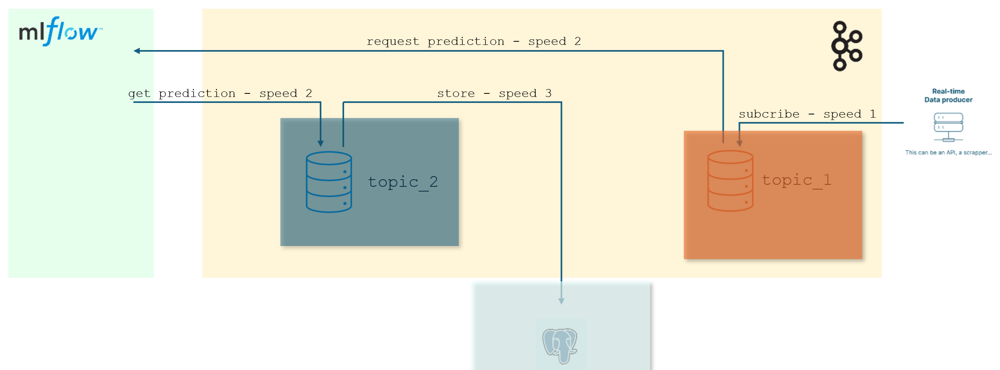
<p>

1. On the right, simulated transactions from the ``Real-time Data producer`` are dumped at ``speed_1`` into ``topic_1``. 
    * If the connection to the Real-time Data producer ever fails and the system receives no new transactions, this should not be a reason to shut down the entire application. 
    * The application is resilient, and continues to function. As long as there is data in `topic_1`, it continues to empty it at ``speed_2`` and to request predictions from the model (MLflow).
    * Thus, if a fraudulent transaction is found in Topic_1, it is detected "as soon as possible" and an alarm is triggered. 
    * Once again, just because you've lost your connection with the Real-time Data producer doesn't mean everything stops. The system does the best it can. 
    * This point is **very important**: whatever happens, the application must do its utmost to consume the transactions received, so that it can make predictions and sound the alarm if necessary.

1. When the transactions have been read at speed ``speed_2`` in ``topic_1`` and sent to the model, the predictions are dumped into ``topic_2`` at speed ``speed_2``. Finally, ``topic_2`` is emptied at ``speed_3`` to feed the database. 
    * Again, this desynchronization makes for a more resilient system. Even if the connection to the database is lost, everything else (retrieving transactions, requesting predictions, filling `topic_2`, issuing alarms) continues to run "at best" (some might say in degraded mode). 


<!-- ###################################################################### -->
## Note
The above shows that the model receives requests and issues predictions at ``speed_2``. This is to simplify the explanation and to emphasize that the prediction speed is different from the transaction acquisition speed and the database storage speed. 

Strictly speaking, there's nothing to prevent the speed of prediction requests from being different from the speed of storage in the database.
* This could be the case if the model is distributed, with some instances being slower than others. Momentarily, prediction retrieval speeds would be different from database storage speeds.
* Another case could arise if, instead of reading from `topic_1` one record at a time, the consumer feeding the model (MLflow) reads several records at once. There are several possible scenarios: 
    * The consumer asks to read half of the available records in `topic_1`.
    * The consumer asks to read 4 records at a time, because he "knows" that predictions will be made on 4 models running on parallel processes. 
    * etc.


There is a further, perhaps more subtle reason for implementing 2 topics in the `Consume Data` block. It concerns the resilience of the system with regard to the format of the documents exchanged.


<!-- ###################################################################### -->
<!-- ###################################################################### -->
# 2. Format of documents exchanged at the various interfaces of the `fraud_detection_2` application

If we take a step back from the diagram below, we can see that the system handles three types of document that are likely to change over time. 

It is therefore important to anticipate what is going to happen, in order to make the `Consume Data` module resilient.

<p align="center">

<p>

 The three document types are:
 1. Banking transactions received from the Real-time Data producer block.
 1. Information provided to the model to make its predictions.
 1. Information stored in the database


<!-- ###################################################################### -->
 ## Examples
 
* On the right, there's no guarantee that the format of bank transactions will remain stable over time. Nor is it certain that today's format corresponds exactly to the format expected by the model to make predictions. A transaction could, for example, include more features than necessary. So we have 2 options:
    1. Store the transactions as they are in ``topic_1``, but filter them before sending them to the model.
    1. Filter at input and store transactions in ``topic_1`` in the format expected by the model.
* It's important to note that with a two-topic architecture, what happens around ``topic_1`` remains transparent to the rest of the `Consume Data` block. If the code in charge of writes/reads in `topic_1` needs to be reworked, the code in charge of writes/reads in `topic_2` remains untouched.
* The same applies if database users ask for additional features to be recorded (version of the model that made the predictions, time of prediction, etc.). Here too, if the code in charge of writes/reads in `topic_2` has to be reworked, this has no impact on the code in charge of writes/reads in `topic_1`.


<!-- ###################################################################### -->
## ``topic_1``: Format of real-time transactions and training set  

In the `data\fraud_test.csv` file used to train the model, the observations have the following format: 
* There are 23 columns
* The first one doesn't have a title (`empty` below) it's just an index

| empty | trans_date_trans_time | cc_num | merchant | category | amt | first | last | gender | street | city | state | zip | lat | long | city_pop | job | dob | trans_num | unix_time | merch_lat | merch_long | is_fraud |
|------|-------------------------|-----------------|----------------------|----------------|------|-------|---------|--------|-------------------|----------|-------|-------|---------|----------|----------|----------------------|-------------|-------------------------------------|-------------|-----------|-------------|----------|
| 0 | 2020-06-21 12:14:25 | 2291163933867244| fraud_Kirlin and Sons | personal_care | 2.86 | Jeff | Elliott | M | 351 Darlene Green | Columbia | SC | 29209 | 33.9659 | -80.9355 | 333497 | Mechanical engineer | 1968-03-19 | 2da90c7d74bd46a0caf3777415b3ebd3 | 1371816865 | 33.986391 | -81.200714 | 0 |

A quick test (see `99_tooling\02_API_test\quick_test.ipynb`) shows that the simulated bank transactions received from the Real-time Data producer block have the following format:

```python
# In dictionary form
{"columns":["cc_num", "merchant", "category", "amt", "first", "last", "gender", "street", "city", "state", "zip", "lat", "long", "city_pop", "job", "dob", "trans_num", "merch_lat", "merch_long", "is_fraud", "current_time"], "index": [301199],"data":[[4497913965512794052,"fraud_Berge, Kautzer and Harris","personal_care",60. 16,"Scott","Edwards","M","838 Amy Street Suite 107","Pembroke","NC",28372,34.6902,-79.1834,14783,"Hospital doctor","1955-11-07","3cb54a489fb351f73a7db98f6c7bb1ad",34.38451,-78.621062,0,1730134684025]]}
```
In table form, we can see that :
* There are 21 columns. Missing: 
    * the index
    * the `trans_date_trans_time` feature (which can probably be rebuilt with the `current_time` feature)
* some names are different (`unix_time` vs `current_time` for example)
* The order of features is not the same as in the training set.
 

| cc_num | merchant | category | amt | first | last | gender | street | city | state | zip | lat | long | city_pop | job | dob | trans_num | merch_lat | merch_long | is_fraud | current_time |
|------------------|-----------------------------|----------------|-------|-------|---------|--------|--------------------------|----------|-------|-------|---------|----------|----------|-----------------|------------|-----------------------------------|-----------|------------|----------|---------------|
| 4497913965512794052 | fraud_Berge, Kautzer and Harris | personal_care | 60.16 | Scott | Edwards | M | 838 Amy Street Suite 107 | Pembroke | NC | 28372 | 34.6902 | -79.1834 | 14783 | Hospital doctor | 1955-11-07 | 3cb54a489fb351f73a7db98f6c7bb1ad | 34.38451 | -78.621062 | 0 | 1730134684025 |


### Decision regarding ``topic_1`` 
* Before saving the transactions from the Real-time Data producer block in ``topic_1``, we will transform them to match those in the training set. 


<!-- ###################################################################### -->
## ``topic_2`` : Format of predictions and database records 

Let's return to the overall architecture of the application 

<p align="center">

<p>

* On the left, in the ``Build algorithm`` block, we see that the model is trained with a training dataset (sheet ``.csv``).
* Below the ``Build algorithm`` block is a complementary data set. This is a set of data that has been validated. Typically, these are transactions from the database that have been verified. In other words, in the database, there's an additional feature (`fraud_confirmed`) in which there may be : 
    1. Nothing: the transaction has not been verified, so we don't know.
    1. `1`: the transaction has been verified and an investigator confirms that it is fraudulent
    1. `0`: the transaction has been verified and an investigator confirms that it is not fraudulent.  
* We already know that transactions classified as fraudulent will have been verified. It's a good idea to reuse this information and allow the model to train on more data than the initial training set.
* Moreover, the idea is that, provided we invest in the verification of certain "non-fraudulent" transactions, we can enrich the training dataset with recent data.

### Decision regarding ``topic_2``
* Records in the same format as those in ``topic_1`` are saved in ``topic_2``.
* The feature `is_fraud` contains the model prediction. 
* We save records in the database that have the same format as those in ``topic_2`` **plus** a `fraud_confirmed` feature, which is empty by default.
* When a fraud alarm is triggered, an investigation is initiated. When the investigation is completed, the transaction's `fraud_confirmed` field is updated in the database (it then contains `1` or ``0``). 
* If a transaction predicted as non-fraudulent is verified. At the end of the investigation, the transaction's `fraud_confirmed` field in the database is updated (it now contains `1` or ``0``).
* Daily 
    1. All transactions whose `fraud_confirmed` feature is not empty are extracted from the database.
    1. Delete the ``is_fraud`` feature (which contains the prediction made by the model). 
    1. Rename the `fraud_confirmed` feature to ``is_fraud``.
    1. We save the observations on the S3 bucket in a file ``validated.csv``.
    1. During the next training session, the contents of the ``validated.csv`` file are added to the training dataset.


<!-- ###################################################################### -->
<!-- ###################################################################### -->
# 3. Implementing a Kafka topic

We're interested in the topic in which a producer will deposit simulated banking transactions that he has retrieved from the "Real-time Data producer".

<p align="center">
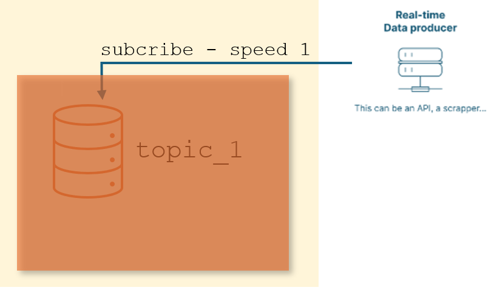
<p>


<!-- ###################################################################### -->
## Create a topic

* Connect to the [Confluent](https://confluent.cloud/home) 
* Add a cluster

<p align="center">
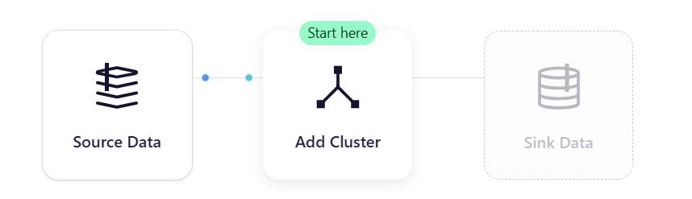
<p>

* Choose a Basic service

<p align="center">
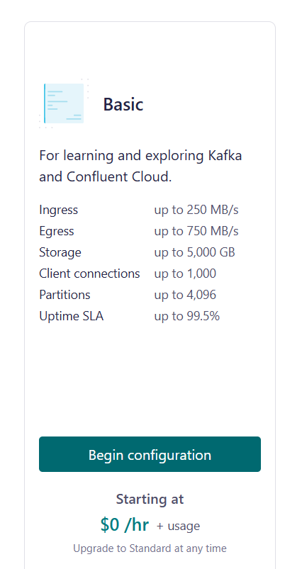
<p>

* Then, since ``fraud_detection_2`` is already using an S3 bucket on AWS, I choose AWS again. 
* **ATTENTION:** it's important to choose a region we have the right to access. 
    * For example, the bucket we use to store MLflow Tracking Server artifacts is in the ``eu-west-3`` region. 
    * I therefore take care to choose this region.

<p align="center">
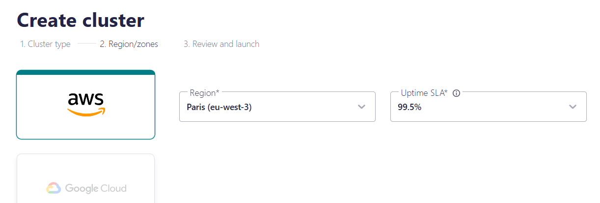
<p>


<p align="center">

<p>

* When the cluster is created, you need to generate the keys to use the API.
* If you're lost in the web page interface, click on "Home" then on "Cluster"

<p align="center">
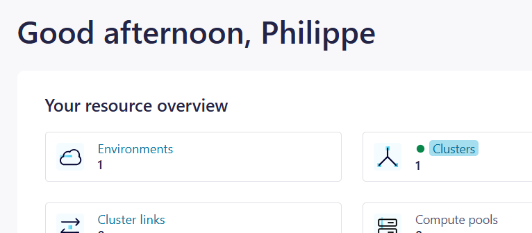
<p>

* Choose `fraud_detection_2_clstr` from the list of clusters

<p align="center">

<p>

* Finally, click on API (left-hand column)
<p align="center">
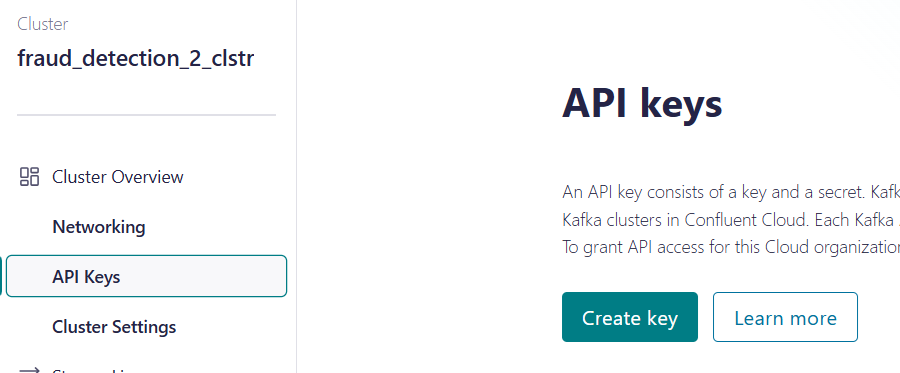
<p>

<p align="center">
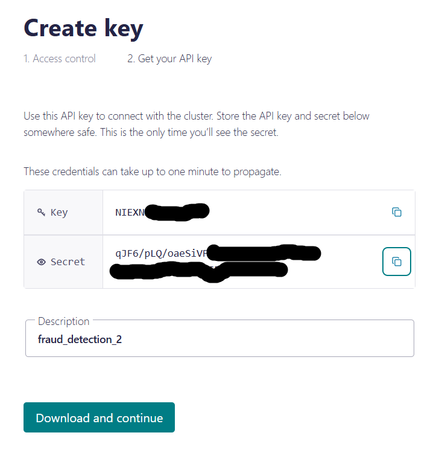
<p>


* Set the ``Key`` and the ``Secret`` aside in a file called ``secrets.ps1``.
* The ``secrets.ps1`` file is created in the module directory, next to this ``README.md`` file. 
* Since the ``.gitignore`` file prevents the ``secrets.ps1`` files from ending up on GitHub, we're in the clear.
* Here's what the ``secrets.ps1`` file should look like

```powershell
$env:SASL_USERNAME = "6KQ..."
$env:SASL_PASSWORD = "zBV..."

```

* Click on the "Download and continue" button 
* The file type `api-key-6KQxxxxx.txt` can be deleted once downloaded.


<!-- ###################################################################### -->
<!-- ###################################################################### -->
# 4. Testing a first version of a producer for the `fraud_detection_2` application


<!-- ###################################################################### -->
## Configure client application access

* This is a Python code that retrieves simulated bank transactions from the "Real-time Data producer" and deposits them in ``topic_1``. 
* It produces data insofar as it deposits them in the topic
* This code must have the credentials to access ``topic_1`` this is why we need to go back to the Confluent web page

<p align="center">

<p>


* Return to the `fraud_detection_2_clstr` page then click on "Set up client"

<p align="center">
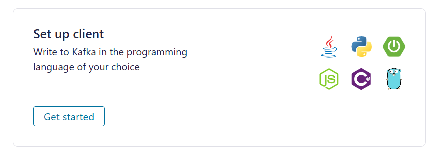
<p>

* Choose a language
* If a form asks for the topic name, enter `topic_1`

<p align="center">
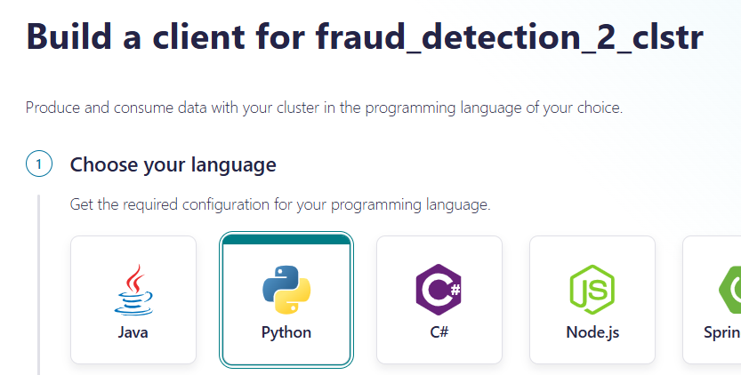
<p>


<p align="center">
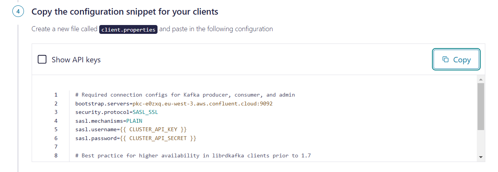
<p>


* On the web page we are offered to save a `clients.properties` file that contains the ``Key`` and the ``Secret`` in clear text (or that we will have to enter later in clear text in the `clients.properties` file in question)
* **IMPORTANT**: Once the `clients.properties` file is saved in the project directory, edit it and delete the 2 lines below:

```
sasl.username=6KQ...
sasl.password=zBV...
```

* In fact, `$env:SASL_USERNAME` and `$env:SASL_PASSWORD` have already been saved in a `secrets.ps1` file.


<!-- ###################################################################### -->
## Testing the producer 

* To test the producer you must :
    1. Open a terminal in the
    1. Launch the Docker image in interactive mode using the `run_confluent_image.ps1` script.

```powershell
./run_confluent_image.ps1
```


<p align="center">
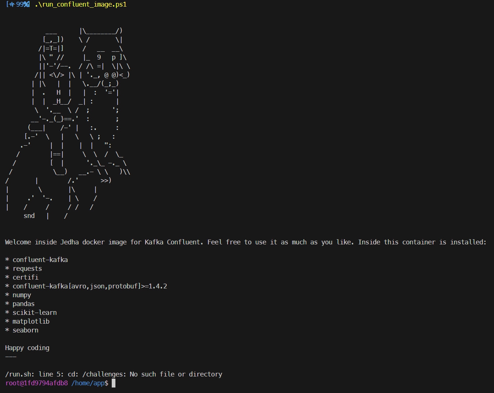
<p>

* When the Linux prompt is on the screen, we launch the producer code itself

```bash
python test_producer02.py 
```

<p align="center">
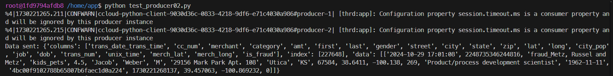
<p>

* Given the speed of the ``Real-time Data producer``, the code displays transactions every 15 seconds.
* To stop the code, press ``CTRL+C`` in the Linux console. 
* To return to PowerShell, type `exit` at the Linux prompt.


<!-- ###################################################################### -->
## It's a kind of magic (remember 1986 ?)
The aim here is to explain how the producer starts up and how the Confluent API's ``Key`` and ``Secret`` pass from PowerShell to Linux.

### The `run_confluent_image.ps1` script

```powershell
. "./secrets.ps1"
docker run -it -v "$(pwd):/home/app" -e SASL_USERNAME="$env:SASL_USERNAME" -e SASL_PASSWORD="$env:SASL_PASSWORD" jedha/confluent-image bash

```

* The script begins by checking that the `secrets.ps1` script is running.
* On the Windows side, it's the execution of the `secrets.ps1` script that defines the 2 environment variables `$env:SASL_USERNAME` and `$env:SASL_PASSWORD`.
* Once these two variables are in place, the ``run_confluent_image.ps1`` script passes them on to the Docker image (via the command line).
* Once launched, the Docker image can access a volume pointing to the current directory, and remains in interactive mode with a ``bash`` prompt.


### The `read_ccloud_config()` function in the `ccloud_lib` file. 

For the `fraud_detection_2` project, this function has been modified to :
1. Read the ``client.properties`` file 
1. retrieve the contents of environment variables ``SASL_USERNAME`` and ``SASL_PASSWORD``.

```python
def read_ccloud_config(config_file: str) -> dict:
    """Read Confluent Cloud configuration for librdkafka clients""""

    conf = {}
    with open(config_file) as fh:
        for line in fh:
            line = line.strip()
            if len(line) != 0 and line[0] != "#":
                parameter, value = line.strip().split("=", 1)
                conf[parameter] = value.strip()

    sasl_username = os.getenv("SASL_USERNAME")
    sasl_password = os.getenv("SASL_PASSWORD")

    # Check if environment var are defined
    if not sasl_username or not sasl_password:
        raise EnvironmentError(
            "The SASL_USERNAME or SASL_PASSWORD environment variables are not defined."
        )

    # Get credentials from environment variables
    conf["sasl.username"] = sasl_username
    conf["sasl.password"] = sasl_password

    # conf['ssl.ca.location'] = certifi.where()

    return conf
```

### The producer code ``test_producerXY.py`` 

See the definition of "constants" below at the very beginning of the code.   

```python
k_Topic = "topic_1"
k_Client_Prop = "client.properties"
k_RT_Data_Producer = "https://real-time-payments-api.herokuapp.com/current-transactions"
```


### It's really a kind of magic
At this point, one thing that really works magic is the Docker image we use to run the producer:

```powershell
./run_confluent_image.ps1
python test_producer02.py 
```
We don't know exactly how it works, or what it's made of. We'll come back to this later.


<!-- ###################################################################### -->
<!-- ###################################################################### -->
# What's next ?
* Go to the directory `04_consumer` and read the [README.md](../04_consumer/README.md) file. 
    * The previous link to the next README.md to read may not work on GitHub but it works like a charm locally in VSCode or a Web browser.