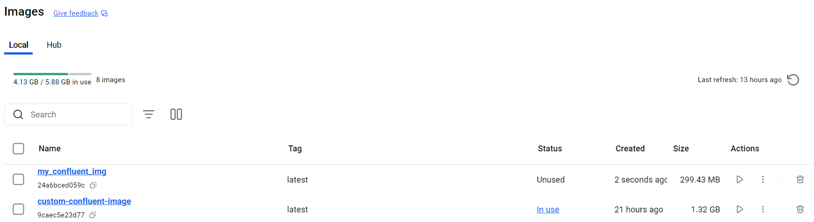
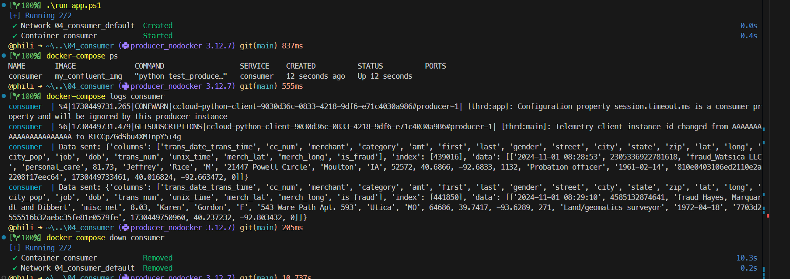
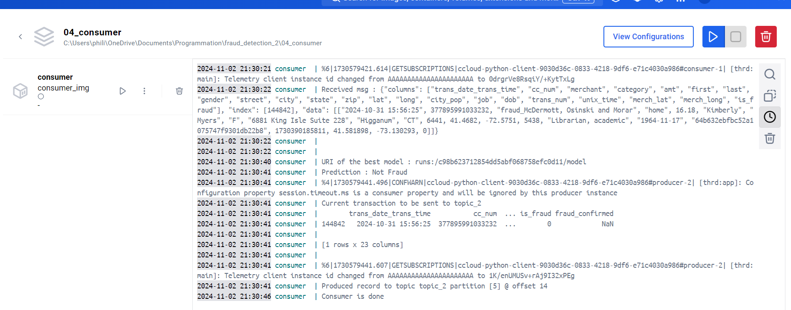
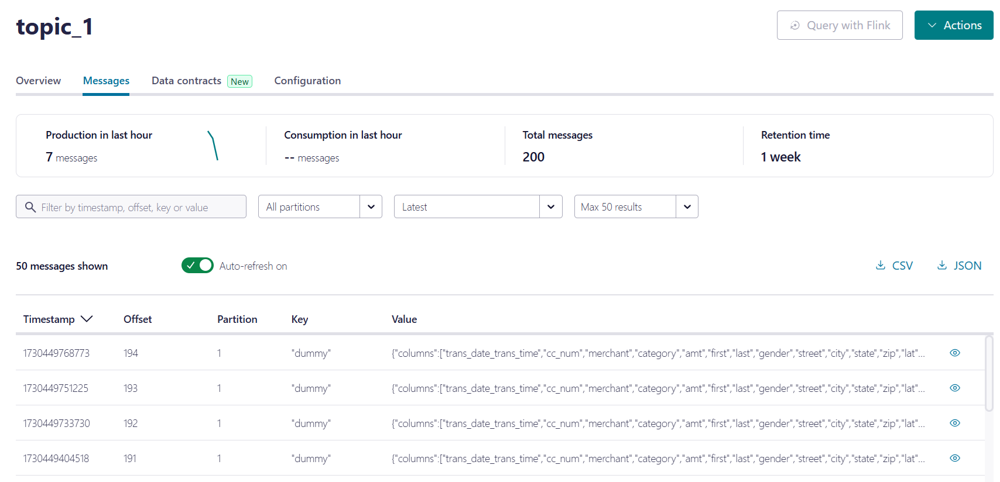
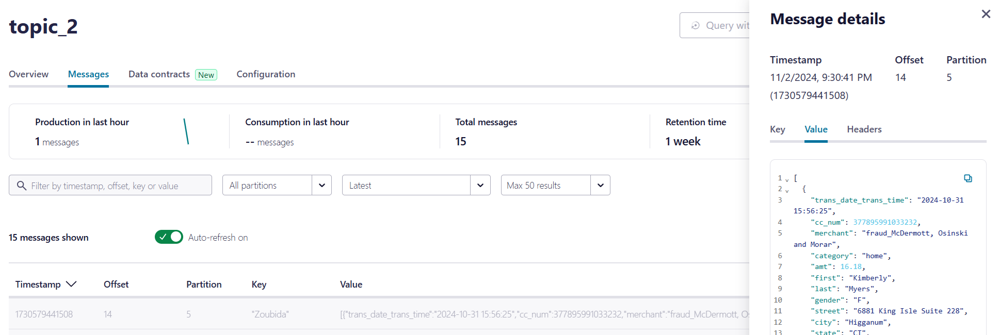
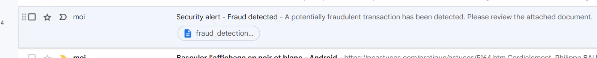

<!-- ###################################################################### -->
<!-- ###################################################################### -->

# Consumer 

Make sure you read the producer [README.md](../03_producer/README.md) file first.


<!-- ###################################################################### -->
<!-- ###################################################################### -->
# Introduction

This document covers :
1. Create a Docker image to run ``consumerXY.py``Pyton scripts which are able to :
    * Read messages from ``topic_1`` 
    * Download the last run (model) from MLflow Tracking Server
    * Use the message as an input for the run
    * Get the prediction from the model
    * Save the message and the prediction in ``topic_2``
1. The first version of a ``consumerXY.py`` for the `fraud_detection_2` application


<!-- ###################################################################### -->
<!-- ###################################################################### -->
# Create a Docker image to run Pyton scripts <!-- that can read ``topic_1`` -->

After running a first version of the ``producer`` Python script in the `jedha/confluent-image` image, rather than launching the `test_producerXY.py` script "by hand" from the Linux prompt I tried, without success, to automate its launch (if needed, read again the [README.md](../03_producer/README.md))

After several attempts, the decision was made to create a Docker image using the following "method" :
1. Creating a minimal conda virtual environment using only Python 3.12 (``conda create --name consumer_nodocker python=3.12 -y``)
1. Create a directory and copy the files needed to run `test_producerXY.py` (``secrets.ps1``, ``client.properties``...)
    * At the very beginning `consumer_XY` did not exist yet 
    * Only `test_producerXY.py` was available
1. Add to the virtual environment, the modules required by the Python script (at least, read and write to ``topic_1``)
1. Organize directories to separate what is needed to create the Docker image from the script itself.
1. Anticipate the use of ``docker-compose``. Indeed, at one point, we'll be launching the different components of the ``fraud_detection_2`` application from a single ``docker-compose.yml``. This include, at least, the following components :
    1. the ``producer`` : writes transactions to ``topic_1``
    1. The ``consumer`` : reads from ``topic_1``, requests predictions from the model (MLflow Tracking Server) and writes the inferences to ``topic_2``. 
    1. The ``logger_sql`` : reads from `topic_2` and saves the inferences in a PostgreSQL database, remembering to add a ``fraud_confirmed`` feature.
    1. ...


<!-- ###################################################################### -->
## Organization of subdirectories

Finally (remember CeCe Peniston, 1991 ?), the directories are organized as follows:

```
04_consumer/
│   build_img.ps1
│   docker-compose.yml
│   run_app.ps1
│
├───app
│       ccloud_lib.py
│       client.properties
│       secrets.ps1
│       consumer03.py
│
└───docker
        Dockerfile
        requirements.txt
```
* `build_img.ps1` = a script to create the Docker image
* ``docker-compose.yml`` = application launch orchestration
* `run_app.ps1` = launches the application. Sets passwords, then invokes ``docker-compose.yml``.
* `./app` = the directory containing the ``consumerXY.py`` script. It contains other needed files and `secrets.ps1` (with keys and sensitive parameters)
* ``./docker`` = the directory with the `Dockerfile` and `requirements.txt` files needed to create our own image.


To build the `consumer_img` image, invoke the script :

```
./build_img.ps1

```

This generates a pretty fat `consumer.img` file.

<p align="center">

<p>


The `build_img.ps1` PowerShell script is a one liner. It calls ``docker`` to build `consumer_img` and indicates where to find the Dockerfile. 

The reason why I keep writing one line PowerShell scripts is that they add a "level of indirection" :
* I always invoke the same script (`build_img.ps1`) 
* The content take care of the context : build an image for ``consumerXY.py``, for ``producerXY.py``...
* The same apply to `run_app.ps1`. I run the same command but it launch different modules according the context. 

```
docker build -t consumer_img -f docker/Dockerfile .
```

Here is the content of the Dockerfile

```
FROM python:3.12-slim

WORKDIR /home/app

RUN apt-get update
RUN apt-get install nano unzip
RUN apt install curl -y

RUN curl "https://awscli.amazonaws.com/awscli-exe-linux-x86_64.zip" -o "awscliv2.zip"
RUN unzip awscliv2.zip
RUN ./aws/install

RUN apt-get update && \
    apt-get install -y --no-install-recommends unzip curl librdkafka-dev && \
    rm -rf /var/lib/apt/lists/* 

COPY docker/requirements.txt .
RUN pip install --no-cache-dir -r requirements.txt    

COPY app/ .

```
* We need the AWS machinery because ``consumerXY.py`` accesses the AWS S3 to read the runs
* We also need to install "by hand" the librdkafka-dev 
* The other modules are listed in the ``requirements.txt`` file


Here below the `requirements.txt` file

```
# same as producer
requests
pandas

# librdkafka is managed with apt-get
confluent_kafka 
avro-python3

# required to execute the model
mlflow
boto3 
imbalanced-learn

```


<!-- ###################################################################### -->
## Comments 
* `imbalanced-learn` is on the last line. 
* Indeed the model, which is on the MLflow Tracking Server use SMOTE.
* It's **important** to bear in mind that if the template uses another ML module, the latter will need to be added to the ``requirements.txt`` file, so that once the model has been downloaded, you can run it in the context of the Docker image.   

At the end of the build process, we have a docker image that we can use in a ``docker-compose.yml`` configuration. Here is the ``.yml`` file :

```
services:
  consumer:
    image: consumer_img
    build: /docker
    container_name: consumer
    environment:
      - SASL_USERNAME=${SASL_USERNAME}
      - SASL_PASSWORD=${SASL_PASSWORD}
      - AWS_REGION=${AWS_REGION}  
      - AWS_ACCESS_KEY_ID=${AWS_ACCESS_KEY_ID}  
      - AWS_SECRET_ACCESS_KEY=${AWS_SECRET_ACCESS_KEY}  
      - SMTP_USER=${SMTP_USER}  
      - SMTP_PASSWORD=${SMTP_PASSWORD}  
      - SMTP_SERVER=${SMTP_SERVER}  
      - SMTP_PORT=${SMTP_PORT}  
      - EMAIL_RECIPIENT=${EMAIL_RECIPIENT}  
    volumes:
      - ./app:/home/app              
    working_dir: /home/app
    command: python consumer03.py
```
* Pay attention to the very last line. I use to have different version of ``consumerXY.py``. If you create a new version of the script, make sure to update this line
* There are many environment variables passed because most of them should not be public.
* The good news is that to run the ``consumerXY.py`` one just need to invoke ``.\run_app.ps1``

Here is the ``./app/secrets.ps1`` file :
```
# topic access confluent
$env:SASL_USERNAME = "6KQ..."
$env:SASL_PASSWORD = "zBV..."

# fraud-detection-2-user full access S3
$env:AWS_REGION             = "eu-west-3"
$env:AWS_ACCESS_KEY_ID      = "AKI..."
$env:AWS_SECRET_ACCESS_KEY  = "vtL..."

# Email
$env:SMTP_USER          = "phil..."
$env:SMTP_PASSWORD      = "..."
$env:SMTP_SERVER        = 'smtp...'
$env:SMTP_PORT          = '587'
$env:EMAIL_RECIPIENT    = "phil..."

```

Here is the `run_app.ps1` PowerShell script

```powershell
. "./app/secrets.ps1"
docker-compose up -d
```

It is 2 lines :
1. run the ``./app/secrets.ps1`` script to make sure the environment variables are set (remember that ``secrets.ps1`` is in ``.gitignore`` so no secret key becomes public)
1. invoque ``docker-compose`` which use the content of ``docker-compose.yml``


<!-- ###################################################################### -->
## Comments
1. Again. Take the time to study the contents of the directories and files. 
1. While building the Docker image, one annoying thing is that a `librdkafka` library is required, but it has to be installed via an `apt-get` (see the content of `Dockerfile`).
1. As for the “method” of creating a conda virtual environment, a directory, and launching the module code in this context... It's a bit cumbersome, consuming disk space and time. On the other hand, at the end you know exactly what's in the Docker image and you're able to make relatively lite images.  
1. As far as the organization of subdirectories and the naming convention for scripts are concerned, I think I'll keep it in future modules (``logger_sql`` ...).
1. I think I'll also continue to use docker-compose regularly even if I only have one application to run. 
1. Indeed, this organization makes a clear separation between the construction of the image and the context to be set up to run the application in the image. Finally, if need be, we have the elements to launch the application with others from a more substantial ``docker-compose.yml``. 


<!-- ###################################################################### -->
<!-- ###################################################################### -->
# Testing a first version of a consumer for the `fraud_detection_2` application

Run the ``consumerXY.py`` script in the Docker image with the following command :

```
./run_app.ps1

```

Via the `run_app.ps1`, the consumer in launched in **detached mode**. This is why we don't see anything in the current terminal. We must use ``docker-compose`` commands to :
* list the running process (``docker-compose ps``)
* inspect the logs (`docker-compose logs consumer`) 
* gently close the app (`docker-compose down consumer`)

<p align="center">

<p>

If, for any reason, you have doubts about the output you get in the terminal with `docker-compose logs consumer`, run the command `docker-compose logs consumer` twice (or more). Indeed, outputs are buffered so they may take some time. On the other hand feel free to use Docker Desktop to inspect the output.

<p align="center">

<p>


The reason we can read messages from ``topic_1`` is simply because we previously used the ``test_producerXY.py`` to send them there. In fact, ``topic_1`` act as a backlog for 7 days.


<p align="center">

<p>

Among the text in the console we can read :

```
consumer  | Received msg : {"columns": ["trans_date_trans_time", "cc_num", "merchant", "category", "amt", "first", "last", "gender", "street", "city", "state", "zip", "lat", "long", "city_pop", "job", "dob", "trans_num", "unix_time", "merch_lat", "merch_long", "is_fraud"], "index": [144842], "data": [["2024-10-31 15:56:25", 377895991033232, "fraud_McDermott, Osinski and Morar", "home", 16.18, "Kimberly", "Myers", "F", "6881 King Isle Suite 228", "Higganum", "CT", 6441, 41.4682, -72.5751, 5438, "Librarian, academic", "1964-11-17", "64b632ebfbc52a1075747f9301db22b8", 1730390185811, 41.581898, -73.130293, 0]]}
```

This means that the script is able to read a transaction from ``topic_1``. 

Later on we can see :  


```
consumer  | URI of the run : runs:/c98b623712854dd5abf068758efc0d11/model
consumer  | Prediction : Not Fraud
```

This means that the script is able to 
1. contact MLflow Tracking Server
1. find the most recent "experiment" and find the latest "run" in there  
1. download the run 
1. submit the read from ``topic_1`` as an input to the downloaded model and get a prediction. 
    * Indeed, the last line above says ``Not Fraud``

The last 2 messages explain that the record plus the inference are now logged on ``topic_2`` 

```
consumer  | Produced record to topic topic_2 partition [5] @ offset 14
consumer  | Consumer is done
```

This means that in ``topic_2``, the folling information are saved :  
1. the record from ``topic_1``
1. plus the inference
1. plus a new ``fraud_confirmed`` feature 
    * This feature will be used to extend the training dataset if and only if it is updated after investigation and confirmation


If one go to [confluent](https://confluent.cloud/) he can double check the content of ``topic_2``

<p align="center">

<p>

This is not demonstrated here but with ``consumer03.py`` and above, the script can :
* Either use the model of the last run or the model of the one before last run (rollback)
    * A mechanism avoids downloading the model of the desired “run” if it is already available locally.
    * Indeed I suspect roolbacks will be seldom. 
    * More often, once downloaded the model of the last run will be used again and again to make inferences
* If a fraudulent transaction is inferred an email is sent 
    * The parameters are found in ``secrets.ps1``
    * The attached ``.csv`` file contains all transaction information  

<p align="center">

<p>


<!-- ###################################################################### -->
<!-- ###################################################################### -->
# What's next ? 

* The next version of ``consumerXY.py`` should be based on an infinite loop 
    * Like it is done in ``producerXY.py``
* As I write this ``README.md``, nothing has been decided yet, but I'm wondering if ``producer``, ``consumer`` and others modules shouldn't be Flask applications. The point is that we could call them to pass them parameters, ask them to return a status. Once again, it's just an idea and nothing has been decided yet. 
* The priority is to run ``logger_sql``, which will read the content of ``topic_2`` and save it in an SQL database.
* Go to the directory `05_logger_sql` and read the [README.md](../05_logger_sql/README.md) file. 
    * The previous link to the next README.md to read may not work on GitHub but it works like a charm locally in VSCode or a Web browser.


<!-- 
## Create a topic

* Connect to the [Confluent](https://confluent.cloud/home) 
* Select the `fraud_detection_2_clstr` cluster

<p align="center">

<p>

* Add a topic
* Name it `topic_2`
* Do not add a contract

<p align="center">

<p>

* Copy the `secrets.ps1` you used with the producer and paste it in the directory


# 4. Running the producer of the `fraud_detection_2` application

## Configure client application access

* This is a Python code that retrieves simulated bank transactions from the "Real-time Data producer" and deposits them in ``topic_1``. 
* It produces data insofar as it deposits them in the topic
* This code must have the credentials to access ``topic_1`` this is why we need to go back to the Confluent web page

<p align="center">

<p>


* Return to the `fraud_detection_2_clstr` page then click on "Set up client"

<p align="center">

<p>

* Choose a language
* If a form asks for the topic name, enter `topic_1`

<p align="center">

<p>


<p align="center">

<p>


* On the web page we are offered to save a `clients.properties` file that contains the ``Key`` and the ``Secret`` in clear text (or that we will have to enter later in clear text in the `clients.properties` file in question)
* **IMPORTANT**: Once the `clients.properties` file is saved in the project directory, edit it and delete the 2 lines below:

```
sasl.username=6KQ...
sasl.password=zBV...
```

* In fact, `$env:SASL_USERNAME` and `$env:SASL_PASSWORD` have already been saved in a `secrets.ps1` file.


## Testing the producer 

* To test the producer you must :
    1. Open a terminal in the
    1. Launch the Docker image in interactive mode using the `run_confluent_image.ps1` script.

```powershell
./run_confluent_image.ps1
```


<p align="center">

<p>

* When the Linux prompt is on the screen, we launch the producer code itself

```bash
python test_producer02.py 
```

<p align="center">

<p>

* Given the speed of the ``Real-time Data producer``, the code displays transactions every 15 seconds.
* To stop the code, press ``CTRL+C`` in the Linux console. 
* To return to PowerShell, type `exit` at the Linux prompt.


## It's a kind of magic...
The aim here is to explain how the producer starts up and how the Confluent API's ``Key'' and ``Secret'' pass from PowerShell to Linux.

### The `run_confluent_image.ps1` script

```powershell
. "./secrets.ps1"
docker run -it -v "$(pwd):/home/app" -e SASL_USERNAME="$env:SASL_USERNAME" -e SASL_PASSWORD="$env:SASL_PASSWORD" jedha/confluent-image bash

```

* The script begins by checking that the `secrets.ps1` script is running.
* On the Windows side, it's the execution of the `secrets.ps1` script that defines the 2 environment variables `$env:SASL_USERNAME` and `$env:SASL_PASSWORD`.
* Once these two variables are in place, the ``run_confluent_image.ps1`` script passes them on to the Docker image (via the command line).
* Once launched, the Docker image can access a volume pointing to the current directory, and remains in interactive mode with a ``bash`` prompt.


### The `read_ccloud_config()` function in the `ccloud_lib` file. 

For the `fraud_detection_2` project, this function has been modified to :
1. Read the ``client.properties`` file 
1. retrieve the contents of environment variables ``SASL_USERNAME`` and ``SASL_PASSWORD``.

```python
def read_ccloud_config(config_file: str) -> dict:
    """Read Confluent Cloud configuration for librdkafka clients""""

    conf = {}
    with open(config_file) as fh:
        for line in fh:
            line = line.strip()
            if len(line) != 0 and line[0] != "#":
                parameter, value = line.strip().split("=", 1)
                conf[parameter] = value.strip()

    sasl_username = os.getenv("SASL_USERNAME")
    sasl_password = os.getenv("SASL_PASSWORD")

    # Check if environment var are defined
    if not sasl_username or not sasl_password:
        raise EnvironmentError(
            "The SASL_USERNAME or SASL_PASSWORD environment variables are not defined."
        )

    # Get credentials from environment variables
    conf["sasl.username"] = sasl_username
    conf["sasl.password"] = sasl_password

    # conf['ssl.ca.location'] = certifi.where()

    return conf
```

### The producer code ``test_producerXY.py`` 

See the definition of "constants" below at the very beginning of the code.   

```python
k_Topic = "topic_1"
k_Client_Prop = "client.properties"
k_RT_Data_Producer = "https://real-time-payments-api.herokuapp.com/current-transactions"
``` -->


