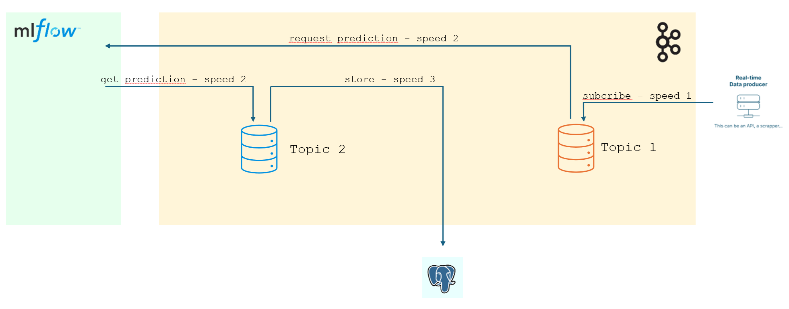

Dans le shéma du readme du projet (https://github.com/40tude/fraud_detection) ce code se trouve entre mlflow et "real-time" data producer (le rectangle jaune)

C'est une toute première implémentation en python pur qui permet de valider quelques idées
* Comment interroger l'API
* Qu'est ce qui faut pour faire une prédiction : quelles données envoyer, quel format, comment...
* Si il y a une fraude, comment envoyer un mail 
* ...

### Remarques :
1. J'ai pas encore regardé la sauvegarde de la transaction simulée et de la prediction associée dans une base de données (mais c'est dans la TODO liste)

1. Pour le reste, à ce jour (05/07/24), il n'est pas interdit d'être malin et de faire des demandes de prédictions par batch. Typiquement, lors de la première prédiction faut rapatrier le modèle sélectionné (lent) puis faire des prédictions (rapide). Ensuite quand il faut faire de nouvelles prédiction, sous réserve que le modèle à utiliser reste le même, il suffit de faire faire des prédictions (il n'y a plus de modèle à rapatrier, c'est donc très rapide)

1. Il faut aussi anticiper l'arrivée de Kafka et de ses "topics". Idéalement je verrai bien une organisation avec 2 topics. À droite, on déverse dans un premier topic les transactions (simulées) avec une vitesse speed_1. Si jamais il n'y a plus de transaction, ce n'est pas très grave. Le système est résilient. Il continue à tourner, on continue à vider le topic 1 à la vitesse speed_2 et à demander des prédictions. Ce faisant, si une transaction frauduleuse était dans le Topic 1, elle est détéctée "au plus vite" et une alarme est déclenchée. Ce n'est pas parce qu'on a perdu la connexion avec le générateur de données que tout s'arrête. Le système fait "au mieux". Ce point est très important. Quoiqu'il arrive, on doit tout faire pour consommer les transactions reçues afin de pouvoir faire des prédictions et sonner l'alarme le cas échéant.

Pour le reste, les prédictions sont déversées dans un second topic (à gauche) à la vitesse speed_2. Enfin, topic 2 est vidé à la vitess speed 3 quand on veut remplir la base de données. Là aussi, cela permet d'avoir un système plus résilient car même si on perd la connexion avec la base, tout le reste (récupération des transactions, demandes de prédictions, alarmes) continue de tourner au mieux (certaines diront mode dégradé).  

<p align="center">

<p>

Une raison supplémentaire, peut être un peu plus plus subtile, incite à mettre en oeuvre 2 topics. En effet, les données issues du simulateur comportent N+1 features (N vraies features + un champs ``is_fraud``). Suite à la prédiction, les données comportent N+2 features 
1. les N features initiales de la transaction CB
1. le champs ``is_fraud`` qui comportera la vraie valeur si un jour la transaction est validée. 
1. la prédiction (fraude/licite) faite par le modèle 

Il est très important, pour la suite des opérations, de sauvegarder les prédictions sous cette forme (N+2 features). Et donc on se retrouve avec 2 types de données (d'objets) ce qui est une très bonne incitation à utiliser 2 topics. Si on se demande pourquoi on veut sauvegarder dans la base les prédictions (les données avec N+2 features) la réponse est simple : Si le monitoring du modèle détecte que ce dernier est de moins en moins bon (drift) il faudra déclencher un ré-entrainement du modèle sur le jeu de données initial. Cela dit, les données auront vieilli. Si d'un autre coté on peut complèter les données d'entrainement avec des données validées, c'est tout bénéfice pour nous. Il y a juste un léger soucis : cela suppose que les données sotckées dans la base soient validées ce qui peut coûter un bras mais ça reste un investissement à très for ROI. Enfin bref... 

### Note :
Si on joue le jeu et si on imagine que les données qui sont dans la base sont validées... Le jour où on veut faire compléter un entrainement il suffit :
1. extraire de la base les données avec N+2 features
1. supprimer la colonne prédiction et garder la colone ``is_fraud`` (celle dans laquele on aura mis la vraie valeur confirmée : fraude/pas fraude)
1. ajouter ces enregistrements au jeu de données complémentaire qui existe déjà sur `s3://fraud-bucket-202406/data/validated.csv` (voir le code `02_train_code\01_sklearn\02_template\train.py`). Faut vraiment faire très attention à ce que le csv de données complémentaires soit identique au csv de données d'entrainement initial (même nombre de colonnes, mêmes noms de features... On se fiche de la première colonne, il faut qu'elle soit là mais elle peut être vide (voir le fichier `s3://fraud-bucket-202406/data/validated.csv` qui existe déjà))


Si une alarme pour fraude doit être envoyée (un mail par exemple), je pense qu'il faut l'envoyer le plus tôt possible, dès que la prédiction est versée dans Topic 2. Cela peut donc faire l'objet d'un consommateur supplémentaire qu'on brancherait sur Topic 2. On aurait donc 2 consommateurs branchés sur Topic 2 :
1. Un qui balance les données dans la base de données à la vitesse speed_3 
1. Un autre qui inspecte toutes les prédictions et qui envoie un mail en cas de fraude (0.38% des transactions à ce jour)

Faut être clair... Il n'est pas prévu que ce code Python reste, en l'état, jusqu'à la fin du projet. C'est une preuve de concept, un moyen de vérifer telle ou telle idée. Il est fort probable que tout ou partie sera remplacée par du Kafka, des topics, du No Code... etc.


### C'est peut être un détail pour vous...

J'ai déjà eu l'occasion de le dire dans un précédent `README.md` mais pour pouvoir lancer un script `.ps1` (voir ci-dessous) il faut que les autorisations soient accordées. Si besoin, en tant qu'Administrateur utilisez la commande ci-dessous ou l'une de ces petites soeurs. 

```
Set-ExecutionPolicy -ExecutionPolicy RemoteSigned -Scope LocalMachine
```


### Pour faire simple :

* Le code c'est : `99_tooling\01_client_predict\app\client_predict.py`
* Pour le lancer, il faut se mettre dans le répertoire `99_tooling\01_client_predict\` puis commencer par lancer : `build_client_predict.ps1`
* Une fois que vous avez une image, toujours dans le même répertoire il faut lancer : `99_tooling\01_client_predict\run_client_predict.ps1`
* Pour faire vos propres tests je vous conseille de faire un copier-coller du répertoire et d'aller jouer dans votre branche


1. Si vous ne comprenez pas pourquoi faut faire ça ou comment ça marche, lisez `00_mlflow_tracking_server\readme.md` mais ne redéployez pas un mlflow tracking server sur Heroku qui risquerait de détruire le serveur déjà en place. 
1. A la fin du readme précédent, on vous renvoit vers le prochain readme à lire : `02_train_code\01_sklearn\01_minimal\readme.md` 
1. Ce dernier vous proposera d'aller lire `02_train_code\01_sklearn\02_template\readme.md`

L'idée c'est que même si vous vous fichez de ces histoires de modèles etc... Dans l'eprit, ça explique comment utiliser le `client_predict.py` qui est dans le répertoire  `99_tooling\01_client_predict`

En effet, lui aussi c'est un code python qui tourne dans une image Docker. Donc il faut construire l'image (avec `build_client_predict.ps1`) puis quand c'est fait, faut lancer l'application dans l'image avec `run_client_predict.ps1`

Sinon, la dernière version de `client_predict.py` est la plus "évoluée" : elle se connecte à l'API, elle peut envoyer des mails, elle fait des prédictions...  

La toute première version s'appelle `client_predict00.py`. Si besoin allez lire son code. Si c'est encore trop pénible, allez dans les autres répertoires de `99_tooling`. Il y a là des codes snippets encore plus simples.