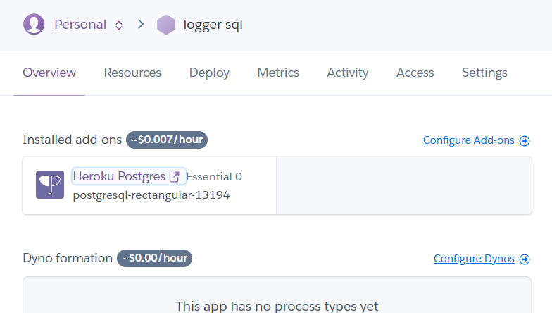
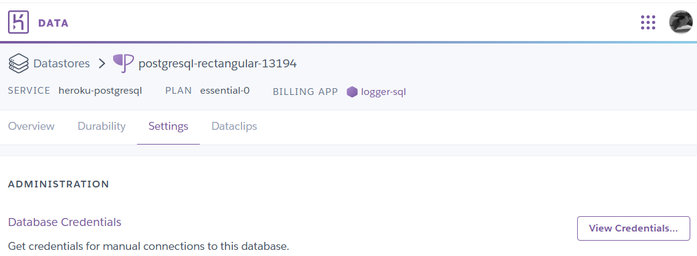
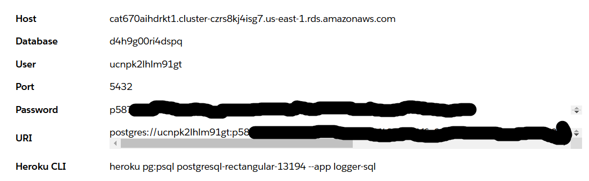
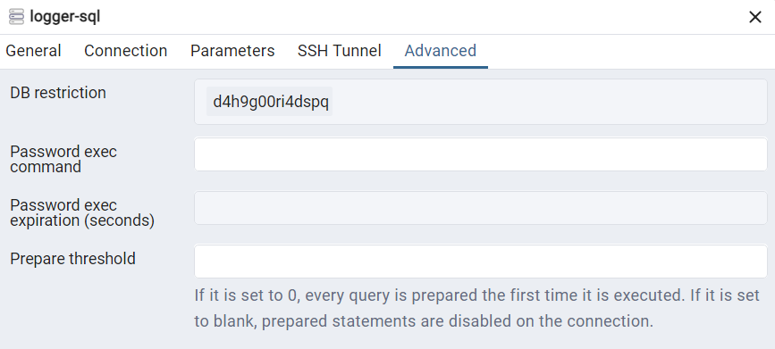
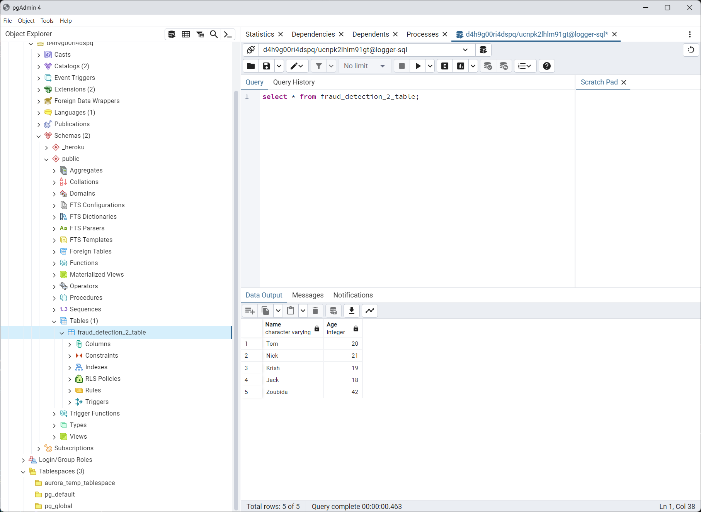

```powershell
conda create --name logger_sql python=3.12 -y
conda activate logger_sql
conda install pandas  -c conda-forge -y

heroku login
heroku create logger-sql 
heroku addons:create heroku-postgresql:essential-0 --app logger-sql
```


Sur heroku.com sur la page de l'application
<p align="center">

<p>

Cliquer sur Heroku PostgreSQL

<p align="center">

<p>

lick on Settings 
View credentials.
<p align="center">

<p>

Copy the URI link : postgres://ucn...
Add "ql" to "postgres://…"  => postgresql://ucn...
Save it into the ./secrets.ps1

```powershell
$env:LOGGER_SQL_URI = "postgresql://ucn..."
```


```powershell
conda install psycopg2-binary -c conda-forge -y
conda install sqlalchemy -c conda-forge -y
```

<p align="center">

<p>

<p align="center">

<p>

<p align="center">

<p>


# Pour faire tourner logger_03.py

~~conda install requests pandas librdkafka -c conda-forge -y~~
conda install librdkafka -c conda-forge -y
pip install confluent_kafka  avro-python3
conda install requests -c conda-forge -y

Dans secrets.ps1 ajouter les access à confluent SASL...

Je change le GroupId pour recommencer à lire depuis le départ
k_GroupId = "python-group-2"

Soucis pour enregistrer car la table attend un bool pour is_fraud et j'ai un int

