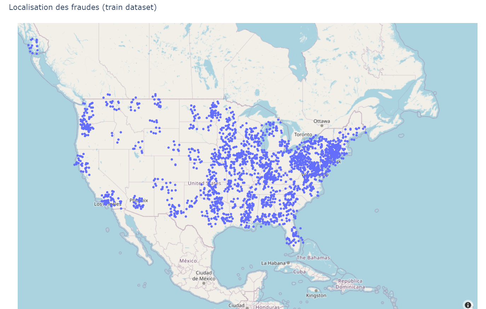

<!-- 
TO DO list

* Jeu de données
    * Clean
    * Missing val, outliers, balancing
    * Feature enginieering 
    * Demonstration ?

* Entrainement du modèle
    * Choisir un algo
    * Choisir un framework
    * Tune hyper parameters
    * Evaluate model (F1, accuracy, precision, recall)
    * Demonstration 
        * MLflow tracking
        * QUESTION : Testing ?
        * QUESTION : Versioning. Comment on fait ?


* Faire tourner l'ensemble de l'application
    * Acquerir les données & sauver dans topic 1 :                  Docker 1 + Confluent + API Data producer
    * Lire topic 1, demander une prévision, stocker dans topic 2    Docker 2 + Confluent + MLflow
    * Lire dans topic 2 et sauver dans PostgreSQL                   Docker 3 + ??? RDS ou Heroku ?


* MLOps
    * Trigger = model updated
        * Automatiser le testing
        * Automatiser la validation
        * Automatiser le déploiement
    * Evidently
        * Suivre metrics (latency, accuracy, drift)
        * S'assurer que le modèle reste dans les specs
        * Envoyer une alerte si drift ou accuracy sous une certains niveau
    * Pipelin de ré-entrainement 
        * Trigger = perf en baisse
        * Trigger = new data available
        * Airflow
    * Rollback
        * MLFlow
        * Data & Model versioning
        * Démontrer le roll back
    * API
        * Fast API
        * Demontrer l'interaction avec le modèle
        * Assurer la documentation


-->

<!-- ###################################################################### -->
<!-- ###################################################################### -->
# Intro 

* This is an updated/reloaded/extended/expanded version of the first version of the [fraud_detection](https://github.com/40tude/fraud_detection) project

<!-- ###################################################################### -->
## Note
* In this ``README.md`` as well as some of the others documentation files, screen captures may include information relative to the previous project. 
    * That shouldn't prevent you from understanding the point.
* Most of the ``README.md`` are written so that you can rebuild the project on your own
    * This is why they look like recipe. 
    * This is made on purpose.
    * The ``README.md`` are also a way for me to keep my own notes and put down in black and white what I think I've understood. 


<!-- ###################################################################### -->
<!-- ###################################################################### -->
# Objectives
* At the end of the day, we want to use a model to predict fraudulent payments in real-time and respond appropriately.
    * Initial [specifications](https://app.jedha.co/course/final-projects-l/automatic-fraud-detection-l)
* At a very high level, here is the spirit of the architecture and how it works :
    * On the right hand side transactions happen in "realtime" (Real-Time Data Producer block)  
    * They are consumed (Consume Data block)
    * Then used to make inferences (MLflow block)
    * Once inference are done
        * If fraudulent transaction is detected an alert is raised
        * All transactions (with associated inference result) are stored in a database (Store data block)
    * Once in the database, records can be used for analysis (Leverage Data block)
    * On the left hand side, a train dataset is used to train the model (Build algorithm block)
        * There is an option to, over the time, extend the training dataset with new validated records

<!-- "real time" or "realtime" is used as a noun (and can also be used as an adjective) but "real-time" is used as an adjective only -->

<p align="center">

<p>


<!-- ###################################################################### -->
## Ideas and Open Questions 
1. Create a model to predict fraudulent payment in real-time
    * We have a training dataset
    * At this point the "performances" of the model is **NOT** important
        * A baseline model could even always answering "not fraudulent"
        * First thing first, let's make sure the infra works
    * Can we plug a new model easily ?
        * And make inference with 
    * How do we monitor model accuracy over time ?
    * What about if it drift ? 
        * Again, can we plug a new model easily?
1. Create an infrastructure that ingest real-time payments
    * What if the number of payments is increased by 10x
    * How does the infra scale ?
    * We need to plan to consume data in batches of N transactions to be verified each time.
        * In fact, making predictions one after the other will be very slow.
    * For database saving (Store Data above)
        * Must save all the data received from the Real-time Data producer (this is done via an API)
        * We should add a “prediction” column with the result of the model inference (fraud, not_a_fraud)
        * Plus a “true_value” column to be filled later after verification (if any)
            * Doing so, if some confirmations are done one day
            * Then the additional confirmed record can be added to the initial training set
            * The training dataset can evolve over time
1. Classify each payment ?
1. Send the prediction in real-time to a notification center
    * Send email ?


<!-- ###################################################################### -->
<!-- ###################################################################### -->
# Getting re-started

* I'm an happy user of WIN 11 and conda. 
* Some of the steps below may slightly defer if you live with a Linux based system
* Open a terminal in a directory where you will be able to create a directory to host the project  


<!-- ###################################################################### -->
## Side Note
* Below I do not make a fork of the previous projet
* This is because I'm not really interested by the future versions of the ``fraud_detection_1``
* Also, I delete the ``./git`` because, for me, ``fraud_detection_2`` is a brand new adventure
    * I could be completely wrong with this way of thinking. I don't feel expert enough to have a definitive opinion on this point.


```bash
git clone https://github.com/40tude/fraud_detection.git
mv ./fraud_detection/ ./fraud_detection_2/
cd ./fraud_detection_2/
Remove-Item ./.git/ -Recurse
conda create --name fraud2 python=3.12 -y
conda activate fraud2
code .
```


<!-- ###################################################################### -->
## Install mypy  
* From the VSCode integrated terminal  
* If necessary, take a look at this [documentation](https://mypy.readthedocs.io/en/stable/getting_started.html#strict-mode-and-configuration)  

```bash
conda install mypy -y 
```

* At the root of the project, create `mypy.ini` containing :

```
[mypy]
python_version = 3.12  
ignore_missing_imports = True
strict = True
warn_return_any = True
warn_unused_ignores = True
show_error_codes = True
color_output = True
```

* You may not agree, with the here above options
* Here too i'm not definitve. Feel free to adapt them to your context


<!-- ###################################################################### -->
## Get the train data
* Create the directory `./data` at the root of the project  
* Get a copy of `fraud_test.csv` from this [page](https://app.jedha.co/course/final-projects-l/automatic-fraud-detection-l)
* Drop the ``.csv`` file in ``./data``

### Note
* If, for any reason, you can't get the ``.csv`` file from the previous page... No worry.
* In the Notebook used for the EDA (see below) you can either get the data from a local copy or from a public AWS S3 bucket.
* Comment/uncomment the option you need 

```python
filename_in = Path(k_AssetsDir)/k_FileName
df = pd.read_csv(filename_in)

# Alternative (AWS S3 bucket)
# df = pd.read_csv("https://lead-program-assets.s3.eu-west-3.amazonaws.com/M05-Projects/fraudTest.csv")

df.columns = df.columns.str.lower()
df.head(3)

```

### Miscelaneous
* Review the contents of `.gitignore`


<!-- ###################################################################### -->
## First commit on GitHub
* You can either use the VSCode graphical way or a git commands in a terminal


<!-- ###################################################################### -->
<!-- ###################################################################### -->
# EDA
* Go to ``98_EDA`` directory and open ``eda.ipynb`` 
* If needed, open a terminal in VSCode

```bash
conda install numpy pandas seaborn matplotlib plotly nbformat -c conda-forge -y
```

* ``Clear All Outputs`` (it does'nt hurt)
* ``Restart`` the kernel
* Approve when VSCode ask to install ``ipykernel`` in order to please Python
* You should be good to go
* ``Run All``
* Read the comments, at the end a map with the spots in US should be displayed

<p align="center">

<p>


<!-- ###################################################################### -->
<!-- ###################################################################### -->
# What's next ?
* Go to the directory `00_mlflow_tracking_server` and read the [README.md](./00_mlflow_tracking_server/README.md) file 
    * The link to the README.md may not work on GitHub but is works like a charm in VSCode.


<!-- ###################################################################### -->
<!-- ###################################################################### -->
# About contributions
This project is developed for personal and educational purposes. Feel free to explore and use it to enhance your own learning in machine learning.

Given the nature of the project, external contributions are not actively sought nor encouraged. However, constructive feedback aimed at improving the project (in terms of speed, accuracy, comprehensiveness, etc.) is welcome. Please note that this project is being created as a hobby and is unlikely to be maintained once my initial goal has been achieved.