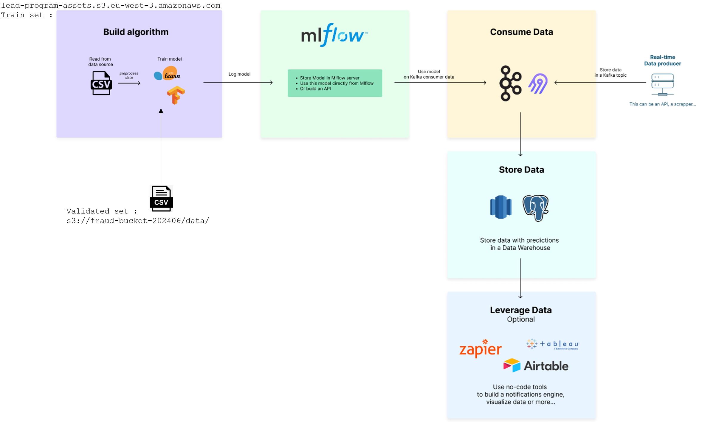

<!-- 
Aller dans un répertoire dans lequel vous allez créer le répertoire du projet
git clone https://github.com/40tude/fraud_detection.git 
mv .\fraud_detection\ .\fraud_detection_2\
cd .\fraud_detection_2\
Remove-Item ./.git/ -Recurse
conda create --name fraud2 python=3.12 -y
conda activate fraud2
code .
Installer mypy
    * Depuis le terminal de VSCode
    * Web = https://mypy.readthedocs.io/en/stable/getting_started.html#strict-mode-and-configuration
    * conda install mypy -y 
À la racine du projet, créer mypy.ini qui contient
```
[mypy]
python_version = 3.12  
ignore_missing_imports = True
strict = True
warn_return_any = True
warn_unused_ignores = True
show_error_codes = True
color_output = True
```

Relire le contenu de .gitignore

Créer le répertoire ./data
Y déposer fraud_test.csv qui est dispo ici : https://app.jedha.co/course/final-projects-l/automatic-fraud-detection-l

-->

# fraud_detection_2 project 

* This is an updated/extended/expanded version of the first version of the [fraud_detection](https://github.com/40tude/fraud_detection) project


## Getting re-started

* I'm an happy user of WIN 11 some step may defer if you run a Linux based system
* Go to a directory where you will create the project directory.  

```bash
git clone https://github.com/40tude/fraud_detection.git
mv ./fraud_detection/ ./fraud_detection_2/
cd ./fraud_detection_2/
Remove-Item ./.git/ -Recurse
conda create --name fraud2 python=3.12 -y
conda activate fraud2
code .
```


### Install mypy  
* From the VSCode terminal  
* Web = https://mypy.readthedocs.io/en/stable/getting_started.html#strict-mode-and-configuration  

```bash
conda install mypy -y 
```

At the root of the project, create `mypy.ini` containing :

```
[mypy]
python_version = 3.12  
ignore_missing_imports = True
strict = True
warn_return_any = True
warn_unused_ignores = True
show_error_codes = True
color_output = True
```

### Get the train data
* Create the directory `./data`  
* Get a copy of `fraud_test.csv` from here : https://app.jedha.co/course/final-projects-l/automatic-fraud-detection-l
* And drop it in ``./data``

### Miscelaneous
* Review the contents of `.gitignore`

### First commit on GitHub


## EDA
* Go to ``98_EDA`` and open ``eda.ipynb``
* Open a terminal in VSCode

```bash
conda install numpy pandas seaborn matplotlib plotly nbformat -c conda-forge -y
```

* Restart the kernel
* Approve when VSCode ask to install ??? for Jupyter
* You should be go to go
* Run All


## About contributions
This project was developed for personal and educational purposes. Feel free to explore and use it to enhance your own learning in machine learning.

Given the nature of the project, external contributions are not actively sought nor encouraged. However, constructive feedback aimed at improving the project (in terms of speed, accuracy, comprehensiveness, etc.) is welcome. Please note that this project is being created as a hobby and is unlikely to be maintained once my initial goal has been achieved.

<!-- 
### JEDHA Bootcamp - Data Science & Engineering - Lead - June 2024

## Webliography
* See : https://app.jedha.co/course/final-projects-l/automatic-fraud-detection-l
* Mlflow Tracking server : https://fraud-202406-70e02a9739f2.herokuapp.com/
* S3 with training dataset : https://lead-program-assets.s3.eu-west-3.amazonaws.com/M05-Projects/fraudTest.csv
* S3 with additionnal validated data for training : s3://fraud-bucket-202406/data/validated.csv


## Objectives
Use a model in production to predict fraudulent payment in real-time and respond appropriately.

This mean :
1. Create a model to predict fraudulent payment in real-time
    * At this point the "performances" of the model is NOT so important
    * Can we plug a new model easily ?
    * How do we monitor model accuracy over time ?
    * What about if it drift ? Again can we plug a new model easily?
    * Faut penser à faire une mini EDA (2500 fraud sur 500 000 lignes)

1. Create an infrastructure that ingest real-time payment
    * What if the number of payments is increase by 10x
    * How the archi scale ?
    * Faut prévoir de consommer les données par batch de N transactions à vérifier à chaque fois
        * En effet faire une prédiction une après l'autre est très lent
    * Pour la sauvegarde dans la base (Store Data ci-dessous)
        * Faut sauver toutes les données reçues de l'API
        * Plus une colonne "prediction" avec l'inférence du modèle
        * Plus une colonne "true value" qui sera remplie plus tard après vérification (si elle a lieu)
            * Quand la vérification est faite il faut envoyer la ligne supplémentaire au jeu de trainning
            * Permet d'enrichir le modèle pour le prochain entrainement

1. Classify each payment 
1. Send the prediction in real-time to a notification center
    * email ?


## Deliverables

A Powerpoint set of slides explaining 
* the architecture
* the choices 
* the use cases
    * performances in terms of scalability
    * Can we unplug-plug new predictions model easily?
    * drifiting monitoring?
    * ...
* Can we demonstrate the project in realtime in some way ?
    * Video ?


<p align="center">

<p>

## Directories organization
```
├───00_mlflow_tracking_server
│   └───assets
├───01_images_for_model_trainers
│   └───01_sklearn_trainer
├───02_train_code
│   └───01_sklearn
│       ├───01_minimal
│       │   ├───assets
│       │   └───img
│       └───02_template
│           ├───assets
│           └───img
├───98_EDA
├───99_tooling
│   ├───01_client_predict
│   │   ├───app
│   │   └───assets
│   ├───02_API_test
│   └───03_combine_train_and validated
├───assets
└───data 
```

* 00_mlflow_tracking_server : everything needed to build & deploy mlflow tracking server. There is a readme.md
* 01_images_for_model_trainers : everything needed to build docker images where the model to be trained will run. There is a readme.md
    * 01_sklearn_trainer : 
* 02_train_code
    * 01_sklearn
        * 01_minimal
        * 02_template
* 98_EDA : quick EDA (jupyter notebook)
* 99_tooling
    * 01_client_predict : demonstrates how to make a prediction using python
    * 02_API_test : demonstrates how to get simulatated transactions with the API  
    * 03_combine_train_and validated : demonstrates how to combine 2 dataframe : initial training dataset and a dataframe containing some additional validated data
* assets : png, pptx
* data : local copy of the dataset 

## Blablabla...

* Demo color : <span style="color:orange"><b>your text</b></span>
* Let's try to create a ``readme.md`` in every directory
    * In this case, create an ``assets`` directory where to store the ``.png`` files of the ``readme.md``
* Link to the mlflow tracking server : https://fraud-202406-70e02a9739f2.herokuapp.com/ 
-->
